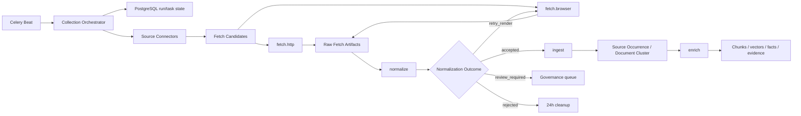

# 来源采集与内容清洗目标设计

> 状态：accepted target design
>
> 架构决策：[ADR-0003](../adr/0003-source-fanout-fetch-architecture.md)、[ADR-0004](../adr/0004-versioned-deterministic-normalization.md)

## 1. 目标与边界

本设计将现有“单个 Celery Pipeline 内串行遍历来源、抓取、清洗并继续知识处理”的实现替换为来源级扇出、阶段级解耦的采集系统。目标是同时提升来源并发、故障隔离、增量效率、清洗可解释性和证据可追溯性。

目标能力：

- URL 发现、页面获取、内容清洗、治理入库和知识增强相互解耦。
- 每个 Information Source 独立调度、限速、重试、熔断和恢复。
- 静态 HTTP、RSS、动态页面、PDF 和显式开启的 Office 附件使用合适的专用引擎。
- 原始响应可在短期内重放；进入 Document Version 或 Evidence Reference 的依据长期保留。
- 清洗输出由结构化 Content Block 承载，结果只使用离散状态和可解释原因码。
- PostgreSQL 保存权威状态；Redis 故障只允许降速或暂停高风险来源，不得改变业务结论。

明确不做：

- 不保留 Crawlee、旧 WebCrawler 或全局 Pipeline 的运行时兼容路径。
- 不抓取登录后内容，不破解 CAPTCHA、设备指纹或访问控制。
- 不让 LLM 改写作为证据基础的逐字正文。
- 不把 Redis、Celery result backend 或消息体当作原文与任务状态的唯一存储。
- 不用一个统一数值分数表达清洗质量、来源可信度或入库结论。

## 2. 领域对象

领域术语以根目录 [CONTEXT.md](../../CONTEXT.md) 为准。本链路的核心对象如下：

| 对象 | 身份与职责 | 生命周期 |
|---|---|---|
| Collection Run | 一组来源在同一调度周期内的采集批次 | created -> running -> partial_failed/succeeded -> finalized |
| Source Fetch Task | 单个 Source Profile 的一次可重试抓取工作单元 | pending -> running -> succeeded/failed/timed_out/cancelled |
| Fetch Candidate | Connector 发现但尚未取得响应的资源线索 | discovered -> scheduled -> fetched/skipped/failed |
| Raw Fetch Artifact | 原始响应、请求与响应元数据 | available -> retained/expired/deleted |
| Retained Fetch Artifact | 形成 Document Version 或 Evidence Reference 依据的长期产物 | retained，直到显式治理删除 |
| Normalized Document | Raw Fetch Artifact 经特定规则版本产生的结构化正文 | accepted/retry_render/review_required/rejected |
| Content Block | Normalized Document 中可稳定引用的逐字内容单元 | 随规范化版本不可变 |

`Source Occurrence` 从 accepted Normalized Document 创建，`Document Cluster` 再基于规范化正文指纹归簇。Fetch Candidate、Raw Fetch Artifact 和 Source Occurrence 是三个不同阶段，不能复用同一个“文章”模型承载。

## 3. 总体架构



Celery 是执行器，不是工作流事实源。Collection Orchestrator 通过 PostgreSQL 中的 Collection Run 和 Source Fetch Task 状态判断阶段是否完成，不把 Celery chord callback 当作唯一 fan-in 信号。

## 4. 发现层：Source Connector

`SourceConnectorProtocol` 只负责发现 Fetch Candidate，不下载正文：

```python
class SourceConnectorProtocol(Protocol):
    def discover(
        self,
        profile: SourceProfile,
        cursor: SourceCursor | None,
    ) -> DiscoveryResult: ...
```

第一版实现：

| Connector | 输入 | 增量边界 |
|---|---|---|
| RssConnector | RSS/Atom URL | entry id、published/updated、规范化 URL |
| SitemapConnector | sitemap 或 sitemap index | lastmod、分页位置、规范化 URL |
| ListingConnector | 列表页与分页规则 | next cursor、时间边界、已见 URL |
| ApiConnector | 官方 JSON/GraphQL/API | API cursor、updated_at、etag |
| SearchConnector | 站内搜索或受控 Web 搜索 | 查询时间窗、结果 URL |

大多数来源使用声明式 Connector 配置；只有无法由组合规则表达的来源实现专用 Connector。Fetch Engine 不递归遍历整个站点，也不决定哪些 URL 是业务上需要的情报。

每个 Fetch Candidate 至少携带：`candidate_id`、`source_profile_id`、`normalized_url`、`discovered_at`、`connector_kind`、`discovery_cursor`、`expected_media_type`、`published_hint` 和稳定幂等键。

## 5. 获取层：Fetch Engine

`FetchEngineProtocol` 获取一个候选并产生 Raw Fetch Artifact：

```python
class FetchEngineProtocol(Protocol):
    async def fetch(
        self,
        candidate: FetchCandidate,
        policy: SourceFetchPolicy,
    ) -> FetchResult: ...
```

### 5.1 引擎选择

- `HttpFetchEngine`：默认路径，使用异步 `httpx` 获取 RSS、HTML、JSON、PDF 和附件。
- `BrowserFetchEngine`：使用 Playwright，只处理 `render_required` 来源或 Normalization Outcome 为 `retry_render` 的候选。
- `feedparser` 只解析已经获取的 Feed body，不自行发起网络请求。
- `trafilatura` 只参与 Normalize 阶段，不自行下载 URL。

Playwright 不是静态失败后的无限兜底。每个 artifact 最多从静态路径升级一次浏览器渲染；渲染后仍无法接受时进入 `review_required` 或 `rejected`，禁止循环重试。

### 5.2 条件请求与早期跳过

HTTP Engine 使用持久化的 ETag、Last-Modified 和来源游标发起条件请求。304 只更新来源观测时间，不创建新 body。200 响应先计算 Raw body SHA-256；命中相同响应时复用已有 Normalized Document，避免重复清洗。

Raw body hash 只用于计算复用。广告、时间戳和模板变化可能改变 HTML，因此 Document Cluster 仍由清洗后的正文指纹决定。

### 5.3 并发、限速与调度

并发分两层：Celery 控制同时运行的来源任务，Fetch Engine 控制单域名请求并发。初始基线：

- `fetch.http` 全局并发 32，单域名默认并发 2，来源可配置上限 4-8。
- `fetch.browser` 每个 Worker 最多运行 2 个 browser context。
- 来源连续健康时逐步提高并发；出现 429、403、高超时或阻断页时快速降低并发并进入冷却。

Source Profile 保存最小/最大并发、请求间隔、是否允许自适应、是否需要渲染和最大允许陈旧时间。每个来源使用独立 `next_due_at`；连续无变化时延长间隔，发现更新时缩短，连续失败时退避熔断。系统使用离散业务优先级，不生成统一来源分数。

## 6. Artifact 存储与保留

PostgreSQL 保存 artifact 元数据和生命周期，Blob Store 保存压缩后的 HTML/XML/JSON/PDF/附件 body。Celery 消息只传 artifact ID。

默认保留规则：

- Raw Fetch Artifact body 保留 24 小时。
- 形成 active 或 superseded Document Version 的依据时，晋升为 Retained Fetch Artifact。
- 被 Evidence Reference 引用时，强制晋升并长期保留。
- 普通重复 Source Occurrence、pending_review、quarantined、失败和 rejected 产物不自动晋升。
- 管理员可设置治理保留；清理只删除 body，不删除最小审计元数据、请求结果、内容哈希和原因码。

Artifact body 必须有大小上限、MIME 与文件头双重校验、解压上限和 hash 校验。PDF 是一等候选；扫描型 PDF 进入独立 OCR 队列。Office 附件按来源显式启用，普通正文图片不默认 OCR。

## 7. Normalize Pipeline

Normalize 是独立、可重放、无网络访问的阶段：

1. 校验媒体类型、解码字符集并保留原始响应事实。
2. 从 JSON-LD、OpenGraph、meta、Feed 字段和 HTTP header 收集元数据候选。
3. 应用来源专用正文与噪声 selector。
4. 运行 `markdownify`、`trafilatura`、HTML text 等确定性提取器。
5. 去除导航、推荐、广告、版权、订阅、重复段落和已知来源模板。
6. 将候选转换为 Content Block，并检查标题、正文结构、链接密度、语言、发布时间与候选冲突。
7. 按版本化规则输出 Normalization Outcome、原因码和选择理由。

LLM 只能辅助页面类型分类和异常元数据候选识别。所有 LLM 建议必须由确定性规则校验；LLM 不得补写、翻译、摘要或润色 Content Block 的逐字文本。

### 7.1 权威输出

Normalized Document 以有序 Content Block 为权威表示。每个 block 至少包含：

- `block_id`：由规范化版本、顺序和逐字内容生成的稳定身份。
- `block_type`：heading、paragraph、list、table、quote、code、caption 等。
- `text`：逐字正文。
- `heading_path`：结构化标题路径。
- `source_locator`：CSS/XPath、DOM 路径、PDF 页码/区域或解析器定位。
- `extractor` 与 `normalizer_version`。

Markdown 从 Content Block 派生，用于展示、Chunking 和 LLM 输入。重新清洗创建新的 Normalized Document 版本，不原地覆盖；Evidence Reference 引用具体版本和 block ID。

### 7.2 离散质量门禁

Normalization Outcome 只有四种：

| Outcome | 后续动作 |
|---|---|
| accepted | 进入来源准入、正文指纹和归簇 |
| retry_render | 最多一次转入 `fetch.browser` |
| review_required | 进入治理队列，不进入知识索引 |
| rejected | 记录原因，等待 24 小时清理 |

原因码包括但不限于：`body_too_short`、`link_density_high`、`title_mismatch`、`blocked_page`、`date_conflict`、`extractor_disagreement`、`unsupported_media_type`、`empty_body` 和 `not_article`。

领域模型不保存统一质量分数。长度、密度、相似度等测量可以作为诊断事实随 trace 或调试记录保存，但接口、治理决策和入库规则只能依赖离散 outcome、原因码与明确阈值。

## 8. 去重与知识入库边界

去重分三层：

1. 抓取前：规范化 URL、来源游标和 HTTP 条件请求。
2. 抓取后：Raw body SHA-256 复用清洗结果。
3. 清洗后：对 Content Block 规范化正文计算 SHA-256、SimHash 和 shingles，提交 Document Cluster 权威判定。

只有 `accepted` Normalized Document 可以创建 Source Occurrence。来源治理和 Document Cluster 规则继续以 [来源治理与去重设计](source-governance-and-deduplication.md) 为准。新簇或 Canonical Article 晋升才触发 Document Version 构建；重复转载只保存 occurrence 元数据，不重复执行分块、Embedding 和 fact 抽取。

## 9. 任务队列与资源隔离

| 队列 | 负载 | 资源特征 |
|---|---|---|
| `fetch.http` | Connector 调度后的 RSS/HTTP/API/PDF 获取 | 高并发 I/O |
| `fetch.browser` | Playwright 渲染 | 低并发、高内存 |
| `normalize` | 解析、清洗、Content Block 与 outcome | CPU/内存 |
| `ingest` | 来源准入、正文指纹、归簇和版本创建 | PostgreSQL 事务 |
| `enrich` | Chunking、Embedding、Qdrant、facts/evidence | 外部 AI/向量 I/O |
| `ocr` | 扫描 PDF OCR | 高 CPU/可选加速 |

每类队列部署独立 Worker 和并发预算。浏览器、OCR、Embedding 或 LLM 变慢时不得占用静态抓取槽位。

Collection Run 的 fan-in 由 PostgreSQL 状态机完成。来源任务重复执行时必须复用稳定幂等键；超时、worker 重启或 callback 丢失后，reconciler 依据数据库状态补偿调度。

## 10. Redis 与故障语义

Redis 保存 Celery 消息、来源 token bucket、短期租约、幂等热点、熔断冷却和进度缓存。PostgreSQL 保存 Collection Run、Source Fetch Task、永久游标、artifact 生命周期和最终业务结论。

Redis 不可用时：

- RSS/普通静态 HTTP 使用 PostgreSQL 幂等和保守的进程内限速继续。
- Playwright、严格限速及反爬敏感来源暂停。
- Redis 恢复后依据 PostgreSQL 状态补偿未完成任务。
- 清空 Redis 后不得改变 Fetch Candidate、artifact、归簇或版本结论。

单来源失败只影响对应 Source Fetch Task。Collection Run 允许 `partial_failed`，仍处理其他来源的成功 artifact。

## 11. 访问边界

- 只采集公开且无需登录的内容。
- 尊重 robots.txt、来源条款和来源级频率配置。
- Playwright 不破解 CAPTCHA、设备指纹或登录墙。
- 403、429、验证码和阻断页记录为 `blocked` 并触发冷却。
- 代理只用于固定出口、地域可用性或网络稳定性，不轮换规避封禁。
- 官方 API 密钥通过密钥配置注入，不写入 Source Profile 明文。

## 12. Protocol 与模块边界

新增 Protocol：

- `SourceConnectorProtocol`：增量发现 Fetch Candidate。
- `FetchEngineProtocol`：执行 HTTP 或 browser 获取并返回 FetchResult。
- `CollectionRunStoreProtocol`：Collection Run、Source Fetch Task 和状态推进。
- `FetchArtifactStoreProtocol`：artifact 元数据、生命周期、条件请求信息和查询。
- `FetchBlobStoreProtocol`：原始 body 保存、读取、晋升和清理；可复用现有 Blob Store 的内容寻址能力。
- `NormalizationServiceProtocol`：从 artifact 产生版本化 Normalized Document。
- `NormalizedDocumentStoreProtocol`：Normalized Document 与 Content Block 权威存储。
- `SourceRateLimiterProtocol`：来源级 token bucket 与冷却；Redis 实现可降级。

Services 只依赖 Protocol。Connector 和 Fetch Engine 属于 infrastructure；Collection Orchestrator、Normalization Service 和 artifact 生命周期编排属于 services；Celery task 只解析 ID、调用 Service 并记录状态，不承载业务规则。

## 13. 可观测性与 SLO

OpenTelemetry trace 从 Collection Run 贯穿 Source Fetch Task、Fetch Candidate、Raw Fetch Artifact、Normalized Document、Source Occurrence 和 Document Version。structlog、trace 与数据库记录共享 `collection_run_id`、`source_task_id` 和 `artifact_id`。

Prometheus 至少记录：

- 来源到期数、发现候选数、HTTP 状态、抓取耗时、响应大小。
- 队列等待、重试、超时、熔断、429/403 和 browser fallback。
- 各 Normalization Outcome 与原因码数量。
- HTTP 304、Raw body 复用、正文精确重复、近重复和 review_required。
- artifact 晋升、24 小时清理与清理失败。
- `discovered -> fetched -> normalized -> accepted -> clustered -> indexed` 漏斗。

单机验收基线：

- 100 个 Source Profile。
- 每日 10,000 个 Fetch Candidate。
- 每日 1,000 篇 accepted Normalized Document。
- 30 个同时到期的静态来源在 10 分钟内完成抓取阶段。
- 静态抓取成功率至少 95%，Playwright fallback 低于 10%。
- 任一来源失败不阻塞其他来源。
- 增加独立队列 Worker 后吞吐近似线性扩展。

## 14. 直接迁移

本次迁移不保留旧运行路径，也不做 shadow 双轨：

1. 为代表性 RSS、静态 HTML、动态 HTML、PDF、阻断页和噪声页保存回放夹具。
2. 创建新领域模型、migration、Store 和 Protocol。
3. 实现 Connector、HTTP Engine、artifact 存储和 Normalize Pipeline。
4. 实现 PostgreSQL 状态机、Celery 队列、Redis 限速/租约和 reconciler。
5. 接入来源治理、Document Cluster、Document Version 和 enrich 队列。
6. 一次性切换 Beat、API 和 CLI 入口。
7. 删除 `infrastructure/web_crawler.py`、旧 `NewsCollector` 网络下载职责、Crawlee 依赖、`sites_config.json` 兼容路径、全局 Pipeline 锁和旧阶段名称。

旧链路不得与新链路同时写入 Document Cluster。旧代码可以作为行为参考，但不提供 adapter、feature flag、双写或旧任务状态迁移。

## 15. 测试与验收

必须覆盖：

- Connector 游标、分页、规范化 URL 和候选幂等。
- HTTP 条件请求、重定向、压缩、字符集、MIME/文件头、大小限制和 304。
- 来源级并发、token bucket、429/403 冷却、Redis 降级和恢复补偿。
- Playwright 最多一次升级，不产生静态/浏览器循环。
- artifact 24 小时清理、Document Version/Evidence Reference 晋升和治理保留。
- 固定页面夹具的多提取器选择、Content Block 稳定 ID、Markdown 派生和全部 outcome。
- LLM 建议不能修改逐字正文，异常输出降级为 review_required。
- Raw body 复用与规范化正文三阶段去重边界。
- Source Fetch Task 重试、worker 中断、partial_failed、reconciler 和幂等恢复。
- 100 来源/10,000 candidate 负载测试与队列隔离验证。

验收时必须使用可观察结果，不写“预计通过”。测试数量、耗时、关键 Prometheus 指标和失败恢复演练结果应进入对应 ExecPlan 的 Artifacts and Notes。
