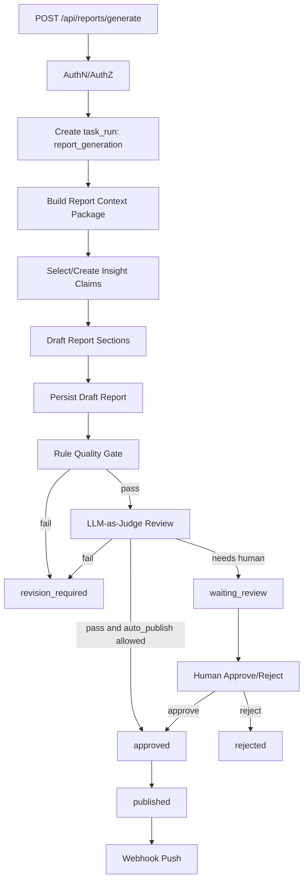

# 第三阶段企业级报告生成、质量门禁与生产增强计划

> **状态**：规划文档  
> **撰写日期**：2026-05-25  
> **依据文档**：`docs/exec-plans/enterprise-ai-competitor-analysis-plan.md`、`docs/exec-plans/phase-2-intel-fact-service-refactor-plan.md`、`ARCHITECTURE.md`、`docs/design-docs/protocol-contracts.md`、`docs/design-docs/api-routes.md`、`docs/flows/config-flow.md`、`docs/deployment/docker-vps.md`、`docs/generated/db-schema.md`  
> **阶段定位**：企业级 AI 竞品分析改造的第三阶段，承接 Phase 2 已落地的 `IntelFact` / `EvidenceRef` / `InsightClaim` / 任务历史 / Redis 状态层，把报告生成升级为可审计、可质检、可审批、可发布的企业级产物，并补齐企业内网试点所需的安全、配置与生产部署基线。  
> **核心原则**：报告不能只是 LLM 输出的 Markdown；报告必须由 claim、fact、evidence 和质量审查结果共同定义。质量门禁失败的报告不能自动发布，生产敏感接口不能只依赖 Caddy Basic Auth。

---

## 1. 背景

Phase 1 已完成 PostgreSQL/Qdrant/Redis/Celery 的基础设施重构，Phase 2 已完成结构化事实层、证据引用、claim、Agent 原子工具、ServiceRegistry 和 facts/claims API。当前系统已经能从 `SourceDocument` 抽取 `IntelFact`，并由 `ReportService.generate_analysis_report()` 基于 facts、claims 和 evidence 生成 Markdown 报告。

但现有报告链路仍然是轻量版：

- `ReportService` 主要负责上下文聚合和一次性调用主 LLM。
- `analysis_reports.source_refs` 仍是 JSON 列表，尚未形成 report -> claim -> evidence 的稳定关系表。
- `AnalysisReport.status` 只有 `draft/published/archived`，无法表达质检、修订、审批和拒绝。
- 报告质量要求只写在 prompt 中，缺少规则门禁、LLM-as-Judge、修订闭环和审计事件。
- 生产部署已有 Caddy Basic Auth 和 Docker Compose 编排，但应用内部缺少 API 认证、角色权限、配置变更审计、生产配置隔离、Redis/Qdrant 密码化和更细的健康检查。

因此第三阶段应把原总计划中的 **Phase 3 报告质量门禁** 与 **Phase 4 安全、配置、生产部署增强** 合并为一个企业试点闭环：报告生成是高价值写操作，必须在安全和部署基线之上运行。

---

## 2. 阶段目标

第三阶段完成后，系统应具备以下能力：

1. 报告生成从“拼上下文后让 LLM 写正文”升级为“构建上下文包 -> 生成/选择 claims -> 起草报告 -> 质量审查 -> 修订或审批 -> 发布”。
2. 每个关键结论都能追踪到 `InsightClaim`、`IntelFact` 和 `EvidenceRef`，报告引用不再只依赖 `analysis_reports.source_refs` JSON。
3. 质量门禁包含规则检查和 LLM-as-Judge，能识别无证据结论、引用不准、数据不足、事实冲突和幻觉风险。
4. 报告状态能表达 `draft`、`quality_reviewing`、`revision_required`、`waiting_review`、`approved`、`published`、`rejected`、`archived`。
5. 报告生成、质量审查、人工审批、发布和 webhook 推送都写入审计链路。
6. 配置、删除、报告生成、Webhook 管理、手动 Pipeline、facts/claims 写操作等敏感 API 至少受应用级 API Key / Session 认证保护。
7. 角色权限覆盖 `viewer`、`analyst`、`admin` 三类最小权限。
8. `.env` 配置支持 `APP_ENV`、生产必填项校验、敏感字段脱敏、配置变更审计和生产环境危险操作限制。
9. Docker Compose 生产部署补齐 Redis 密码/持久化、Qdrant API key、健康检查、队列隔离、备份恢复和故障排查说明。

---

## 3. 明确非目标

第三阶段不做以下事项：

- 不引入 Multi-agent 运行时；质检角色由 `ReportQualityService`、规则门禁和 Judge 模型表达。
- 不替换父子分块 RAG；质量审查需要复查证据时仍通过 `search_evidence` / HybridSearchService 召回父块。
- 不把 `InsightClaim` 当作唯一真相来源；报告引用必须能继续回链到 fact/evidence/source document。
- 不实现完整多租户；本阶段只预留 `tenant_id` / actor 字段的扩展边界。
- 不提供 Agent 任意 SQL、DDL 或通用表编辑工具。
- 不把生产安全完全交给 Caddy Basic Auth；Caddy 仍作为入口防护，应用内部必须有自己的认证授权。
- 不一次性重做全前端工作台；只补齐报告详情、质量结果和审批动作所需 UI/API。

---

## 4. 核心判断

### 4.1 报告是受治理的业务产物

报告正文只是最终展示形态。企业级报告至少由以下对象共同定义：

| 层 | 职责 |
|---|---|
| `IntelFact` | 原子事实、事件、信号，绑定来源和父块证据 |
| `EvidenceRef` | 可定位的原文 snippet、URL、`source_document_id`、`parent_chunk_id` |
| `InsightClaim` | 基于 facts/evidence 形成的分析结论，保存局限和置信度 |
| `ReportSection` | 报告结构化章节，声明本章节使用哪些 claims/evidence |
| `AnalysisReport` | 报告正文、状态、版本、发布信息 |
| `ReportQualityReview` | 规则/LLM/人工审查结果、问题和修订建议 |
| `analysis_audit_log` | 生成、审查、修订、审批、发布全过程事件 |

### 4.2 质量门禁必须阻断发布

Prompt 中的“不要编造”不是门禁。第三阶段必须把质量要求落到服务层规则：

```text
draft
  -> quality_reviewing
  -> revision_required -> draft
  -> waiting_review
  -> approved
  -> published
  -> rejected
```

自动发布只允许发生在规则门禁通过、LLM Judge 通过且策略允许的场景。默认策略应是 `waiting_review`，由人工或 admin API 显式批准后再发布。

### 4.3 Judge 模型与结构化抽取模型分离

Phase 2 已把结构化抽取模型从主 LLM 分离。Phase 3 应新增 Judge 配置，不复用结构化抽取接口：

| 客户端 | 用途 | 典型要求 |
|---|---|---|
| `StructuredExtractionClientProtocol` | 从原文抽取 facts JSON | 低温、低价、稳定 JSON |
| `LLMClientProtocol` | Agent 问答和报告撰写 | 长上下文、中文写作、综合推理 |
| `JudgeClientProtocol` | 报告质量审查 | 严格评价、引用核验、输出结构化评分 |

如果用户希望 Judge 复用主 LLM，需要显式配置相同 provider/model；系统不隐式回退。

### 4.4 安全与部署不是后置事项

报告生成、配置修改、Webhook 推送、手动 Pipeline 都可能触发外部 API 调用、消耗成本或泄露敏感信息。第三阶段应把安全和生产配置作为报告质量闭环的验收条件，而不是等报告功能完成后再补。

---

## 5. 目标业务流程



### 5.1 报告上下文包

`ReportService.build_report_context()` 应升级为显式上下文包：

| 字段 | 说明 |
|---|---|
| `request` | 竞品、时间窗、维度、focus、report_type、actor |
| `competitors` / `products` | 竞品主数据和产品线 |
| `facts` | 已过滤和去重的 facts/events |
| `claims` | 已有 active/draft claims，按维度和置信度排序 |
| `evidence_refs` | 所有候选 evidence，按 fact/claim 归并 |
| `coverage` | 各维度 facts/claims/evidence 覆盖情况 |
| `limitations` | 缺失竞品、缺失维度、数据窗口不足、来源不足 |
| `retrieval_trace` | 检索、筛选、去重和排序摘要 |

上下文包应写入审计事件，不必完整落库为大 JSON；关键计数、filters、hash 和版本必须可追踪。

### 5.2 Claim 选择与生成

报告优先使用已有 `active` claims；缺少覆盖时可以由 `InsightService` 创建 `draft` claims，但不得直接作为最终发布结论，除非质量门禁确认。

规则：

- 每个关键章节至少绑定 1 个 claim 或明确写入 `limitations`。
- 新生成 claim 必须至少绑定 1 个 fact 或 evidence。
- 多竞品对比报告必须覆盖至少 2 个竞品；否则降级为单竞品概览并写入 audit。
- 数据窗口内事实不足时，不允许输出趋势判断，只能输出“当前证据不足”。

### 5.3 起草报告

报告草稿采用结构化章节生成，再组装 Markdown：

| 章节 | 说明 |
|---|---|
| 执行摘要 | 3-5 条结论，每条绑定 claim/evidence |
| 关键变化 | 时间窗内重要 facts/events |
| 功能与产品对比 | `product/technology` 维度 |
| 定价与商业模式 | `pricing/go_to_market/customer` 维度 |
| 生态与渠道 | `ecosystem/go_to_market` 维度 |
| 机会与风险 | `risk/opportunity` claims |
| 数据限制 | 覆盖缺口、来源缺口、推断边界 |
| 证据附录 | evidence refs、URL、父块定位 |

初期可以不新增 `report_sections` 表，先在 `analysis_reports.audit_trail` 或新增 `report_outline` JSONB 中保存章节结构；但 report-claim 和 report-evidence 关系表应优先落地。

---

## 6. PostgreSQL Schema 计划

新增 migration，编号按实际当前最大编号递增，例如：

```text
migrations/005_report_quality_security_schema.sql
```

### 6.1 扩展 `analysis_reports`

建议新增字段：

| 字段 | 类型 | 说明 |
|---|---|---|
| `version` | INT NOT NULL DEFAULT 1 | 报告版本 |
| `review_status` | TEXT NOT NULL DEFAULT 'not_reviewed' | `not_reviewed/passed/failed/needs_human` |
| `quality_score` | FLOAT NULL | 0-1 总分 |
| `quality_summary` | TEXT NOT NULL DEFAULT '' | 最近一次质量审查摘要 |
| `generation_context_hash` | TEXT NOT NULL DEFAULT '' | 上下文包 hash |
| `published_at` | TIMESTAMPTZ NULL | 发布时间 |
| `approved_by` | TEXT NULL | 审批 actor |
| `approved_at` | TIMESTAMPTZ NULL | 审批时间 |

状态枚举扩展：

```text
draft / quality_reviewing / revision_required / waiting_review / approved / published / rejected / archived
```

### 6.2 `report_claims`

报告与分析结论的关系表。

| 字段 | 类型 | 说明 |
|---|---|---|
| `report_id` | INT NOT NULL | 引用 `analysis_reports.id` |
| `claim_id` | UUID NOT NULL | 引用 `insight_claims.id` |
| `section_key` | TEXT NOT NULL DEFAULT '' | 所属章节 |
| `position` | INT NOT NULL DEFAULT 0 | 章节内排序 |
| `usage_type` | TEXT NOT NULL DEFAULT 'supporting' | `key_finding/supporting/risk/limitation` |
| `created_at` | TIMESTAMPTZ NOT NULL DEFAULT NOW() | 创建时间 |

主键建议：`(report_id, claim_id, section_key, usage_type)`。

### 6.3 `report_evidence_refs`

报告引用的证据关系表，替代长期依赖 `analysis_reports.source_refs` JSON 的方式。

| 字段 | 类型 | 说明 |
|---|---|---|
| `report_id` | INT NOT NULL | 引用 `analysis_reports.id` |
| `evidence_ref_id` | UUID NULL | 引用 `evidence_refs.id` |
| `claim_id` | UUID NULL | 对应 claim |
| `fact_id` | UUID NULL | 对应 fact |
| `section_key` | TEXT NOT NULL DEFAULT '' | 所属章节 |
| `citation_label` | TEXT NOT NULL DEFAULT '' | 正文引用标识，如 `[E12]` |
| `url` | TEXT NOT NULL DEFAULT '' | 冗余 URL 快照 |
| `title` | TEXT NOT NULL DEFAULT '' | 冗余标题快照 |
| `snippet` | TEXT NOT NULL DEFAULT '' | 冗余 snippet 快照 |
| `created_at` | TIMESTAMPTZ NOT NULL DEFAULT NOW() | 创建时间 |

规则：

- 正文引用的每个 `citation_label` 必须能在本表找到。
- 有 `evidence_ref_id` 时优先回查 `evidence_refs`；冗余字段用于历史报告稳定展示。
- 初期保留 `analysis_reports.source_refs` 作为读取兼容字段，但写入应同步到关系表；后续再迁移删除。

### 6.4 `report_quality_reviews`

报告质量审查结果表。

| 字段 | 类型 | 说明 |
|---|---|---|
| `id` | UUID PRIMARY KEY | 审查 ID |
| `report_id` | INT NOT NULL | 引用 `analysis_reports.id` |
| `review_type` | TEXT NOT NULL | `rule/llm/manual` |
| `status` | TEXT NOT NULL | `passed/failed/needs_human` |
| `overall_score` | FLOAT NOT NULL DEFAULT 0.0 | 0-1 总分 |
| `dimension_scores` | JSONB NOT NULL DEFAULT `{}` | grounding/citation/completeness 等分项 |
| `issues` | JSONB NOT NULL DEFAULT `[]` | 结构化问题列表 |
| `revision_suggestions` | JSONB NOT NULL DEFAULT `[]` | 修订建议 |
| `model_provider` | TEXT NOT NULL DEFAULT '' | Judge provider |
| `model_name` | TEXT NOT NULL DEFAULT '' | Judge model |
| `prompt_version` | TEXT NOT NULL DEFAULT '' | Judge prompt 版本 |
| `reviewed_by` | TEXT NOT NULL DEFAULT 'system' | `system/judge/user id` |
| `created_at` | TIMESTAMPTZ NOT NULL DEFAULT NOW() | 创建时间 |

建议 issue 结构：

```json
{
  "severity": "blocker|major|minor",
  "category": "missing_evidence|bad_citation|unsupported_claim|contradiction|incomplete_section|stale_data",
  "section_key": "executive_summary",
  "claim_id": "...",
  "message": "...",
  "evidence_ref_ids": []
}
```

### 6.5 `config_audit_log`

配置变更不应塞进报告审计。新增独立审计表：

| 字段 | 类型 | 说明 |
|---|---|---|
| `id` | BIGSERIAL PRIMARY KEY | 审计 ID |
| `actor` | TEXT NOT NULL | 操作者 |
| `action` | TEXT NOT NULL | `config_updated/secret_rotated/env_reloaded` |
| `target` | TEXT NOT NULL | 配置域，如 `llm/embedding/webhook/security` |
| `changed_keys` | JSONB NOT NULL DEFAULT `[]` | 变更字段名 |
| `before_masked` | JSONB NOT NULL DEFAULT `{}` | 脱敏前值摘要 |
| `after_masked` | JSONB NOT NULL DEFAULT `{}` | 脱敏后值摘要 |
| `request_id` | TEXT NOT NULL DEFAULT '' | 请求追踪 |
| `created_at` | TIMESTAMPTZ NOT NULL DEFAULT NOW() | 创建时间 |

### 6.6 `api_keys`

最小认证方案可先使用静态环境变量；但企业试点建议落库管理 API Key。

| 字段 | 类型 | 说明 |
|---|---|---|
| `id` | UUID PRIMARY KEY | Key ID |
| `name` | TEXT NOT NULL | 名称 |
| `key_hash` | TEXT NOT NULL | 哈希后 key，不保存明文 |
| `role` | TEXT NOT NULL | `viewer/analyst/admin` |
| `status` | TEXT NOT NULL DEFAULT 'active' | `active/revoked` |
| `last_used_at` | TIMESTAMPTZ NULL | 最近使用 |
| `created_by` | TEXT NOT NULL DEFAULT 'system' | 创建者 |
| `created_at` | TIMESTAMPTZ NOT NULL DEFAULT NOW() | 创建时间 |
| `revoked_at` | TIMESTAMPTZ NULL | 撤销时间 |

如果本阶段先不做管理 UI，至少支持 `.env` 注入 `APP_API_KEYS`，并在后续迁移到表。

---

## 7. 模型与 Protocol 计划

### 7.1 `models/report.py`

新增或扩展：

- `ReportStatus`
- `ReportReviewStatus`
- `ReportClaimRef`
- `ReportEvidenceRef`
- `ReportQualityReview`
- `ReportQualityIssue`

`AnalysisReport` 保持纯 dataclass，不依赖 Store、LLM 或 FastAPI。

### 7.2 `JudgeClientProtocol`

新增到 `core/protocols.py`：

```python
class JudgeClientProtocol(Protocol):
    def judge_json(
        self,
        system_prompt: str,
        user_message: str,
        *,
        schema_name: str,
        temperature: float = 0.0,
    ) -> dict[str, Any]: ...
```

实现可复用现有 OpenAI/Gemini/Anthropic 适配器代码，但命名和配置必须独立。

### 7.3 `ReportStoreProtocol`

扩展：

```python
class ReportStoreProtocol(Protocol):
    def save_report(self, report: AnalysisReport) -> AnalysisReport: ...
    def get_report(self, report_id: int) -> AnalysisReport | None: ...
    def list_reports(...): ...
    def update_report_status(
        self,
        report_id: int,
        status: str,
        *,
        review_status: str | None = None,
        quality_score: float | None = None,
        actor: str = "system",
    ) -> AnalysisReport: ...
    def attach_claims(self, report_id: int, claim_refs: list[ReportClaimRef]) -> None: ...
    def attach_evidence_refs(self, report_id: int, evidence_refs: list[ReportEvidenceRef]) -> None: ...
    def list_report_claims(self, report_id: int) -> list[ReportClaimRef]: ...
    def list_report_evidence_refs(self, report_id: int) -> list[ReportEvidenceRef]: ...
    def save_quality_review(self, review: ReportQualityReview) -> ReportQualityReview: ...
    def list_quality_reviews(self, report_id: int) -> list[ReportQualityReview]: ...
    def append_audit_log(...): ...
```

Store 只负责持久化，不判断质量阈值。

### 7.4 `AuthStoreProtocol`

如采用落库 API Key，新增：

```python
class AuthStoreProtocol(Protocol):
    def get_api_key_by_hash(self, key_hash: str) -> ApiKeyRecord | None: ...
    def update_last_used(self, key_id: str) -> None: ...
```

短期静态 API Key 可由 `AuthService` 从配置读取，不强制新增 Store。

---

## 8. 服务层计划

### 8.1 `ReportService`

从轻量上下文聚合升级为报告工作流服务：

| 方法 | 职责 |
|---|---|
| `build_report_context()` | 构建上下文包、覆盖度、limitations、hash |
| `select_or_create_claims()` | 选择已有 claims，必要时创建 draft claims |
| `draft_report()` | 调用主 LLM 生成结构化章节和 Markdown |
| `save_draft()` | 保存报告、report_claims、report_evidence_refs |
| `run_quality_gate()` | 调用 `ReportQualityService` |
| `request_human_review()` | 进入 `waiting_review` |
| `approve_report()` | 人工批准 |
| `publish_report()` | 状态转 published，可触发 webhook |
| `generate_analysis_report()` | 编排以上步骤，保持 Agent 工具和 API 的统一入口 |

### 8.2 `ReportQualityService`

新增服务，包含三类检查：

| 检查 | 说明 |
|---|---|
| 规则门禁 | 引用完整性、来源数量、竞品 ID、claim/evidence 覆盖、JSON 结构、limitations |
| 证据复核 | 根据 report_evidence_refs 回查 evidence/source chunks，检查 snippet 和正文引用一致性 |
| LLM-as-Judge | 对 grounding、citation、completeness、contradiction、hallucination、usefulness 打分 |

输出统一为 `ReportQualityReview`，由 `ReportService` 决定状态流转。

### 8.3 `AuthService`

新增认证授权服务：

| 方法 | 职责 |
|---|---|
| `authenticate_request()` | 从 `Authorization: Bearer` 或 `X-API-Key` 解析 actor |
| `require_role()` | 校验角色 |
| `mask_secret()` | 统一敏感字段脱敏 |
| `audit_auth_failure()` | 记录可疑请求摘要 |

角色：

| 角色 | 权限 |
|---|---|
| `viewer` | 读取 reports、facts、claims、competitors、tasks |
| `analyst` | 触发 pipeline、生成报告、创建 draft facts/claims、审批前修订 |
| `admin` | 配置变更、删除、Webhook 管理、API Key 管理、发布/归档 |

### 8.4 `ConfigAuditService`

配置修改通过服务层统一写审计：

- 只记录字段名和脱敏摘要，不记录明文密钥。
- 生产环境下禁止通过 API 修改 `PG_DSN`、Redis、Qdrant、上传根目录等基础设施配置。
- 配置 reload 后记录 `env_reloaded` 和受影响组件。

---

## 9. 质量门禁规则

### 9.1 P0 阻断规则

以下规则失败时，报告不得进入 `approved/published`：

| 规则 | 阈值 |
|---|---|
| 正文中的每个关键结论必须绑定 claim 或 evidence | 100% |
| 每个 citation label 必须能在 `report_evidence_refs` 找到 | 100% |
| `report_evidence_refs` 必须能回链 URL 或 `source_document_id + parent_chunk_id` | 100% |
| 报告涉及的竞品 ID 必须存在 | 100% |
| LLM 输出为空、解析失败或无章节结构 | 0 次 |
| 数据不足但仍输出趋势/定价/客户/融资等确定性判断 | 0 次 |
| 出现未在 facts/evidence/competitor profile 中出现的产品、价格、客户或融资信息 | 0 次 |

### 9.2 P1 评分规则

以下规则不一定阻断，但会降低质量分并可能进入人工复核：

| 规则 | 建议阈值 |
|---|---|
| 报告至少覆盖 3 个独立来源 | >= 3 |
| 多竞品报告每个竞品至少有 2 条 facts | >= 2 |
| 每个核心维度至少有 claim 或 limitation | 100% |
| evidence snippet 与 claim 相关度 | >= 0.65 |
| 过旧 evidence 比例 | <= 30%，按 report_type 配置 |

### 9.3 LLM-as-Judge 维度

| 维度 | 说明 |
|---|---|
| `grounding` | 结论是否由 evidence 支撑 |
| `citation_accuracy` | 引用是否指向正确原文 |
| `completeness` | 是否覆盖报告模板要求 |
| `contradiction` | 是否存在内部或证据冲突 |
| `hallucination_risk` | 是否引入无来源实体/数字 |
| `business_usefulness` | 是否给出可执行洞察 |
| `limitations_quality` | 是否明确数据不足与推断边界 |

建议默认通过条件：

```text
overall_score >= 0.75
grounding >= 0.8
citation_accuracy >= 0.8
hallucination_risk >= 0.8
无 blocker issue
```

---

## 10. API 路由计划

### 10.1 报告 API 扩展

| 方法 | 路径 | 角色 | 说明 |
|---|---|---|---|
| `POST` | `/api/reports/generate` | analyst | 生成 draft 并运行质量门禁，默认不自动发布 |
| `GET` | `/api/reports/{report_id}` | viewer | 返回报告、claims、evidence、质量摘要 |
| `GET` | `/api/reports/{report_id}/quality` | viewer | 获取质量审查列表和问题 |
| `POST` | `/api/reports/{report_id}/quality/review` | analyst | 重新运行质量门禁 |
| `POST` | `/api/reports/{report_id}/approve` | admin | 审批通过 |
| `POST` | `/api/reports/{report_id}/reject` | admin | 拒绝并记录原因 |
| `POST` | `/api/reports/{report_id}/publish` | admin | 发布报告并可触发 webhook |
| `POST` | `/api/reports/{report_id}/archive` | admin | 归档 |
| `GET` | `/api/reports/{report_id}/audit` | viewer | 完整审计链路 |

### 10.2 安全 API

| 方法 | 路径 | 角色 | 说明 |
|---|---|---|---|
| `GET` | `/api/auth/me` | viewer | 当前 actor 和角色 |
| `GET` | `/api/auth/api-keys` | admin | 列出 API Key 元数据 |
| `POST` | `/api/auth/api-keys` | admin | 创建 API Key，只返回一次明文 |
| `DELETE` | `/api/auth/api-keys/{key_id}` | admin | 撤销 API Key |

如果本阶段不落库 API Key，则不开放管理 API，只提供静态 key 认证。

### 10.3 配置 API 约束

现有 `/api/config/*`：

- GET 返回必须脱敏。
- PUT/PATCH 需要 admin。
- 生产环境禁止修改基础设施连接配置。
- 所有变更写 `config_audit_log`。
- 配置 reload 要清理 `ConfigManager` 对应缓存，并写入审计。

---

## 11. Agent 工具计划

`generate_analysis_report` 保持工具名，但行为升级：

- 工具只调用 `ReportService.generate_analysis_report()`。
- 参数增加 `auto_publish: bool = false`，默认 false。
- 返回中必须包含 `report_id`、`status`、`review_status`、`quality_score`、`blocking_issues_count`。
- 如果质量门禁失败，工具返回“已生成草稿但未发布”和主要问题，不把失败报告包装成成功。
- 工具不得绕过 `ReportQualityService` 直接保存 published 报告。

暂不新增“通用审批工具”。如需要 Agent 协助修订，可新增有限工具：

| 工具 | 用途 |
|---|---|
| `review_analysis_report` | 运行质量门禁 |
| `revise_analysis_report` | 基于质量问题修订 draft |

审批和发布仍建议保留给 API/admin，不默认开放给 Agent。

---

## 12. 安全基线

### 12.1 认证策略

短期最小实现：

- `APP_AUTH_ENABLED=true`
- `APP_API_KEYS` 支持多个 key，格式可为 `name:role:hash` 或 JSON。
- 请求支持 `Authorization: Bearer <key>` 和 `X-API-Key`。
- key 只保存 hash；日志永不输出明文。

中期：

- `api_keys` 表管理 key。
- 支持 OIDC/OAuth2 预留接口。
- 前端登录态可基于 session cookie 或短期 token。

### 12.2 路由权限矩阵

| 路由类别 | viewer | analyst | admin |
|---|---:|---:|---:|
| `/api/health` | 允许匿名或受配置控制 | 允许 | 允许 |
| facts/claims 查询 | 允许 | 允许 | 允许 |
| facts/claims 创建/更新 draft | 禁止 | 允许 | 允许 |
| 手动 Pipeline | 禁止 | 允许 | 允许 |
| 报告生成/质量复查 | 禁止 | 允许 | 允许 |
| 报告审批/发布/删除 | 禁止 | 禁止 | 允许 |
| Webhook 管理与测试 | 禁止 | 禁止 | 允许 |
| 配置修改 | 禁止 | 禁止 | 允许 |
| API Key 管理 | 禁止 | 禁止 | 允许 |

### 12.3 日志与脱敏

统一脱敏字段：

```text
api_key, apikey, token, secret, password, authorization, cookie,
webhook_url, basic_auth_hash, dsn
```

要求：

- middleware 注入 `request_id`。
- 所有审计事件包含 `actor`、`role`、`request_id`、`ip_hash` 可选。
- 不在 `analysis_audit_log`、`task_events`、`config_audit_log` 中保存明文密钥。

---

## 13. 配置增强

### 13.1 `AppConfig` 新增字段

| 字段 | 默认 | 说明 |
|---|---|---|
| `app_env` | `development` | `development/test/production` |
| `app_auth_enabled` | `false` 本地，生产必须 true | 是否启用应用级认证 |
| `app_api_keys` | 空 | 静态 API Key 配置 |
| `secret_mask_show_last` | `4` | 脱敏保留尾位 |
| `report_auto_publish_enabled` | `false` | 是否允许自动发布 |
| `report_quality_min_score` | `0.75` | 质量门禁总分阈值 |
| `report_quality_min_grounding` | `0.8` | grounding 阈值 |
| `judge_provider` | `openai_compatible` | Judge provider |
| `judge_api_key` | 空 | Judge API key |
| `judge_base_url` | 空 | Judge base URL |
| `judge_model` | 空 | Judge model |
| `judge_temperature` | `0.0` | Judge 温度 |
| `redis_password` | 空 | 生产 Redis 密码 |
| `qdrant_api_key` | 已有 | 生产必填建议 |

### 13.2 环境加载策略

建议支持：

```text
.env
.env.development
.env.production
LOGOS_ENV_FILE
APP_ENV
```

优先级：

```text
显式环境变量 > LOGOS_ENV_FILE 指向文件 > .env.{APP_ENV} > .env
```

如果实现成本过高，本阶段至少要求 `LOGOS_ENV_FILE` 和 `APP_ENV` 在文档与校验中明确。

### 13.3 生产必填校验

`APP_ENV=production` 时启动应检查：

- `APP_AUTH_ENABLED=true`
- 至少存在一个 admin API Key 或外部认证配置。
- `POSTGRES_PASSWORD` 不为默认值。
- `PG_DSN` 不含默认弱密码。
- Redis 配置启用密码。
- Qdrant 不公开端口；如支持 API key，应配置。
- `LLM_API_KEY` / `EMBEDDING_API_KEY` / `STRUCTURED_EXTRACTION_API_KEY` / `JUDGE_API_KEY` 按启用功能校验。
- `BASIC_AUTH_HASH` 不为空，且 Caddy 仍启用入口保护。

---

## 14. 生产部署增强

### 14.1 Docker Compose

`docker-compose.prod.yml` 建议调整：

| 服务 | 增强 |
|---|---|
| `redis` | `--requirepass`、AOF `appendonly yes`、healthcheck 使用密码、URL 使用 `redis://:password@redis:6379/0` |
| `qdrant` | 配置 API key，不发布公网端口，healthcheck 使用 key 或内部端口探测 |
| `web` | healthcheck 增加应用依赖摘要，可区分 degraded/healthy |
| `worker` | 拆分 queue：`collect`、`embedding`、`llm`、`report`，避免报告生成阻塞采集 |
| `beat` | schedule volume 已有，补充备份说明 |
| `migrate` | migration 失败时阻止 web/worker 启动 |
| `caddy` | 保留 Basic Auth，可选限流、访问日志和安全响应头 |

### 14.2 队列隔离

建议 Celery queue：

| Queue | 任务 |
|---|---|
| `collect` | RSS/Web/上传解析 |
| `embedding` | 分块向量化 |
| `llm` | 结构化抽取、claim 创建 |
| `report` | 报告生成、质量门禁、Webhook 推送 |
| `default` | 低频管理任务 |

短期可以只配置 worker consume 多队列；中期再按资源拆多 worker。

### 14.3 健康检查

`/api/health` 扩展：

```json
{
  "status": "healthy|degraded|unhealthy",
  "components": {
    "postgres": "healthy",
    "redis": "healthy",
    "qdrant": "healthy",
    "llm": "configured|missing|error",
    "embedding": "configured|missing|error",
    "judge": "configured|missing|disabled"
  }
}
```

外部 API 不应在每次健康检查都真实调用；只检查配置存在和必要的轻量连接。

### 14.4 备份与恢复

部署文档补充：

- PostgreSQL 定时 `pg_dump`。
- Qdrant volume 停机备份或 snapshot。
- Redis AOF/RDB 备份，说明 Redis 不是权威事实层。
- `logos_data`、`logos_output`、上传文件存储备份。
- 恢复演练步骤：恢复 PostgreSQL -> 恢复 Qdrant -> 启动 migrate -> 启动 web/worker -> 运行健康检查。

---

## 15. 前端工作台最小改造

### 15.1 Reports 页面

补齐：

- 报告状态 badge：draft / revision_required / waiting_review / approved / published。
- 质量分和 review status。
- blocker issue 列表。
- 证据侧栏：citation label -> evidence snippet -> URL / source document / parent chunk。
- 审批按钮：Approve / Reject / Publish，仅 admin 可见。
- 重新质检按钮，仅 analyst/admin 可见。

### 15.2 Config 页面

补齐：

- 生产环境危险配置只读。
- API Key 和 secret 字段只显示脱敏值。
- 保存后显示 reload 结果和受影响组件。
- 配置审计入口可后置到 admin 页面；本阶段至少 API 可查。

---

## 16. 审计事件

扩展 `analysis_audit_log.action`：

| action | 说明 |
|---|---|
| `report_context_built` | 上下文包构建完成 |
| `report_claims_selected` | claim 选择/创建完成 |
| `report_drafted` | 报告草稿生成 |
| `report_quality_rule_reviewed` | 规则门禁完成 |
| `report_quality_judge_reviewed` | LLM Judge 完成 |
| `report_revision_required` | 需要修订 |
| `report_waiting_review` | 等待人工审批 |
| `report_approved` | 人工批准 |
| `report_rejected` | 人工拒绝 |
| `report_published` | 报告发布 |
| `report_webhook_pushed` | Webhook 推送完成 |

配置审计写 `config_audit_log`，不要混入报告审计。

---

## 17. 实施步骤

### Step 1：落定文档和状态机

产物：

- 本计划文档。
- 更新 `enterprise-ai-competitor-analysis-plan.md` 中 Phase 3/4 摘要，说明第三阶段合并报告质量与生产安全基线。
- 更新 `docs/PLANS.md` 增加本阶段文档入口。

验收：

- 文档明确报告状态机、质量门禁、认证授权和生产部署增强范围。

### Step 2：新增 migration 和模型

产物：

- `migrations/005_report_quality_security_schema.sql`
- `models/report.py` 扩展质量审查、关系引用和状态枚举。
- 可选 `models/auth.py`、`models/config_audit.py`。

验收：

- 空库 migration 可执行。
- 旧报告读取不失败。
- 新状态、review 表、关系表存在。

### Step 3：扩展 Protocol 和 Store

产物：

- `core/protocols.py` 扩展 `ReportStoreProtocol`，新增 `JudgeClientProtocol`。
- `infrastructure/report_store.py` 支持 report_claims、report_evidence_refs、quality_reviews。
- `infrastructure/judge_client.py` 或复用结构化客户端适配代码后独立命名。

验收：

- Store 不执行 DDL。
- 质量 review CRUD、报告关系表 CRUD 有单元测试。
- Judge 配置独立于主 LLM 和结构化抽取。

### Step 4：新增质量门禁服务

产物：

- `services/report_quality_service.py`
- 规则门禁实现。
- LLM Judge prompt 和 JSON schema。

验收：

- 无 evidence 的关键结论会被 blocker 拦截。
- citation label 找不到 evidence 会被 blocker 拦截。
- Judge JSON 解析失败不会发布报告。

### Step 5：重构 ReportService 工作流

产物：

- `services/report_service.py`
- `agent/tools/builtin/generate_analysis_report.py`
- `delivery/api/report_router.py`

验收：

- `POST /api/reports/generate` 保存 draft，运行质量门禁，并返回状态/质量结果。
- 默认不自动发布。
- `generate_analysis_report` 工具不能绕过质量门禁。

### Step 6：应用级认证与授权

产物：

- `delivery/auth.py` 或 `delivery/security.py`
- FastAPI middleware/dependencies。
- 路由权限接入。
- 可选 `infrastructure/auth_store.py`。

验收：

- 未认证请求不能访问敏感 API。
- viewer 不能生成报告、触发 Pipeline 或修改配置。
- analyst 不能发布/删除/修改配置。
- admin 可以执行审批和配置操作。

### Step 7：配置和审计

产物：

- `core/config.py` 新增 App/Judge/Auth/Quality 配置。
- `core/config_manager.py` reload 规则。
- `services/config_audit_service.py`
- `delivery/api/config_router.py` 写配置审计。

验收：

- GET 配置全部脱敏。
- PUT 配置写 `config_audit_log`。
- `APP_ENV=production` 时缺少认证配置会启动失败或至少 healthcheck unhealthy。

### Step 8：生产部署增强

产物：

- `.env.deploy.example`
- `docker-compose.prod.yml`
- `docs/deployment/docker-vps.md`

验收：

- Redis 使用密码 URL。
- 生产文档不再保留旧 `SUMMARY_*` 配置。
- 部署文档包含健康检查、备份、恢复和升级失败回滚说明。

### Step 9：前端最小接入

产物：

- `frontend/src/views/ReportView.vue`
- `frontend/src/api/index.ts`
- 必要的 auth header 注入。

验收：

- 报告详情能看到质量分、问题、证据和审计。
- admin 可审批/发布。
- 未授权用户的按钮不可见且 API 拒绝。

### Step 10：测试与文档收尾

产物：

- Store/Service/API/Tool/Config/Deployment 测试。
- 更新 `ARCHITECTURE.md`、`docs/design-docs/api-routes.md`、`docs/flows/config-flow.md`、`docs/deployment/docker-vps.md`。

验收：

- 核心测试通过。
- 文档中的路由、状态和工具行为与实现一致。

---

## 18. 测试计划

### 18.1 Store 测试

- report_claims 增删查。
- report_evidence_refs 增删查。
- report_quality_reviews 保存和列表。
- update_report_status 状态字段正确更新。
- 旧 `source_refs` 读取兼容。

### 18.2 Quality Service 测试

- 无证据 claim 被 blocker 拦截。
- citation label 缺失被 blocker 拦截。
- 数据不足但输出确定性趋势被拦截。
- Judge 返回 malformed JSON 时状态为 failed，报告不发布。
- Judge 分数低于阈值进入 `revision_required` 或 `waiting_review`。

### 18.3 Report Service 测试

- build context 包含 facts、claims、evidence、limitations、coverage。
- 生成报告默认进入 draft 或 waiting_review，不进入 published。
- auto_publish=true 但质量失败时不得 published。
- approve 后才能 publish。
- publish 写 audit，并可触发 webhook。

### 18.4 Auth/API 测试

- 无 key 访问敏感 API 返回 401。
- viewer 调用写操作返回 403。
- analyst 可生成报告但不可发布。
- admin 可审批、发布、修改配置。
- 配置 GET 脱敏，配置 PUT 写审计。

### 18.5 部署测试

- `docker compose -f docker-compose.prod.yml config` 通过。
- Redis 密码配置后 web/worker/beat 正常连接。
- `/api/health` 返回 component 状态。
- migration 失败时 web/worker 不启动。

---

## 19. 验收标准

第三阶段完成的硬性标准：

1. 报告有质量审查记录，报告详情 API 能返回质量分、质量问题、claims、evidence 和 audit。
2. 无证据关键结论、无效引用、Judge 解析失败的报告不能自动发布。
3. 报告发布前至少经过质量门禁；默认需要人工审批。
4. `generate_analysis_report` 工具只调用服务层，不能绕过质量门禁。
5. 配置、Webhook、报告发布、删除、手动 Pipeline 和 facts/claims 写操作均受应用级认证授权保护。
6. 配置读取脱敏，配置修改写审计。
7. `APP_ENV=production` 有生产必填校验。
8. 生产 Compose 支持 Redis 密码，部署文档覆盖健康检查、备份、恢复和升级。
9. Caddy Basic Auth 仍可作为入口防线，但不是唯一安全机制。

---

## 20. 风险与取舍

| 风险 | 说明 | 处理 |
|---|---|---|
| 质量门禁误杀 | Judge 可能过严，导致报告总是待审 | 规则门禁只拦 P0，P1 用评分和人工复核 |
| 报告生成成本升高 | 起草 + Judge 至少两次模型调用 | 缓存上下文包、限制 evidence 数、Judge 可配置低价模型 |
| Schema 过度扩展 | 一次加太多报告表会拖慢实现 | P0 先做 `report_quality_reviews` 和 `report_evidence_refs`，`report_sections` 后置 |
| Auth 影响本地开发 | 本地调试被认证阻塞 | `APP_ENV=development` 默认关闭认证，生产强制开启 |
| 配置 API 写 `.env` 有风险 | 并发写、格式损坏、密钥泄露 | 用服务封装、原子写、备份、审计、生产限制 |
| Redis 密码改造影响 Celery | broker/result URL 全部需要同步 | 统一从 AppConfig 注入，部署文档给出迁移步骤 |
| 前端权限不可信 | 按钮隐藏不能代替授权 | 后端 dependency 强制校验角色 |

---

## 21. 推荐优先级

P0：

1. 报告状态机和 `report_quality_reviews`。
2. `ReportQualityService` 规则门禁。
3. `ReportService` 生成后默认运行门禁，失败不得发布。
4. 应用级 API Key 认证和 route dependency。
5. 配置读取脱敏和修改审计。

P1：

1. LLM-as-Judge。
2. `report_claims` / `report_evidence_refs` 关系表。
3. 报告审批/发布 API。
4. 生产必填配置校验。
5. Redis 密码和部署文档更新。

P2：

1. 前端质量问题侧栏和审批流。
2. Celery 队列隔离。
3. API Key 落库管理。
4. Qdrant API key 和更完整的备份恢复演练。

---

## 22. 最小可行版本

如果第三阶段只做一轮，最小闭环建议：

1. 新增 `report_quality_reviews`，扩展 `analysis_reports` 的 `review_status/quality_score/quality_summary`。
2. 新增 `ReportQualityService` 的规则门禁：无证据、无效引用、竞品不存在、数据不足未声明限制即失败。
3. `ReportService.generate_analysis_report()` 保存 draft 后自动运行规则门禁，失败进入 `revision_required`，通过进入 `waiting_review`。
4. 新增 approve/publish API，只有 admin 可调用。
5. 给配置、Webhook、报告生成/发布、手动 Pipeline、facts/claims 写操作加 API Key 认证和角色授权。
6. 配置 GET 脱敏，配置 PUT 写 `config_audit_log`。
7. 更新生产部署文档，明确 Caddy Basic Auth + 应用认证、Redis 密码、备份恢复和健康检查。

这 7 项完成后，系统就能从“能生成竞品分析报告”升级为“报告可审计、质量可拦截、发布可审批、生产试点有安全基线”的企业级竞品情报工作台。
