# InsightForge 企业级 AI 竞品分析助手改造计划

> **状态**：规划文档
> **撰写日期**：2026-05-23
> **适用范围**：在现有 ReAct Agent + Pipeline + PostgreSQL/Qdrant + Celery/Redis 架构上，把项目从 Demo+ 竞品分析助手提升为企业级市场情报与竞品分析系统。

---

## 1. 背景与目标

当前项目已经从新闻助手演进为 **InsightForge AI 竞品分析助手**，具备竞品档案、情报采集、混合检索、ReAct Agent、深度研究、报告存储、审计日志与 Webhook 推送等基础能力。企业级改造的核心不应只停留在“能生成报告”，而应升级为一条可审计、可追踪、可复跑、可治理的竞品情报生产线。

需求参考强调“采集、分析、撰写、质检”等角色协作与 DAG 任务流转。本项目暂不改造为 Multi-agent，可采用 **单 ReAct Agent + 显式任务阶段 + 工具链 + 质量门禁** 的方式满足同类目标：

- 用 DAG 化任务编排表达采集、解析、归因、分析、撰写、质检、发布阶段。
- 用 Prompt 模板、工具权限和服务边界表达“角色职责”，而不是引入多个独立 Agent 运行时。
- 用 PostgreSQL 保存权威文档、父块、任务历史、报告和审计链路；用 Qdrant 保存子块向量和 payload；用 Redis 承载执行期状态、锁、缓存、限流、进度事件和异步协作信号。
- 每条结论必须关联证据来源，报告生成过程必须可回放、可观察、可人工复核。

---

## 2. 现状分析

### 2.1 已具备的基础

| 能力 | 当前实现 | 企业级价值 |
|---|---|---|
| 数据摄入 | RSS、网页爬取、NewsAPI/Web Search | 已具备公开信息采集入口 |
| 内容标准化 | HTML -> Markdown，语义块，父子分块 | 为结构化情报和 RAG 奠定基础 |
| 存储与检索 | PostgreSQL 父块全文搜索 + Qdrant 子块向量检索 + RRF | 职责拆分清晰，支持可解释召回和向量索引重建 |
| 异步任务 | Celery + Redis Beat/Worker | 支持耗时任务异步化、重试与定时 |
| Agent 能力 | ReAct Agent + 10 个工具 | 可根据问题自主检索、读取、比较、生成报告 |
| 竞品域模型 | `competitors`、`competitor_products`、`intel_fact_competitors` | 已有竞品档案；Phase 2 事实级关联替代旧文档级 `intel_competitors` |
| 报告域模型 | `analysis_reports`、`analysis_audit_log` | 已有报告、来源引用和审计表 |
| 会话热缓存 | `AgentSessionStore` 使用 Redis | 执行期会话更新不必频繁写库 |
| 评估 | RAGAs 三维度评估 | 具备质量评估起点 |
| 部署 | Docker Compose + Caddy | 有生产部署雏形 |

### 2.2 当前主要缺口

| 方向 | 缺口 | 影响 |
|---|---|---|
| 领域建模 | 竞品情报仍主要复用 `articles`，缺少独立的情报项、证据、结论 Schema | 报告结论难以做到 claim-level 溯源 |
| 任务治理 | Celery 单次 `AsyncResult` 可查，但缺少持久化任务历史、阶段状态、失败补偿记录 | 企业用户无法追踪任务生命周期 |
| Redis 使用深度 | Redis 目前主要用于 Celery、频率门控和 session 热缓存 | 未发挥缓存、锁、限流、进度事件和幂等控制价值 |
| 报告质量 | `generate_analysis_report` 收集情报后直接让 LLM 写报告，质量门禁较弱 | 容易出现证据覆盖不足、引用不精确、结论不可审计 |
| 结构化分析 | 缺少 SWOT、定价、功能、客户、渠道、融资、招聘等统一分析维度 | 难以形成稳定可比较的企业报告 |
| 可观测性 | structlog 已有，但缺少任务、工具、模型调用、缓存命中、报告质量的指标化 | 运维和问题定位成本高 |
| 安全治理 | API 认证/授权、多环境配置、密钥保护仍是技术债 | 不适合企业部署 |
| 前端工作流 | UI 仍在从新闻助手迁移到竞品分析仪表盘 | 人工复核、报告审批和来源查看体验不足 |

---

## 3. 产品定位升级

### 3.1 目标形态

InsightForge 应定位为 **企业级 AI 竞品情报工作台**：

1. **持续采集**：围绕指定竞品和行业主题持续采集公开信息。
2. **结构化情报**：把文章、搜索结果、网页快照抽取成标准化竞品情报。
3. **自动关联**：将情报关联到竞品、产品线、情报类型和分析维度。
4. **辅助分析**：Agent 基于可追溯证据进行竞品对比、趋势分析和风险提示。
5. **报告生产**：生成结构化报告，支持来源引用、审计链路和人工审批。
6. **质量评估**：用规则和 LLM-as-Judge 检查证据覆盖、引用准确性、幻觉风险与报告完整性。
7. **运营可观测**：任务进度、失败原因、外部调用、成本、缓存命中率都可查询。

### 3.2 不改为 Multi-agent 的落地方式

| 需求参考中的角色 | 本项目建议实现 | 说明 |
|---|---|---|
| 采集 Agent | `PipelineService` + Celery 任务阶段 | 专注抓取、去重、正文提取、来源快照 |
| 分析 Agent | `IntelService` + `CompetitorService` + ReAct 工具 | 负责分类、竞品归因、情报重要度、维度抽取 |
| 撰写 Agent | `ReportService` / `GenerateAnalysisReportTool` | 负责按模板生成报告草稿 |
| 质检 Agent | `ReportQualityService` | 规则 + LLM Judge，输出质量评分和修订意见 |
| DAG 流转 | Celery Canvas / 显式 task stage 表 | 用链式任务、状态机和 Redis 事件表达流转 |
| 交叉审查 | 质量门禁 + 人工审批 | 不依赖多个 Agent，也能形成反馈闭环 |

---

## 4. 目标业务流程

```mermaid
flowchart LR
    A["Source Registry"] --> B["Collect: RSS/Web/Search"]
    B --> C["Normalize: Markdown/Snapshot"]
    C --> D["Classify: intel_type/dimension"]
    D --> E["Entity Link: competitor/product"]
    E --> F["Evidence Store"]
    F --> G["Retrieve: hybrid/RRF/rerank"]
    G --> H["Draft Report"]
    H --> I["Quality Gate"]
    I -->|pass| J["Publish/Push"]
    I -->|revise| H
    I -->|needs human| K["Human Review"]
    K --> J
```



### 4.1 采集阶段

- 从 `data/feeds_config.json`、`data/sites_config.json`、NewsAPI、Tavily、DuckDuckGo 获取内容。
- 每条来源建立 source profile：来源类型、权威度、更新频率、抓取策略、robots/限速配置。
- 保存原始 URL、标准化 URL、采集时间、内容 hash、正文快照、提取器版本。

### 4.2 情报抽取阶段

- 将原文父块抽取为 `IntelFact` / `IntelEvent`，包括事实类型、关联竞品、关联产品线、时间点、置信度、来源可靠度和证据引用。
- 情报类型建议使用固定枚举：`feature`、`pricing`、`strategy`、`partnership`、`hiring`、`funding`、`market`、`review`、`security`、`legal`、`general`。
- 情报维度建议使用固定枚举：`product`、`technology`、`go_to_market`、`pricing`、`customer`、`ecosystem`、`risk`、`financial`、`talent`。

### 4.3 分析阶段

- 按竞品、产品线、时间窗口和分析维度聚合情报。
- 输出结构化 insight claim，而不是只输出自由文本。
- 每个 claim 必须包含 evidence refs、置信度、适用范围、证据缺口。

### 4.4 报告阶段

- 报告由结构化 claim 组装成 Markdown。
- 报告模板包括：执行摘要、竞品概况、关键变化、功能/定价/市场/生态对比、机会与风险、证据附录。
- 报告生成后进入质量门禁，未通过则返回修订或进入人工审阅。

---

## 5. 建议的企业级知识 Schema

### 5.1 新增/强化领域对象

| 对象 | 建议位置 | 说明 |
|---|---|---|
| `SourceProfile` | `models/source.py` | 来源元数据：类型、权威度、更新频率、限速、启用状态 |
| `IntelFact` / `IntelEvent` | `models/intel.py` | 从原文父块抽取出的结构化事实和事件；`IntelItem` 只作为早期总称，不作为实现模型名 |
| `EvidenceRef` | `models/evidence.py` | 指向来源文档、父块、URL、网页快照或搜索结果的证据引用 |
| `InsightClaim` | `models/insight.py` | 可审计的分析结论，必须带 evidence refs |
| `ReportQualityReview` | `models/report.py` 扩展 | 报告质检结果：分数、问题、修订建议 |
| `TaskRun` / `TaskStage` | `models/task_run.py` | 任务运行历史、阶段状态、错误、耗时、重试次数 |

### 5.2 核心字段建议

#### `IntelFact` / `IntelEvent`

`IntelItem` 是早期规划中的概括性命名。Phase 2 实现时拆为 `IntelFact` 和 `IntelEvent`：事实/事件只保存可过滤、可聚合、可审计的业务事实，不保存长摘要，也不替代父子分块 RAG。

| 字段 | 说明 |
|---|---|
| `id` | 情报 ID |
| `source_document_id` | 来源文档 ID |
| `parent_chunk_id` | 证据父块 ID，通过 `EvidenceRef` 绑定 |
| `competitor_ids` | 关联竞品 |
| `product_ids` | 关联产品线 |
| `fact_type` | 事实类型 |
| `dimension` | 分析维度 |
| `fact_text` | 人类可读原子事实，不是长摘要 |
| `event_date` | 事件发生日期，缺失时使用发布时间 |
| `importance_score` | 重要度 0-1 |
| `confidence_score` | 抽取置信度 0-1 |
| `source_reliability` | 来源可靠度 0-1 |
| `evidence_refs` | 证据引用数组 |
| `extraction_version` | 抽取 Prompt/规则版本 |

#### `InsightClaim`

| 字段 | 说明 |
|---|---|
| `claim` | 分析结论 |
| `claim_type` | 趋势、对比、风险、机会、事实归纳 |
| `competitor_ids` | 涉及竞品 |
| `dimension` | 分析维度 |
| `evidence_refs` | 支撑证据，至少 1 条 |
| `confidence_score` | 结论置信度 |
| `counter_evidence_refs` | 反例或冲突证据 |
| `limitations` | 数据不足或推断边界 |

### 5.3 与现有表的关系

| 现有表 | 建议保留方式 |
|---|---|
| `source_documents` | 新 RAG 权威文档来源，承载网页、RSS、上传和 API 文档 |
| `document_parent_chunks` | 父块权威内容和全文索引 |
| `document_vector_points` | Qdrant point 状态，不保存 embedding 或子块正文 |
| `articles` | 继续服务新闻列表和旧 UI/API，不作为新 RAG/chunk/vector 权威模型 |
| `competitors` / `competitor_products` | 继续作为竞品主数据 |
| `intel_fact_competitors` / `intel_fact_products` | 事实级关联表，由 `IntelFact` 派生或同步 |
| `analysis_reports` | 继续保存报告正文、来源引用、状态 |
| `analysis_audit_log` | 扩展为报告生成和质量审查的审计时间线 |
| `agent_sessions` | 继续保存问答、深度研究和报告生成会话 |

---

## 6. Redis 企业级应用场景

Redis 的定位应是 **执行期状态与高频临时数据层**。PostgreSQL 仍是权威存储；Redis 数据必须允许过期、重建或降级。

### 6.1 已有用法

| 场景 | 当前实现 |
|---|---|
| Celery Broker / Result Backend | `celery_broker_url`、`celery_result_backend` |
| Pipeline 频率门控 | `logos:last_pipeline_run` |
| Brief 频率门控 | `logos:last_daily_brief_run` |
| Agent Session 热缓存 | `logos:agent_session:{session_id}` |

### 6.2 建议新增场景

| 场景 | Redis 结构 | Key 示例 | TTL | 说明 |
|---|---|---|---|---|
| 分布式锁 | `SET NX EX` | `logos:lock:pipeline` | 1-2h | 防止多 worker 重复执行同一 Pipeline |
| 单源抓取锁 | `SET NX EX` | `logos:lock:crawl:{source_id}` | 10-30m | 防止同一站点被并发抓取 |
| 报告生成锁 | `SET NX EX` | `logos:lock:report:{hash}` | 30-60m | 防止相同竞品/时间窗重复生成 |
| 任务实时状态 | `HASH` | `logos:task:{task_id}` | 24-72h | 保存阶段、进度、耗时、错误摘要 |
| 任务事件流 | `STREAM` | `logos:task_events:{task_id}` | 24-72h | 前端实时展示阶段事件和日志摘要 |
| SSE Fan-out | `PUBSUB` 或 Stream | `logos:channel:task:{task_id}` | 执行期 | 多端订阅同一任务进度 |
| 外部 API 限流 | `INCR + EXPIRE` / token bucket | `logos:rate:llm:{provider}` | 秒/分钟级 | 控制 LLM、搜索、爬虫调用频率 |
| Web 搜索缓存 | `STRING/JSON` | `logos:cache:web_search:{query_hash}` | 1-6h | 降低搜索 API 成本和重复请求 |
| 内容抓取缓存 | `HASH` | `logos:cache:fetch:{url_hash}` | 1-24h | 保存 ETag/Last-Modified/短期响应元数据 |
| LLM 抽取缓存 | `STRING/JSON` | `logos:cache:intel_extract:{content_hash}:{version}` | 7-30d | 相同正文和 Prompt 版本不重复抽取 |
| Embedding 幂等缓存 | `STRING` | `logos:cache:embed:{text_hash}:{model}` | 30d | 防止重复向量化同一 chunk |
| 幂等键 | `SET NX EX` | `logos:idempotency:{operation}:{hash}` | 24h | 防止 API 重试造成重复报告或重复任务 |
| 告警队列 | `LIST` / Stream | `logos:alerts` | 7d | 汇总失败任务、质量门禁失败和外部 API 异常 |

### 6.3 Redis 与 PostgreSQL 的职责边界

| 数据类型 | Redis | PostgreSQL |
|---|---|---|
| 任务执行中进度 | 主写，短 TTL | 终态快照和历史记录 |
| Agent 执行中事件 | 热缓存 | 终态 flush |
| 采集/报告锁 | 主写，自动过期 | 可选记录审计 |
| 搜索/LLM/Embedding 缓存 | 主写，可丢失 | 不保存或仅保存重要产物 |
| 报告、情报、证据 | 不作为权威来源 | 权威存储 |
| 审计日志 | 可临时缓冲 | 权威存储 |

### 6.4 建议新增基础设施组件

| 组件 | 位置 | 职责 |
|---|---|---|
| `RedisStateStoreProtocol` | `core/protocols.py` | 统一锁、缓存、事件、限流接口 |
| `RedisStateStore` | `infrastructure/redis_state_store.py` | Redis 具体实现 |
| `TaskRunStoreProtocol` | `core/protocols.py` | 任务历史权威存储接口 |
| `PostgresTaskRunStore` | `infrastructure/task_run_store.py` | 保存任务运行历史和阶段快照 |
| `TaskObservabilityService` | `services/task_observability_service.py` | 统一写 Redis 进度和 PostgreSQL 终态 |

---

## 7. DAG 与任务编排计划

### 7.1 建议的任务阶段

| 阶段 | Celery 任务 | 输入 | 输出 |
|---|---|---|---|
| `collect_sources` | `collect_sources_task` | source scope | raw articles / crawl errors |
| `normalize_content` | `normalize_content_task` | article IDs | Markdown、semantic blocks |
| `summarize_and_classify` | `classify_intel_task` | article IDs | summary、tags、intel_type |
| `link_competitors` | `link_competitors_task` | article/intel IDs | competitor/product links |
| `chunk_and_embed` | `chunk_and_embed_task` | article IDs | parent/child chunks、embeddings |
| `build_insights` | `build_insights_task` | competitor/time window | insight claims |
| `draft_report` | `draft_report_task` | claims + evidence | report draft |
| `quality_review` | `quality_review_task` | report draft | quality review result |
| `publish_report` | `publish_report_task` | approved report | published report + webhook |

### 7.2 状态机

```text
queued -> running -> succeeded
                 -> retrying -> running
                 -> failed -> dead_letter
                 -> cancelled
                 -> waiting_review -> approved -> succeeded
```

### 7.3 编排建议

- 短期：在 `scheduler/tasks.py` 中保持显式阶段调用，先把每个阶段的状态写入 `TaskObservabilityService`。
- 中期：使用 Celery Canvas `chain/group/chord` 表达 DAG，按 source、article batch、competitor 维度并行。
- 长期：如果任务依赖变复杂，再考虑引入工作流引擎；当前不需要额外引入 Airflow/Temporal。

---

## 8. 报告质量门禁

### 8.1 规则门禁

报告保存前必须通过以下规则：

| 规则 | 建议阈值 |
|---|---|
| 每个关键结论至少 1 条 `evidence_ref` | 100% |
| 每个报告至少覆盖 3 个以上来源，单竞品数据不足时允许降级但必须说明 | >= 3 |
| 引用来源必须能追溯到 `articles.id`、URL 或 chunk ID | 100% |
| 报告中出现的竞品名必须来自 `competitors` 或明确标记为外部对象 | 100% |
| 数据不足的维度必须输出 `limitations` | 100% |
| LLM 输出 JSON 结构解析失败不得直接发布 | 0 次 |

### 8.2 LLM-as-Judge 门禁

新增 `ReportQualityService`，检查：

- Evidence grounding：结论是否被证据支撑。
- Citation accuracy：引用是否对应原文。
- Completeness：是否覆盖报告模板要求的章节。
- Contradiction：不同证据或结论是否冲突。
- Hallucination risk：是否存在无来源的产品、定价、融资、客户等信息。
- Business usefulness：是否给出可执行洞察，而不是资料堆砌。

### 8.3 审计链路

`analysis_audit_log.action` 建议扩展：

| action | 说明 |
|---|---|
| `task_started` / `task_completed` | 任务阶段开始/结束 |
| `source_collected` | 来源采集完成 |
| `intel_extracted` | 情报抽取完成 |
| `entity_linked` | 竞品/产品线关联 |
| `tool_called` | Agent 工具调用 |
| `claim_generated` | 结构化结论生成 |
| `quality_reviewed` | 质量门禁结果 |
| `human_approved` | 人工审核通过 |
| `report_published` | 报告发布或推送 |

---

## 9. 企业级能力建设清单

### 9.1 安全与治理

| 事项 | 建议 |
|---|---|
| 认证 | FastAPI 增加 API Key / Session / OIDC 预留，至少保护配置、删除、生成报告、Webhook API |
| 授权 | 最小权限角色：viewer、analyst、admin |
| 密钥 | `.env` 只做部署注入，前端不暴露真实 key；配置变更写审计 |
| 多环境 | 支持 `.env.development`、`.env.production` 或 `APP_ENV` 配置加载 |
| 敏感字段脱敏 | 统一 `core/logging.py` / middleware 做脱敏 |

### 9.2 可观测性

| 事项 | 建议 |
|---|---|
| 任务历史 | PostgreSQL `task_runs`、`task_stages` |
| 实时进度 | Redis Hash + Stream，API 统一读取 |
| 日志关联 | 全链路 `request_id`、`task_id`、`session_id`、`report_id` |
| 指标 | 抓取成功率、LLM 成本、缓存命中率、报告通过率、外部 API 错误率 |
| 告警 | 失败任务、质量门禁失败、来源连续失败、API 配额耗尽 |

### 9.3 数据质量

| 事项 | 建议 |
|---|---|
| 来源可靠度 | 在 source profile 上维护基础分，采集后动态修正 |
| 情报重要度 | 结合来源、时效、竞品匹配、关键词、重复来源数评分 |
| 实体归因 | 先规则匹配，再 LLM 校验高价值情报 |
| 冲突处理 | 同一事件多来源互证；冲突证据进入 `counter_evidence_refs` |
| 过期策略 | 不同 intel_type 配不同有效期，报告生成时标注数据窗口 |

### 9.4 性能与成本

| 事项 | 建议 |
|---|---|
| 缓存 | Redis 缓存搜索、LLM 抽取、Embedding 幂等结果 |
| 限流 | Redis token bucket 控制 LLM/Search/Crawler 调用 |
| 队列隔离 | `collect`、`llm`、`embedding`、`report` 分 Celery queue |
| 批处理 | 摘要、分类、embedding 继续批量化 |
| 降级 | Rerank/LLM 失败时使用规则分类和混合检索结果继续输出低置信度报告 |

---

## 10. 分阶段实施计划

### Phase 0：对齐领域和文档基线

**目标**：把项目从“新闻助手遗留命名”进一步对齐到“竞品情报工作台”。

| 任务 | 产物 |
|---|---|
| 更新架构文档和路由文档，补齐竞品/报告 API | `ARCHITECTURE.md`、`docs/design-docs/api-routes.md` |
| 修正缺失或过时文档链接 | `docs/product-specs/index.md` 等 |
| 梳理 News/Brief 命名到 Intel/Report 的迁移策略 | [`news-brief-to-intel-report-migration.md`](news-brief-to-intel-report-migration.md) |

### Phase 1：基础设施底座与任务历史

**目标**：完成 PostgreSQL 文档权威层、Qdrant 子块向量索引、任务历史表和 Redis 执行期状态层。

| 任务 | 产物 |
|---|---|
| 已完成 PostgreSQL/Qdrant 基础设施重构 | `source_documents`、`document_parent_chunks`、`document_vector_points`、`QdrantVectorIndex` |
| 新增 `RedisStateStoreProtocol` 和实现 | `core/protocols.py`、`infrastructure/redis_state_store.py` |
| 新增任务历史表 | `task_runs`、`task_stages`、`task_events` |
| 新增 `TaskObservabilityService` | `services/task_observability_service.py` |
| 改造 Pipeline/Brief/Report 任务写入阶段状态 | `scheduler/tasks.py` |
| 扩展 `/api/tasks` 支持历史列表、阶段详情、实时事件 | `delivery/api/tasks_router.py` |
| Redis 分布式锁保护 pipeline、brief、report generation | `scheduler/tasks.py` / state store |

**验收标准**：

- PostgreSQL 保存父块和 point 状态，Qdrant 保存子块向量与 payload。
- 前端或 API 可查看最近任务历史、阶段状态、失败原因和耗时。
- 同一 Pipeline 不会被多个 Worker 并发执行。
- Redis 不可用时任务仍可降级执行并写 PostgreSQL 终态。

### Phase 2：结构化竞品情报 Schema

**目标**：从文章列表升级为结构化竞品情报库。

| 任务 | 产物 |
|---|---|
| 新增 `IntelFact` / `IntelEvent`、`EvidenceRef`、`InsightClaim` 模型 | `models/intel.py`、`models/evidence.py`、`models/insight.py` |
| 新增事实表、证据表、结论表 | `migrations/004_intel_fact_schema.sql` |
| 新增 `IntelStoreProtocol` 和 PostgreSQL 实现 | `core/protocols.py`、`infrastructure/intel_store.py` |
| 新增情报抽取与分类服务 | `services/intel_service.py` |
| 改造 Pipeline：分块后生成 `IntelFact` / `IntelEvent` | `services/pipeline_service.py` |
| Redis 缓存 LLM 抽取结果和搜索结果 | `RedisStateStore` |

**验收标准**：

- 新文章可生成结构化 `IntelFact` / `IntelEvent`。
- 每个事实至少包含来源、类型、维度、竞品关联和证据引用。
- 相同正文重复跑抽取时命中 Redis 缓存。

### Phase 3：企业级报告生成与质量门禁

**目标**：让报告成为可审计、可质检、可审批的产物。

详细执行计划见 [`phase-3-enterprise-report-quality-security-plan.md`](completed/phase-3-enterprise-report-quality-security-plan.md)。由于报告生成、审批和发布属于高价值写操作，第三阶段执行时将原 Phase 4 的安全、配置与生产部署增强并入同一试点闭环。

**实施状态（2026-05-25）**：Step 1-3 已完成基础契约落地：报告状态机、质量审查状态、`005_report_quality_security_schema.sql`、report-claim/report-evidence/report-quality-review 关系表、配置审计/API Key 表、`JudgeClientProtocol`、Auth/ConfigAudit Store Protocol 和 `PostgresReportStore` 扩展已接入。后续 Step 4 起继续实现质量门禁服务、报告工作流、安全授权和生产部署增强。

| 任务 | 产物 |
|---|---|
| 抽离 `ReportService`，不要把报告逻辑只放在 Tool 内 | `services/report_service.py` |
| 新增结构化 claim 生成 | `services/insight_service.py` |
| 新增质量门禁服务 | `services/report_quality_service.py` |
| 扩展 `analysis_reports` 保存 quality score/review status | `migrations/005_report_quality_security_schema.sql` |
| 新增报告 claim/evidence/review 关系持久化 | `ReportStoreProtocol`、`PostgresReportStore` |
| 新增 Judge 独立配置与客户端契约 | `JudgeClientProtocol`、`infrastructure/judge_client.py` |
| 新增配置审计/API Key 基础表与 Store 契约 | `config_audit_log`、`api_keys`、`AuthStoreProtocol`、`ConfigAuditStoreProtocol` |
| `generate_analysis_report` 工具改为调用服务层 | `agent/tools/builtin/generate_analysis_report.py` |

**验收标准**：

- 关键结论无证据引用时报告不能自动发布。
- 报告详情 API 能返回正文、来源、claim、质量评分和审计链路。
- 数据不足时报告必须显式输出 limitations。

### Phase 4：前端工作台升级

**目标**：让企业用户能浏览、复核、审批和追踪竞品情报。

详细执行计划见 [`phase-4-frontend-workbench-upgrade-plan.md`](phase-4-frontend-workbench-upgrade-plan.md)。原 Phase 4 的安全、配置与生产部署增强已并入第三阶段计划，因此本阶段承接原 Phase 5 的前端工作台升级，并按新的阶段编号推进。

| 页面 | 改造 |
|---|---|
| Dashboard | 竞品数量、本周情报、待审报告、失败任务、来源健康 |
| Intel | 情报列表、竞品筛选、情报类型、重要度、证据预览 |
| Competitors | 竞品档案、产品线、情报趋势、最近变化 |
| Reports | 报告列表、详情、来源侧栏、质量评分、审批状态 |
| Tasks | 任务历史、阶段进度、失败重试、实时事件 |
| Settings | 来源可靠度、采集策略、限流参数 |

**前端约束**：

- 前端页面、导航、按钮、空状态和状态提示不得使用 emoji。
- 所有界面图标只能使用内联 SVG、本地 `.svg` 文件、SVG sprite 或 CSS data URI SVG。
- 前端权限隐藏只作为体验优化，敏感写操作仍由后端 role dependency 强制校验。

---

## 11. 推荐优先级

| 优先级 | 事项 | 理由 |
|---|---|---|
| P0 | Redis 状态层 + 任务历史 | 企业级可观测性和可靠性的基础 |
| P0 | 报告 claim-level 溯源 | 竞品分析可信度的核心 |
| P0 | 质量门禁 | 防止无来源结论和幻觉报告 |
| P1 | 结构化 `IntelFact` / `IntelEvent` Schema | 支撑稳定对比、趋势和报告模板 |
| P1 | 安全认证和多环境配置 | 进入企业部署的最低门槛 |
| P1 | Redis 限流和缓存 | 降低成本并保护外部 API |
| P2 | 前端任务/报告审批工作台 | 提升日常使用效率 |
| P2 | 队列隔离和高级 DAG | 数据量上来后再做 |

---

## 12. 风险与取舍

| 风险 | 说明 | 缓解 |
|---|---|---|
| Redis 过度承载权威数据 | Redis 适合热状态，不适合长期审计 | 所有终态写 PostgreSQL |
| Schema 过早复杂化 | 情报字段太多会拖慢实现 | 先实现 `IntelFact` / `IntelEvent`、`EvidenceRef`、`InsightClaim` 三个核心对象 |
| LLM 抽取不稳定 | JSON 解析、分类一致性可能波动 | 版本化 Prompt + 规则兜底 + RAGAs/LLM Judge |
| 报告生成成本高 | 多竞品、多来源会消耗大量 token | Redis 缓存、批处理、先 claim 后报告 |
| 不使用 Multi-agent 可能被误解为角色不足 | 需求中的角色可以由阶段、服务和质量门禁表达 | 文档和 UI 明确展示阶段流转和审计链路 |

---

## 13. 最小可行升级版本

如果只做一轮企业级升级，建议优先完成以下 6 项：

1. 新增 `task_runs/task_stages` 表和 Redis task progress，补齐任务历史与实时进度。
2. 新增 Redis 分布式锁，保护 Pipeline、报告生成和单源抓取。
3. 新增 `IntelFact` / `IntelEvent` 与 `EvidenceRef`，让事实从文章摘要中独立出来。
4. 报告生成改为先生成 `InsightClaim`，再组装 Markdown。
5. 新增报告质量门禁，无证据结论禁止发布。
6. 给配置、删除、报告生成、Webhook 管理 API 加认证。

这 6 项完成后，项目会从“能用的 AI 竞品分析 Demo”升级为“具备企业试点条件的竞品情报系统”。
