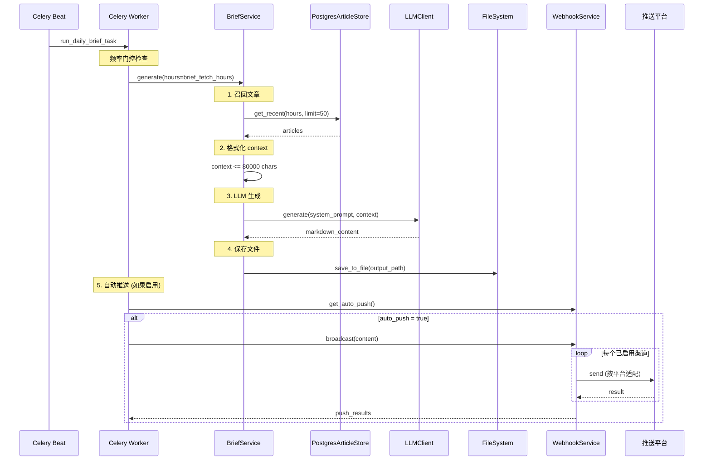

# 日报生成与推送全流程

> 覆盖定时日报生成到多平台 Webhook 广播的完整链路。

---

## 触发机制

日报由 Celery Beat 定时触发（每 5 分钟检查），通过两种模式控制频率：

| 模式 | 配置项 | 行为 |
|------|--------|------|
| daily (默认) | daily_brief_hour (默认 8) | 每天 >= 该时刻后执行一次 |
| interval | brief_interval_hours (默认 8) | 按固定间隔执行 |

```
Celery Beat (crontab */5)
  -> scheduler.tasks.run_daily_brief_task
  -> Redis GET logos:last_daily_brief_run
  -> daily 模式: now.hour >= daily_brief_hour && last_run.date < today
  -> interval 模式: elapsed_hours >= brief_interval_hours
  -> 通过则执行，否则返回 Skipped
```

也可通过 API 手动触发: `POST /api/brief/generate`

---

## 总体流程



---

## 各阶段详解

### 阶段 1: 文章召回

`PostgresArticleStore.get_recent(hours=brief_fetch_hours, limit=50)`
- 获取最近 hours 小时内的文章
- 限制 50 篇
- 按 created_at 排序

### 阶段 2: Context 格式化

- 每篇文章调用 `article.to_context_str()` 格式化为文本
- 总长度控制 <= 80000 字符 (_MAX_CONTEXT_CHARS)
- 超长文章自动截断 (content > 800 截断为前 800 字符)
- 拼接格式: article_1

---

article_2 ...

### 阶段 3: LLM 生成日报

使用结构化日报 Prompt，输出四段式：

```markdown
# 每日新闻简报 — YYYY-MM-DD

## 今日要闻
(3-5条最重要的新闻，每条含标题、来源、一句话摘要)

## 深度分析
(选取 1-2 个值得关注的趋势或事件，200字以内的分析)

## 快讯
(其余新闻标题列表 + 来源)
```

### 阶段 4: 文件保存

`DailyBrief.save_to_file(output_path)`
- 路径: `{output_path}/daily_brief_YYYY-MM-DD.md`
- 格式: Markdown
- 编码: UTF-8

### 阶段 5: 自动推送

`WebhookService.broadcast(content)`:
1. 读取 webhook_config.json
2. 筛选 enabled=true 的渠道
3. 逐个调用平台特定 sender

---

## 平台适配

| 平台 | 方式 | 格式 | 最大长度 |
|------|------|------|---------|
| 飞书 | 群机器人 Webhook | interactive card (markdown) | 30000 |
| 钉钉 | 群机器人 Webhook | markdown | 20000 |
| 企业微信 | 群机器人 Webhook | markdown | 4096 |
| Telegram | Bot API | Markdown parse_mode | 4096 |
| ntfy | HTTP POST | raw markdown | 4096 |

各平台按 _PLATFORM_MAX_LEN 自动截断超长内容。

**配置示例** (webhook_config.json):
```json
{
  "channels": [
    {
      "id": "abc12345",
      "name": "我的飞书群",
      "platform": "feishu",
      "enabled": true,
      "webhook_url": "https://open.feishu.cn/..."
    }
  ],
  "auto_push": true
}
```

---

## 配置项

| 配置项 | 默认值 | 说明 |
|--------|--------|------|
| brief_mode | daily | 日报模式: daily / interval |
| daily_brief_hour | 8 | daily 模式触发时刻 |
| brief_interval_hours | 8 | interval 模式间隔 |
| brief_fetch_hours | 24 | 召回文章时间窗口 |
| output_path | output | 日报文件保存目录 |

---

## 相关文档

- [pipeline-flow.md](pipeline-flow.md) — 文章来源
- [config-flow.md](config-flow.md) — Webhook 配置管理
- [ARCHITECTURE.md](../../ARCHITECTURE.md) §1 — 系统概览
