# 配置管理与启动全流程

> 覆盖从 `.env` 加载到组件实例化的链路：配置加载 -> 工厂构建 -> 前端管理 -> 进程启动。

---

## 总体流程

```mermaid
graph TB
    subgraph "配置来源"
        ENV[.env]
        JSON1[feeds_config.json]
        JSON2[sites_config.json]
        JSON3[webhook_config.json]
    end

    subgraph "配置加载"
        AC[AppConfig]
        CM[ConfigManager]
    end

    subgraph "工厂函数"
        F1[create_article_store]
        F2[create_document_store]
        F3[create_qdrant_vector_index]
        F4[create_llm_client]
        F5[create_embedding_client]
        F6[create_rerank_client]
        F7[create_chunking_service]
        F8[create_agent_session_store]
        F9[create_memory_store]
        F10[create_task_run_store]
        F11[create_redis_state_store]
        F12[create_upload_store]
        F13[create_file_blob_store]
        F14[create_archive_extractor]
        F15[create_document_parser]
        F16[create_structured_extraction_client]
        F17[create_intel_store]
        F18[create_insight_store]
        F19[create_report_store]
        F20[create_judge_client]
        F21[create_auth_store]
        F22[create_config_audit_store]
        F23[create_report_service]
    end

    subgraph "基础设施"
        PG[PostgreSQL 16]
        REDIS[Redis 7]
        QD[Qdrant]
        FS[Local storage]
    end

    ENV --> AC --> CM
    CM --> F1
    CM --> F2
    CM --> F3
    CM --> F4
    CM --> F5
    CM --> F6
    CM --> F7
    CM --> F8
    CM --> F9
    CM --> F10
    CM --> F11
    CM --> F12
    CM --> F13
    CM --> F14
    CM --> F15
    CM --> F16
    CM --> F17
    CM --> F18
    CM --> F19
    CM --> F20
    CM --> F21
    CM --> F22
    CM --> F23

    F1 --> PG
    F2 --> PG
    F3 --> QD
    F8 --> PG
    F8 --> REDIS
    F9 --> PG
    F16 --> AC
    F17 --> PG
    F18 --> PG
    F19 --> PG
    F20 --> AC
    F21 --> PG
    F22 --> PG
    F23 --> F19
    F23 --> F20
    F10 --> PG
    F11 --> REDIS
    F12 --> PG
    F13 --> FS
    F14 --> FS
    F15 --> FS

    JSON1 --> CM
    JSON2 --> CM
    JSON3 --> CM
```



---

## AppConfig

`core/config.py` 负责：

- 从 `.env` 加载配置。
- 使用 pydantic 类型校验。
- 给缺失 API key 发出 warning，但不阻止启动。
- 暴露 PostgreSQL、Redis、Qdrant、上传文件、LLM、Judge、Embedding、Rerank、分块、混合检索、安全和报告质量策略配置。

关键基础设施字段：

| 字段 | 说明 |
|---|---|
| `pg_dsn` | PostgreSQL 连接串 |
| `celery_broker_url` / `celery_result_backend` | Redis/Celery |
| `qdrant_url` | Qdrant REST 地址 |
| `qdrant_api_key` | Qdrant API key，本地可为空 |
| `qdrant_documents_collection` | 文档 collection，默认 `insightforge_documents_v1` |
| `qdrant_distance` | 距离度量，默认 `Cosine` |
| `vector_backend` | 固定为 `qdrant` |
| `embedding_vector_size` | Qdrant vector size |
| `upload_storage_root` | 本地上传文件存储根目录 |
| `upload_max_file_size_mb` | 单文件大小限制 |
| `upload_max_batch_size_mb` | 上传批次大小限制 |
| `upload_max_archive_files` | zip 最大解包文件数 |
| `upload_max_archive_unpacked_mb` | zip 解包后总大小限制 |
| `upload_allowed_extensions` | 允许的上传扩展名 |
| `judge_provider` / `judge_model` | 报告质量 Judge provider 和模型，独立于主 LLM |
| `app_env` / `auth_enabled` / `app_api_keys` | 应用环境与最小 API Key 认证配置 |
| `report_quality_min_score` / `report_quality_auto_publish` | 报告质量阈值与自动发布策略 |

生产环境要求 `APP_ENV=production` 且 `AUTH_ENABLED=true`。应用 API Key 通过 `python -m delivery.cli auth create-key --name <name> --role admin|analyst|viewer` 创建，明文只打印一次，数据库只保存 hash。

---

## ConfigManager

`ConfigManager` 是线程安全单例，缓存：

- `document_store`
- `vector_index`
- `llm_client`
- `embedding_client`
- `rerank_client`
- `structured_extraction_client`
- `judge_client`
- `chunking_service`
- `agent_session_store`
- `memory_store`
- `task_run_store`
- `redis_state_store`
- `upload_store`
- `file_type_detector`
- `file_blob_store`
- `archive_extractor`
- `document_parser`
- `intel_store`
- `insight_store`
- `report_store`
- `auth_store`
- `config_audit_store`

`reload()` 重新读取 `.env` 并按变更字段清理缓存。PostgreSQL DSN 变化会重建 PostgreSQL Store；Redis broker URL 变化会重建 `redis_state_store` 和 `agent_session_store`；Qdrant URL/API key/collection/distance/vector size 变化会重建 `vector_index`；结构化抽取 provider/model/base URL/API key 变化会重建 `structured_extraction_client`；Judge provider/model/base URL/API key 变化会重建 `judge_client` 并使报告服务缓存失效；上传路径、限制或扩展名变化会重建文件存储、解包器和解析器。

配置 API 写入 `.env` 时会：

- 跳过带 `*` 的脱敏 secret，避免把脱敏值写回真实配置。
- 通过 `ConfigAuditService` 写入 `config_audit_log`，记录 actor、action、target、changed_keys、before_masked、after_masked 和 request_id。
- 在 `APP_ENV=production` 下拒绝修改 `APP_ENV`、`AUTH_ENABLED`、`APP_API_KEYS`、`PG_DSN`、`CELERY_*`、`QDRANT_*`、上传路径和存储限制等部署级危险配置。
- 返回 reload 结果和 rebuilt components，但不返回 secret 原文。

生产 Docker Compose 不再通过 `env_file` 让服务隐式读取宿主 `.env`；`docker-compose.prod.yml` 使用显式环境变量映射，并把 `.env` 挂载到 `/app/.env` 作为配置 API 的持久化目标。`docker compose --env-file .env.deploy.example -f docker-compose.prod.yml config` 应只解析示例部署基线，不应混入本地开发 `.env` 或旧 `SUMMARY_*` 配置。

---

## 工厂函数

| 工厂函数 | 返回实现 | 依赖配置 |
|---|---|---|
| `create_document_store` | `PostgresDocumentStore` | `pg_dsn` |
| `create_qdrant_vector_index` | `QdrantVectorIndex` | Qdrant URL/API key/collection/distance/vector size |
| `create_llm_client` | OpenAI Compatible / OpenAI / Gemini / Anthropic | LLM provider 配置 |
| `create_structured_extraction_client` | OpenAI Compatible / OpenAI / Gemini / Anthropic 结构化抽取客户端 | 结构化抽取 provider 配置 |
| `create_judge_client` | OpenAI Compatible / OpenAI / Gemini / Anthropic Judge 客户端 | Judge provider 配置 |
| `create_embedding_client` | `OpenAICompatibleEmbeddingClient` | Embedding API + vector size |
| `create_rerank_client` | `OpenAICompatibleRerankClient` 或 `None` | Rerank 配置 |
| `create_chunking_service` | `ChunkingService` | 分块 token 配置 |
| `create_agent_session_store` | `AgentSessionStore` | PostgreSQL + Redis |
| `create_memory_store` | `MemoryStore` | PostgreSQL |
| `create_task_run_store` | `PostgresTaskRunStore` | `pg_dsn` |
| `create_redis_state_store` | `RedisStateStore` | `celery_broker_url` |
| `create_upload_store` | `PostgresUploadStore` | `pg_dsn` |
| `create_file_blob_store` | `LocalFileBlobStore` | 上传路径、大小限制、扩展名 |
| `create_archive_extractor` | `ArchiveExtractor` | 上传限制、扩展名 |
| `create_document_parser` | `DocumentParser` | 上传扩展名 |
| `create_intel_store` | `PostgresIntelStore` | `pg_dsn` |
| `create_insight_store` | `PostgresInsightStore` | `pg_dsn` |
| `create_report_store` | `PostgresReportStore` | `pg_dsn` |
| `create_auth_store` | `PostgresAuthStore` | `pg_dsn` |
| `create_config_audit_store` | `PostgresConfigAuditStore` | `pg_dsn` |

旧向量 Store 工厂函数不再存在。

---

## 进程模型

```text
基础设施层 (docker compose up -d)
  logos-postgres (:5432) PostgreSQL 16
  logos-redis    (:6379) Redis 7
  logos-qdrant   (:6333) Qdrant REST

应用层
  FastAPI Server  (:8005)
  Celery Worker
  Celery Beat
  Vite Dev Server (:5173)
```

启动顺序：

1. `docker compose up -d` 启动 PostgreSQL、Redis、Qdrant。
2. `python -m delivery.server` 启动 FastAPI。
3. `celery -A scheduler.celery_app worker -l info -P threads` 启动 Worker。
4. `celery -A scheduler.celery_app beat -l info` 启动 Beat。
5. `cd frontend && pnpm dev` 启动前端开发服务器。

---

## 前端配置界面

| 视图 | 管理内容 |
|---|---|
| ConfigView | LLM、Embedding、Rerank、搜索引擎和基础配置 |
| SettingsView | RSS feed、爬虫源和调度参数 |
| WebhookView | 推送渠道 |
| MemoryView | 核心记忆、持久记忆、会话记忆 |

`ConfigView` 现在只对 admin 可见。页面展示 Judge、安全和质量策略配置、reload 结果以及配置审计记录；生产环境危险配置显示为只读。Secret 字段由后端返回脱敏值，前端保存时保留该脱敏值语义，后端不会把包含 `*` 的 secret 当作新明文写回。

`WebhookView` 面向分析报告和竞品情报推送，不再使用新闻简报文案。Webhook URL、Bot Token 等敏感字段在前端列表中脱敏显示；新增、测试、推送、删除等写操作只对 admin 显示，最终仍由后端权限依赖校验。

---

## 相关文档

- [pipeline-flow.md](pipeline-flow.md)
- [query-flow.md](query-flow.md)
- [ARCHITECTURE.md](../../ARCHITECTURE.md)
- [intergrations.md](../design-docs/intergrations.md)
