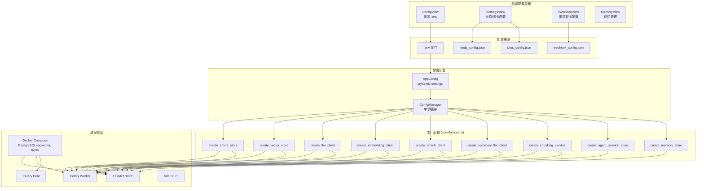

# 配置管理与启动全流程

> 覆盖从 .env 加载到组件实例化的完整链路：配置加载 -> 工厂构建 -> 前端管理 -> 进程启动。

---

## 总体流程



---

## 配置加载详解

### AppConfig (pydantic-settings)

`core/config.py` 定义所有配置项：
- 从 .env 文件自动加载
- pydantic 类型校验 + field_validator
- 空 API Key 发出警告但不阻止启动

配置域：

| 域 | 配置项数 | 说明 |
|----|---------|------|
| LLM | 9 | provider, api_key, base_url, model (主 + 摘要独立配置) |
| Embedding | 3 | api_key, base_url, model |
| Rerank | 4 | enabled, api_key, base_url, model, top_k_multiplier |
| 存储 | 3 | pg_dsn, markdown_output_path, output_path |
| 调度 | 6 | fetch_interval, daily_brief_hour, brief_mode 等 |
| 分块 | 3 | max_child_tokens, target_parent_tokens, overlap_tokens |
| 混合检索 | 5 | enabled, rrf_k, vector_weight, keyword_weight 等 |

### ConfigManager 单例

`core/config_manager.py`:
- 首次获取时创建并缓存所有组件实例
- `reload()` 方法重新加载 .env 并重建实例
- 线程安全

---

## 工厂函数

| 工厂函数 | 返回实现 | 依赖配置 |
|---------|---------|---------|
| create_article_store | PostgresArticleStore | pg_dsn |
| create_vector_store | PgVectorStore | pg_dsn, embedding_vector_size |
| create_llm_client | OpenAICompatibleClient / OpenAIClient / GeminiClient / AnthropicClient | llm_provider, api_key, base_url, model |
| create_embedding_client | OpenAICompatibleEmbeddingClient | embedding_api_key, base_url, model |
| create_rerank_client | OpenAICompatibleRerankClient 或 None | rerank_enabled, api_key, base_url, model |
| create_summary_llm_client | LLMClient (复用或独立) | summary_use_same_llm, summary_* 配置 |
| create_chunking_service | ChunkingService | chunk_max_child_tokens 等 |
| create_agent_session_store | AgentSessionStore | pg_dsn, celery_broker_url |
| create_memory_store | MemoryStore | pg_dsn |

**LLM 多后端切换**：通过 `llm_provider` 配置项在 4 种后端间切换，工厂函数使用 match/case 选择对应实现。

---

## 前端配置界面

| 视图 | 路由 | 管理内容 | 后端路由 |
|------|------|---------|---------|
| ConfigView | /config | .env 中的 LLM/Embedding/Rerank/存储参数 | config_router |
| SettingsView | /settings | feeds_config.json + sites_config.json | settings_router |
| WebhookView | /webhook | webhook_config.json (渠道 CRUD + auto_push) | webhook_router |
| MemoryView | /memory | 核心记忆/持久记忆/会话管理 | memory_router |

---

## 进程模型

```
基础设施层 (docker compose up -d)
  容器 1: logos-postgres (:5432) — PostgreSQL 16 + pgvector
  容器 2: logos-redis    (:6379) — Celery Broker

应用层 (start_dev.bat 或手动)
  进程 1: FastAPI Server  (:8005) — delivery/server.py
  进程 2: Celery Worker             — scheduler/celery_app.py worker
  进程 3: Celery Beat               — scheduler/celery_app.py beat
  进程 4: Vite Dev Server (:5173)   — frontend/ (开发模式)
```

### 启动流程

1. `docker compose up -d` — 启动 PostgreSQL + Redis
2. `python -m delivery.server` — 启动 FastAPI
   - startup 事件: 注册 6 个内置 Agent 工具
   - structlog 中间件: 注入 request_id + client_ip
   - 检查前端构建产物，有则生产模式，无则 API 模式
3. `celery -A scheduler.celery_app worker` — 启动 Worker
4. `celery -A scheduler.celery_app beat` — 启动 Beat (定时触发)

### 进程间通信

- FastAPI <-> Worker: Redis Broker (任务投递 + 状态轮询)
- 所有进程 <-> 数据: PostgreSQL (共享数据库)
- 前端 <-> 后端: HTTP/SSE (Axios)

---

## 热重载

`ConfigManager.reload()`:
- 重新读取 .env 文件
- 重建所有工厂创建的组件实例
- Celery Worker 在每次任务执行前调用 reload() 确保使用最新配置
- 前端 ConfigView 保存配置后自动触发

---

## 相关文档

- [pipeline-flow.md](pipeline-flow.md) — Celery Worker 使用配置
- [query-flow.md](query-flow.md) — FastAPI 服务配置
- [ARCHITECTURE.md](../../ARCHITECTURE.md) §8 — 配置管理
- [ARCHITECTURE.md](../../ARCHITECTURE.md) §10 — 进程模型
