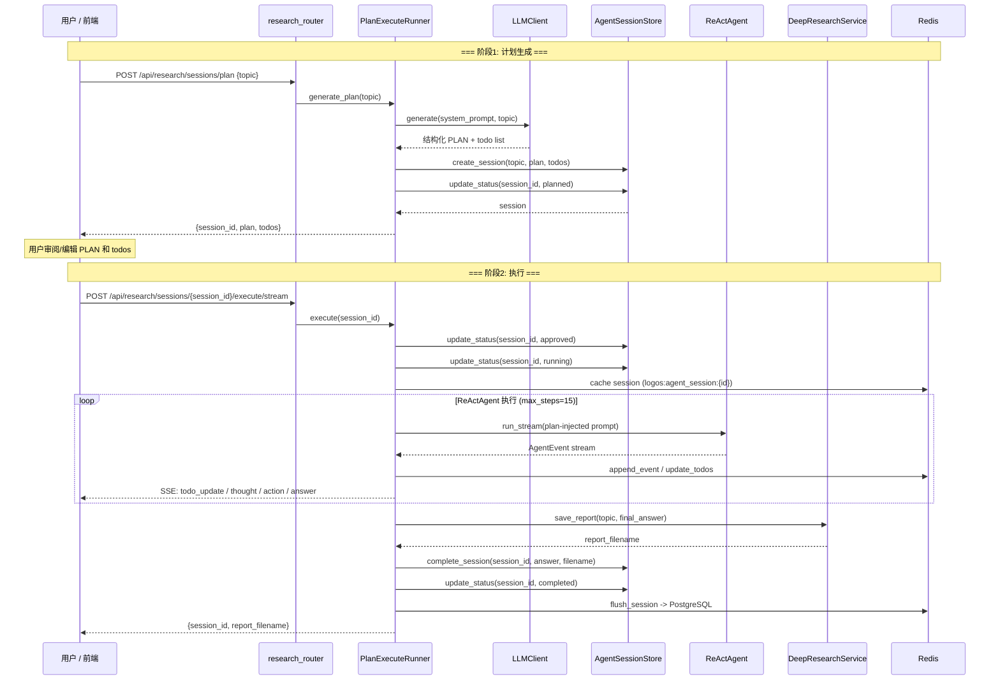
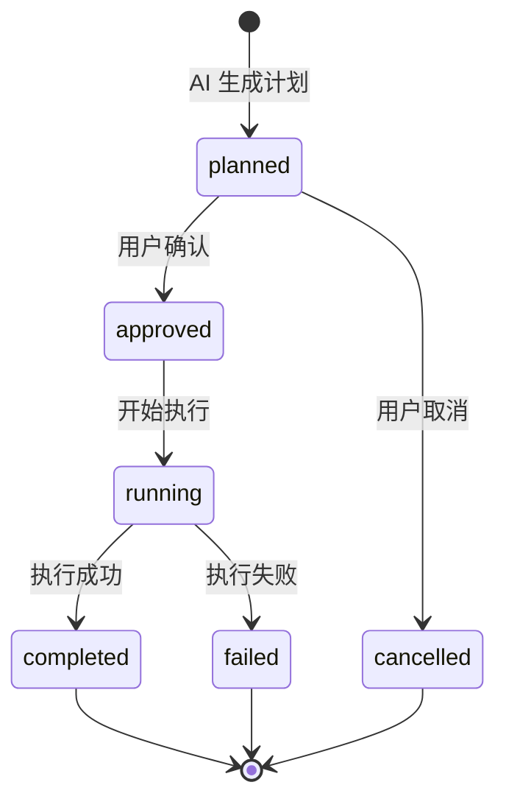

# Plan-Execute 深度研究全流程

> 覆盖从提交研究主题到报告保存的两阶段研究链路。

---

## 总体流程

---

## 两阶段详解

### 阶段 1: 计划生成 (Plan Generation)

**端点**: `POST /api/research/sessions/plan`

`PlanExecuteRunner.generate_plan(topic)`:
1. LLM 调用 build_research_plan_prompt 生成结构化研究计划
2. 计划包含：
   - plan: 研究目标、范围、方法
   - todos: 待执行步骤列表 (id/title/status)
3. 写入 PostgreSQL agent_sessions:
   - session_type = "research_plan_execute"
   - status = "planned"
   - plan = 结构化 JSON
   - todos = 步骤列表
4. 返回 session_id + plan + todos 给前端展示

**前端交互**：
- 展示可编辑的 PLAN 文本
- 展示可勾选/编辑/删除的 todo list
- 用户点击"确认并执行"

### 阶段 2: 执行 (Execute)

**端点**: `POST /api/research/sessions/{session_id}/execute/stream`

生产或启用认证时，前端执行 SSE 请求必须携带 `Authorization: Bearer <api_key>`，并通过 analyst 权限校验。

`PlanExecuteRunner.execute(session_id)`:
1. 状态切换: planned -> approved -> running
2. 将用户确认后的 PLAN + todos 注入 system prompt
3. 创建 ReActAgent(max_steps=15)，使用 build_plan_execute_research_prompt
4. 流式执行 ReAct 循环，SSE 推送事件:
   - todo_update: 步骤状态变更时实时推送
   - thought/action_start/action_result: 推理和工具调用
   - answer: 最终研究报告
5. 执行完成:
   - DeepResearchService.save_report() -> output/research/research_YYYY-MM-DD_HHMMSS_topic.md
   - AgentSessionStore.complete_session() 写入 final_answer + report_filename
   - status = "completed"
   - Redis 缓存 flush 到 PostgreSQL

---

## 状态流转

---

## 会话缓存策略

| 操作 | 存储 |
|------|------|
| 计划生成 | 直接写入 PostgreSQL |
| 用户保存计划 | PostgreSQL upsert |
| 状态切换 | PostgreSQL upsert |
| 执行中 events/messages/todos | 优先 Redis (logos:agent_session:{id})，不可用时写 PostgreSQL |
| 终态 (completed/failed/cancelled) | Redis flush 到 PostgreSQL |

---

## 与通用问答的差异

| 维度 | 通用问答 | 深度研究 |
|------|---------|---------|
| max_steps | 5 | 15 |
| system prompt | build_react_system_prompt | build_plan_execute_research_prompt |
| 前置阶段 | 无 | 计划生成 + 用户审阅 |
| 进度展示 | 仅 thought/action | + todo_update 实时进度 |
| 输出持久化 | 无 | 报告文件 + session 记录 |
| session_type | general_query | research_plan_execute |

---

## 兼容接口

前端默认使用 Plan Execute 两阶段接口：`POST /api/research/sessions/plan` 生成计划，`PUT /api/research/sessions/{session_id}/plan` 保存用户调整，`POST /api/research/sessions/{session_id}/execute/stream` 流式执行。

深度研究完成后仍由 `DeepResearchService.save_report()` 保存为 `output/research/*.md` 文件报告。该产物不自动写入 `analysis_reports`，也不自动进入报告质量门禁；需要质量审查、证据侧栏、审批和发布时，应通过 Reports 工作流生成或查看受治理的结构化分析报告。

---

## 相关文档

- [query-flow.md](query-flow.md) — 通用问答流程
- [memory-flow.md](memory-flow.md) — 会话记忆管理
- [ARCHITECTURE.md](../../ARCHITECTURE.md) §6 — Agent 智能体层
