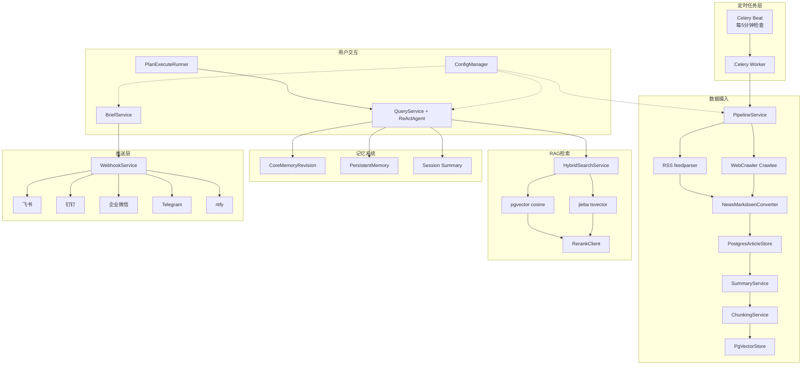

# Logos 核心流程文档索引

> 本目录包含 Logos 项目所有核心功能域的全生命周期流程文档。每篇文档覆盖一个功能域的完整链路（触发→执行→输出→持久化），采用 Mermaid 图表 + 架构级步骤说明。

---

## 系统全景

---

## 流程文档清单

| # | 文档 | 覆盖功能域 | 核心组件 |
|---|------|-----------|---------|
| 1 | [pipeline-flow.md](pipeline-flow.md) | 定时数据摄入管线 | PipelineService, PostgresArticleStore, SummaryService, ChunkingService, PgVectorStore |
| 2 | [query-flow.md](query-flow.md) | ReAct Agent 问答 | QueryService, ReActAgent, ToolRegistry, StreamingReActParser |
| 3 | [deep-research-flow.md](deep-research-flow.md) | Plan-Execute 深度研究 | PlanExecuteRunner, ReActAgent, DeepResearchService, AgentSessionStore |
| 4 | [brief-flow.md](brief-flow.md) | 日报生成与推送 | BriefService, WebhookService, DailyBrief |
| 5 | [search-flow.md](search-flow.md) | 混合检索 RAG | HybridSearchService, PgVectorStore, PostgresArticleStore, RerankClient |
| 6 | [memory-flow.md](memory-flow.md) | 三层记忆系统 | MemoryService, MemoryStore, AgentSessionStore |
| 7 | [config-flow.md](config-flow.md) | 配置管理与启动 | AppConfig, ConfigManager, factory.py, 前端配置视图 |

---

## 跨流程关系

| 关系 | 说明 |
|------|------|
| Pipeline -> Query | Pipeline 摄入的文章是 Query Agent query_knowledge_base 工具的数据源 |
| Pipeline -> Brief | Pipeline 摄入的文章是日报生成的素材 |
| Query -> Search | Agent 问答的 query_knowledge_base 工具调用混合检索 |
| Query -> Memory | 每次问答后触发会话压缩和持久记忆候选提取 |
| Query <-> Research | 深度研究复用 ReActAgent，差异在 system prompt 和 max_steps |
| Brief -> Webhook | 日报自动推送到配置的 Webhook 渠道 |
| Config -> All | 所有流程依赖 ConfigManager 获取组件实例和配置参数 |

---

## 相关文档

- [ARCHITECTURE.md](../../ARCHITECTURE.md) — 项目架构全景
- [docs/DESIGN.md](../DESIGN.md) — 设计哲学
- [docs/design-docs/](../design-docs/index.md) — 详细设计文档
- [docs/product-specs/](../product-specs/) — 产品规格