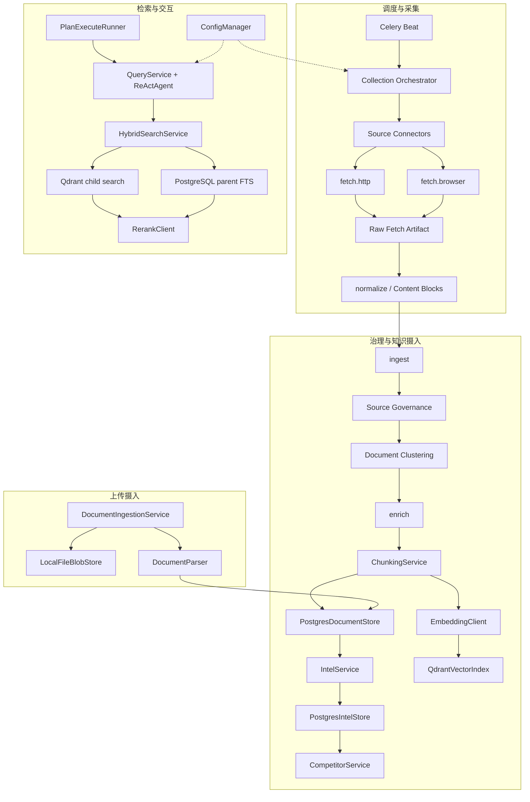

# InsightForge 核心流程文档索引

> 本目录包含核心功能域的全生命周期流程文档。每篇文档覆盖一个功能域的完整链路：触发 -> 执行 -> 输出 -> 持久化。

## 系统全景

## 流程文档清单

| # | 文档 | 覆盖功能域 | 核心组件 |
|---|---|---|---|
| 1 | [pipeline-flow.md](pipeline-flow.md) | 来源级采集、规范化、治理与知识摄入 | Collection Orchestrator, Source Connectors, Fetch Engines, Normalize, Document Clustering, Enrich |
| 2 | [query-flow.md](query-flow.md) | ReAct Agent 问答 | QueryService, ReActAgent, ToolRegistry, StreamingReActParser |
| 3 | [deep-research-flow.md](deep-research-flow.md) | Plan-Execute 深度研究 | PlanExecuteRunner, ReActAgent, DeepResearchService, AgentSessionStore |
| 5 | [search-flow.md](search-flow.md) | 混合检索 RAG | HybridSearchService, QdrantVectorIndex, PostgresDocumentStore, RerankClient |
| 6 | [memory-flow.md](memory-flow.md) | 三层记忆系统 | MemoryService, MemoryStore, AgentSessionStore |
| 7 | [config-flow.md](config-flow.md) | 配置管理与启动 | AppConfig, ConfigManager, factory.py, 前端配置视图 |
| 8 | [document-ingestion-flow.md](document-ingestion-flow.md) | 上传文档摄入 | UploadStore, LocalFileBlobStore, ArchiveExtractor, DocumentParser, DocumentIngestionService |

## 跨流程关系

| 关系 | 说明 |
|---|---|
| Collection -> Governance | accepted Normalized Document 才能进入来源准入和 Document Cluster |
| Collection -> Search | 新簇或晋升版本写入 PostgreSQL 父块和 Qdrant 子块 point，供混合检索使用 |
| Collection -> Intel Facts | active Document Version 完成向量化后抽取 Intel Fact 并绑定 Evidence Reference |
| Document Ingestion -> Search | 上传文档解析后复用父子分块和 Qdrant 索引链路 |
| Search -> Query | `search_evidence` 通过 HybridSearchService 获取带过滤下推的父块证据上下文 |
| Query -> Memory | 问答后触发会话压缩和持久记忆候选提取 |
| Query <-> Research | 深度研究复用 ReActAgent，差异在 system prompt 和 max_steps |
| Report -> Webhook | 最新分析报告推送到配置的 Webhook 渠道 |
| Config -> All | 所有流程依赖 ConfigManager 获取组件实例和配置参数 |
| Tasks -> Collection/Report/Upload | `/tasks` 读取 PostgreSQL 权威任务历史，承接采集、报告和上传批次阶段追踪 |

## 前端工作台入口

前端以 `/dashboard` 为入口，并通过 `/reports`、`/intel`、`/competitors`、`/tasks`、`/query`、`/config`、`/governance` 和 `/webhook` 串联情报生产线。Collection Run 触发后进入 Tasks 追踪，来源异常和清洗 review_required 进入 Governance，报告生成后进入 Reports 查看质量、证据和审计。

## 相关文档

- [ARCHITECTURE.md](../../ARCHITECTURE.md)
- [docs/DESIGN.md](../DESIGN.md)
- [docs/design-docs/](../design-docs/index.md)
- [docs/product-specs/](../product-specs/)
