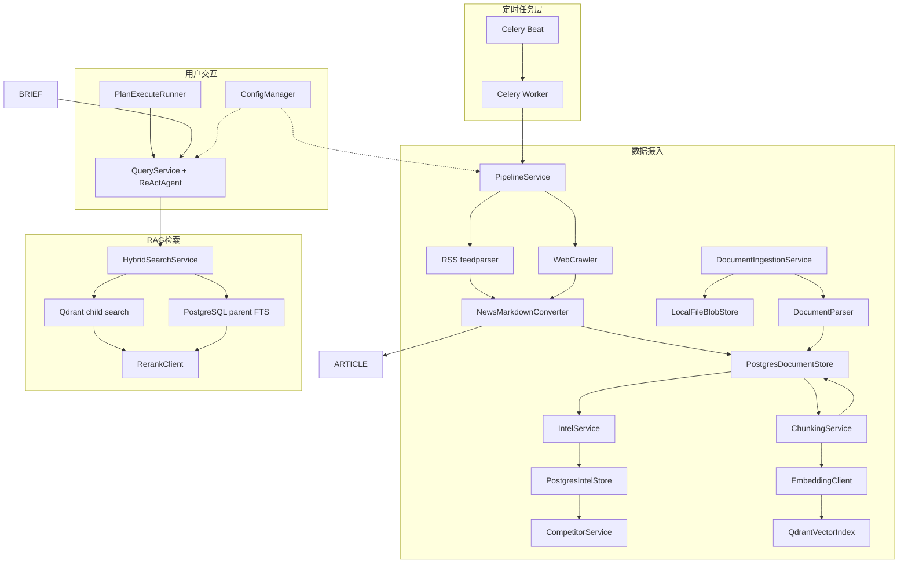

# InsightForge 核心流程文档索引

> 本目录包含核心功能域的全生命周期流程文档。每篇文档覆盖一个功能域的完整链路：触发 -> 执行 -> 输出 -> 持久化。

---

## 系统全景

---

## 流程文档清单

| # | 文档 | 覆盖功能域 | 核心组件 |
|---|---|---|---|
| 1 | [pipeline-flow.md](pipeline-flow.md) | 定时数据摄入管线 | PipelineService, PostgresDocumentStore, ChunkingService, QdrantVectorIndex, IntelService, CompetitorService |
| 2 | [query-flow.md](query-flow.md) | ReAct Agent 问答 | QueryService, ReActAgent, ToolRegistry, StreamingReActParser |
| 3 | [deep-research-flow.md](deep-research-flow.md) | Plan-Execute 深度研究 | PlanExecuteRunner, ReActAgent, DeepResearchService, AgentSessionStore |
| 5 | [search-flow.md](search-flow.md) | 混合检索 RAG | HybridSearchService, QdrantVectorIndex, PostgresDocumentStore, RerankClient |
| 6 | [memory-flow.md](memory-flow.md) | 三层记忆系统 | MemoryService, MemoryStore, AgentSessionStore |
| 7 | [config-flow.md](config-flow.md) | 配置管理与启动 | AppConfig, ConfigManager, factory.py, 前端配置视图 |
| 8 | [document-ingestion-flow.md](document-ingestion-flow.md) | 上传文档摄入 | UploadStore, LocalFileBlobStore, ArchiveExtractor, DocumentParser, DocumentIngestionService |

---

## 跨流程关系

| 关系 | 说明 |
|---|---|
| Pipeline -> Search | Pipeline 写入 PostgreSQL 父块和 Qdrant 子块 point，供混合检索使用 |
| Pipeline -> Intel Facts | Pipeline 在向量化后抽取 `IntelFact` 和 `EvidenceRef`，并执行 fact 级竞品关联 |
| Document Ingestion -> Search | 上传文档解析为 SourceDocument 后复用父子分块和 Qdrant 索引链路 |
| Search -> Query | `search_evidence` 通过 HybridSearchService 获取带过滤下推的父块证据上下文 |
| Query -> Memory | 问答后触发会话压缩和持久记忆候选提取 |
| Query <-> Research | 深度研究复用 ReActAgent，差异在 system prompt 和 max_steps |
| Report -> Webhook | 最新分析报告推送到配置的 Webhook 渠道 |
| Config -> All | 所有流程依赖 ConfigManager 获取组件实例和配置参数 |
| Tasks -> Pipeline/Report/Upload | `/tasks` 读取 `task_runs/task_stages/task_events`，承接 Pipeline、报告和上传批次的阶段追踪 |

## 前端工作台入口

Phase 4 后前端以 `/dashboard` 为入口，并通过 `/reports`、`/intel`、`/competitors`、`/tasks`、`/query`、`/config` 和 `/webhook` 串联情报生产线。Pipeline 触发后进入 Tasks 追踪，报告生成后进入 Reports 查看质量、证据和审计，Query 生成结构化报告后跳转 Reports。

---

## 相关文档

- [ARCHITECTURE.md](../../ARCHITECTURE.md)
- [docs/DESIGN.md](../DESIGN.md)
- [docs/design-docs/](../design-docs/index.md)
- [docs/product-specs/](../product-specs/)
