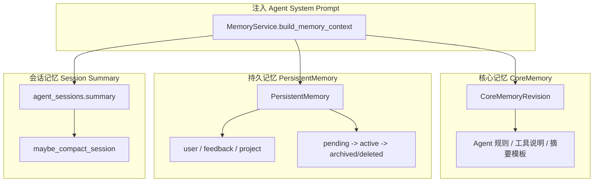
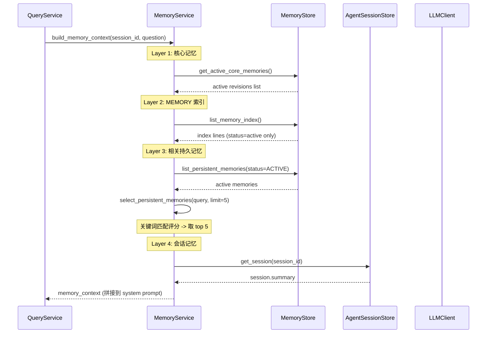
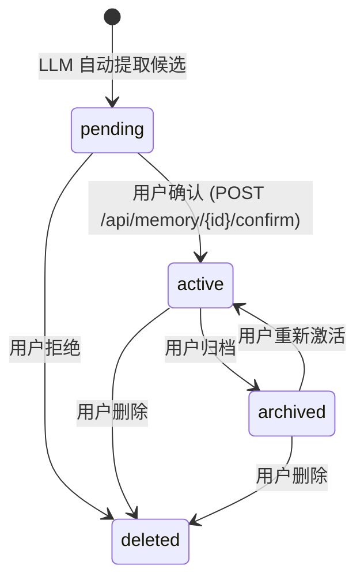

# 三层记忆系统全流程

> 覆盖核心记忆、持久记忆、会话记忆的完整生命周期：构建 -> 注入 -> 更新 -> 候选提取。

---

## 三层记忆架构



---

## 记忆注入流程



---

## 核心记忆 (CoreMemoryRevision)

存储在 `core_memory_revisions` 表：

| 字段 | 说明 |
|------|------|
| kind | 记忆类型 (如 agent_rules, tool_descriptions) |
| title | 记忆标题 |
| content | 记忆内容 |
| revision | 版本号 |
| status | active / inactive |

**版本化策略**：
- 更新时创建新 revision，旧 revision 标记为 inactive
- 不物理删除，保留完整历史
- `get_active_core_memories()` 只返回 status=active 的版本

---

## 持久记忆 (PersistentMemory)

存储在 `persistent_memories` 表：

### 记忆类型

| 类型 | 内容 | 示例 |
|------|------|------|
| user | 用户偏好、背景、工作方式 | "用户偏好简洁回复，不需要解释性前言" |
| feedback | 对回答质量、格式、工具的反馈 | "用户反馈检索结果太多需要控制数量" |
| project | 需要持续跟踪的目标、决策、约束 | "正在跟踪特斯拉 FSD 在中国的落地进展" |

### 生命周期



### MEMORY 索引

从 status=active 的持久记忆生成：
```
- [feedback-concise] - 回复保持简洁
- [project-tesla-fsd] - 跟踪特斯拉 FSD 在中国进展
```

### 候选提取

每次问答后触发 `MemoryService.extract_persistent_memory_candidates()`：
1. LLM 分析最近一轮 question + answer
2. 提取最多 3 条候选
3. 写为 status=pending
4. 前端 MemoryView 展示 pending 候选
5. 用户逐个确认/拒绝

### 去重机制

`_is_duplicate_candidate()`:
- 对候选的 title + summary + content 做关键词归一化
- 与已有 pending/active 记忆比较
- 完全匹配或子串包含 (>=20 字符) 时跳过

---

## 会话记忆 (Session Summary)

### 压缩触发条件

`MemoryService.maybe_compact_session(session_id)`:

| 条件 | token 阈值 | 说明 |
|------|-----------|------|
| 首次压缩 | 10000 | 会话消息达到 10k token |
| 后续更新 | last_compacted + 5000 | 上次压缩后新增 5k token |
| 连续失败退避 | last_compacted + 10000 | compact_failures >= 3 时 |

### 压缩流程

1. 估算 messages 的 token 数
2. 检查是否超过阈值
3. LLM 生成会话摘要 (基于 existing_summary + messages + events)
4. 更新 agent_sessions.summary
5. 重置 compact_failures = 0 (成功时)

### 失败处理

- 每次压缩失败: compact_failures += 1
- compact_failures >= 3: 更新间隔退避到 10k token
- 退避期间仍然尝试压缩，成功后重置

---

## 存储

所有记忆以 PostgreSQL 为准，Redis 可缓存 MEMORY 索引：

| 表 | 内容 | 缓存 |
|----|------|------|
| core_memory_revisions | 核心记忆版本 | 无 |
| persistent_memories | 持久记忆 | 无 |
| agent_sessions.summary | 会话摘要 | Redis logos:agent_session:{id} |

---

## API 路由

| 端点 | 方法 | 用途 |
|------|------|------|
| /api/memory/core | GET | 获取核心记忆列表 |
| /api/memory/core | POST | 创建核心记忆 revision |
| /api/memory/persistent | GET | 获取持久记忆列表 |
| /api/memory/persistent/{id}/confirm | POST | 确认 pending 记忆 (-> active) |
| /api/memory/persistent/{id} | DELETE | 删除记忆 |
| /api/memory/sessions | GET | 获取会话列表 |
| /api/memory/sessions/{id} | GET | 获取会话详情 |

---

## 配置项

| 配置项 | 默认值 | 说明 |
|--------|--------|------|
| SESSION_COMPACT_INITIAL_TOKENS | 10000 | 首次压缩阈值 |
| SESSION_COMPACT_INCREMENT_TOKENS | 5000 | 后续压缩增量 |
| SESSION_COMPACT_BACKOFF_TOKENS | 10000 | 失败退避阈值 |

---

## 相关文档

- [query-flow.md](query-flow.md) — 记忆注入到 Agent prompt
- [ARCHITECTURE.md](../../ARCHITECTURE.md) §6 — 三层记忆系统
- [db-schema.md](../generated/db-schema.md) — 三层记忆系统表结构
