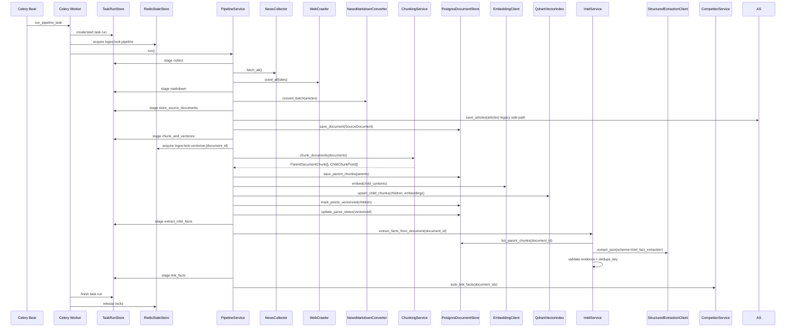

# Pipeline 定时管线全流程

> 覆盖从 Celery Beat 触发到文档可被检索的完整摄入链路。

---

## 触发机制

Pipeline 由 Celery Beat 定时触发，每 5 分钟检查一次，通过 Redis 频率门控保证实际执行间隔：

```text
Celery Beat
  -> scheduler.tasks.run_pipeline_task
  -> Redis lock logos:lock:pipeline
  -> Redis GET logos:last_pipeline_run
  -> elapsed_hours >= fetch_interval_hours
  -> task_runs/task_stages/task_events
  -> PipelineService.run()
```

也可通过 CLI 或 API 手动触发：

- CLI: `python -m delivery.cli pipeline`
- API: `POST /api/intel/pipeline` 先创建 `task_runs`，再用同一个 ID 作为 Celery `task_id`，前端轮询 `GET /api/tasks/{task_id}`。

`GET /api/tasks` 返回任务历史列表，`GET /api/tasks/{task_id}` 同时返回 PostgreSQL run/stages/events 和 Celery 状态。前端手动触发 Pipeline 后跳转 `/tasks?task_id=...` 查看阶段进度；Dashboard 也优先读取任务列表展示最近失败任务。Redis 热状态仅用于执行期展示和锁保护，不作为长期任务历史。

---

## 总体流程



`extract_intel_facts` 和 `link_facts` 是当前 full pipeline 运行路径的一部分；旧 `summary` 阶段不再出现。新增 facts/claims API 只读取和创建结构化业务对象，不替代 Qdrant 子块 + PostgreSQL 父块的 RAG evidence 检索路径。

---

## 阶段说明

### 1. 数据采集

`NewsCollector.fetch_all()` 读取 `data/feeds_config.json` 并发抓取 RSS/Atom。`WebCrawler.crawl_all()` 读取 `data/sites_config.json` 抓取网页。单源失败只记录错误，不中断其他来源。

### 2. Markdown 转换

`NewsMarkdownConverter.convert_batch()` 将 HTML 正文转为标准化 Markdown，保留标题层级、来源 metadata、语言、发布时间和低质量页面识别结果。

### 3. 文档入库

Pipeline 将抓取内容转换为 `SourceDocument` 并写入 `source_documents`。旧 `articles` 旁路、摘要状态推进和新闻列表 API 已删除，full pipeline 只通过 SourceDocument、parent chunks、Qdrant child chunks、facts 和 fact links 推进。

### 4. 文档化

`SourceDocument` 字段来源：

- `source_type`: `rss` 或 `web`
- `document_type`: `article`
- `title`、`content`、`url`、`language`、`published_at`
- `metadata`
- `competitor_ids`、`product_ids`

`PostgresDocumentStore.save_document()` 保存到 `source_documents`，文档进入 `parsed` 状态。

### 5. 父子分块

`ChunkingService.chunk_documents()` 输出：

- `ChildChunkPoint`：子块，`<=512` tokens，写入 Qdrant。
- `ParentDocumentChunk`：父块，约 `1024` tokens，写入 PostgreSQL。

保证：

- Markdown-aware section parsing。
- `heading_path`、`doc_name`、`source`、`url`、`document_type`、`competitor_ids`、`product_ids`、`language` metadata 全链路保留。
- 父块由连续子块组成，不拆碎子块。
- 相邻父块共享尾部子块实现约 `100` tokens overlap。
- 每个子块只有一个主 `parent_chunk_id`。
- 短文档仍生成一个父块和至少一个子块。

### 6. 父块与 point 状态写入

`PostgresDocumentStore.save_parent_chunks()` 写入 `document_parent_chunks`：

- 父块正文。
- `child_point_ids`，包含 overlap 关系。
- `search_vector`，用于 PostgreSQL 全文搜索。

`document_vector_points` 保存 Qdrant point 状态，不保存 embedding 或子块正文。

### 7. 子块向量化与 Qdrant upsert

`EmbeddingClient.embed()` 对子块正文生成 embedding。`QdrantVectorIndex.upsert_child_chunks()` 写入：

- vector：子块 embedding。
- payload：子块正文和 metadata。

point id 格式：

```text
{document_id}:c:{chunk_index}
```

成功后 `PostgresDocumentStore.mark_points_vectorized()` 将对应 point 标为 `vectorized`，并将文档 `parse_status` 推进到 `vectorized`；失败则 `mark_points_vector_failed()` 和文档 `failed` 状态记录错误。

`chunk_and_vectorize` 阶段会写入 `chunk`、`embed`、`qdrant_upsert` 和 `mark_vectorized` 事件。若 Embedding 或 Qdrant 失败，已知 point 会尽力标记为 failed，任务阶段记录错误；Redis 不可用时仅跳过锁和热状态，PostgreSQL 任务历史仍写入。

### 8. 结构化事实抽取

`extract_intel_facts` 对成功向量化的文档调用 `IntelService.extract_facts_from_document()`：

- 输入为 `SourceDocument` 和 `PostgresDocumentStore.list_parent_chunks(document_id)` 返回的父块。
- AI 调用只走 `StructuredExtractionClientProtocol.extract_json()`，不回退到主 `LLMClientProtocol`。
- 输出 JSON 固定为 `{"facts": [...]}`；每个 fact 必须绑定至少一个有效 `parent_chunk_id` evidence。
- `dedupe_key` 由 `source_document_id + fact_type + subject + predicate + object + event_date` 规范化生成，重跑时复用/更新同一 fact。
- Redis 可缓存抽取结果：`logos:intel_extract:{document_id}:{extraction_version}`；Redis 不可用时仍写 PostgreSQL。

### 9. Fact 级竞品关联

`link_facts` 调用 `CompetitorService.auto_link_facts(document_ids=...)`，基于竞品名称、aliases、产品名称与 `fact.subject/object/fact_text` 做规则归因，写入 `intel_fact_competitors` / `intel_fact_products`。

竞品 API 的 `/api/competitors/{id}/facts` 和 `/api/competitors/{id}/timeline` 读取 fact 聚合结果；旧 `/api/competitors/{id}/intel` 已删除。

---

## 状态生命周期

文章列表层仍保留旧 UI/API 状态：

```text
stored -> pending_summary -> summarized -> embedded
```

文档层使用：

```text
pending -> parsed -> chunked -> vectorized
                     \-> failed
```

---

## 配置项

| 配置项 | 默认值 | 说明 |
|---|---|---|
| `fetch_interval_hours` | 4 | Pipeline 执行间隔 |
| `max_articles_per_fetch` | 20 | 单次采集最大文章数 |
| `chunk_max_child_tokens` | 512 | 子块最大 token |
| `chunk_target_parent_tokens` | 1024 | 父块目标 token |
| `chunk_overlap_tokens` | 100 | 父块 overlap token |
| `embedding_vector_size` | 1536 | Qdrant vector size |
| `qdrant_documents_collection` | `insightforge_documents_v1` | Qdrant 文档 collection |
| `structured_extraction_provider` | `openai_compatible` | 结构化事实抽取 provider |
| `structured_extraction_model` | 配置决定 | 结构化事实抽取模型 |
| `structured_extraction_base_url` | 配置决定 | 结构化事实抽取 API 地址 |

---

## 错误处理

| 阶段 | 失败后果 |
|---|---|
| 采集 | 记录错误，继续其他来源 |
| Markdown 转换 | 跳过失败文章或保留原文入库 |
| 文档保存 | 当前文档无法进入分块 |
| 分块 | 当前文档无法检索，保留错误日志 |
| Embedding | point 标记 failed，可重试 |
| Qdrant upsert | point 标记 failed，不伪装成功 |
| 事实抽取 | 不创建半结构化 fact，记录阶段错误，文档 RAG 仍可用 |
| Fact 关联 | 不影响已生成 fact/evidence，记录阶段错误 |

---

## 相关文档

- [search-flow.md](search-flow.md)
- [config-flow.md](config-flow.md)
- [db-schema.md](../generated/db-schema.md)
- [ARCHITECTURE.md](../../ARCHITECTURE.md)
