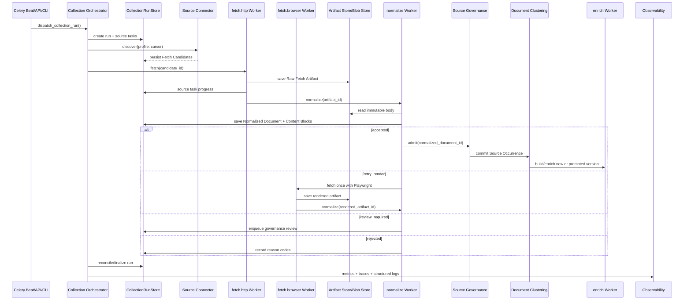

# 来源采集与知识摄入全流程

> 目标流程：从来源级调度、内容发现和抓取，到规范化、归簇、版本构建与知识增强。
>
> 详细设计：[来源采集与内容清洗](../design-docs/collection-and-normalization.md)

## 触发与汇合

Celery Beat 不再启动一个带全局锁的长 Pipeline，也不再使用统一 `fetch_interval_hours` 门控所有来源。它周期性调用 Collection Orchestrator，查询 `next_due_at` 已到期且可运行的 Source Profile，为每个来源创建 Source Fetch Task 并扇出执行。

```text
Celery Beat
  -> dispatch_collection_run
  -> PostgreSQL: create Collection Run
  -> PostgreSQL: select due Source Profiles
  -> PostgreSQL: create Source Fetch Tasks
  -> Celery: dispatch one task per source
  -> PostgreSQL: aggregate authoritative task states
  -> finalize_collection_run
```

Collection Run 的 fan-in 由 PostgreSQL 状态机完成，不把 Celery chord callback 或 Redis result backend 当作唯一完成信号。来源任务允许 partial failure；单个来源失败不阻塞其他来源产物继续处理。

CLI 和 API 手动触发也创建同一 Collection Run，不绕过来源级幂等、限速、任务状态和审计。

## 总体时序



## 阶段说明

### 1. 来源调度

每个 Source Profile 独立维护 `next_due_at`、业务优先级、请求间隔、并发范围、渲染策略、持久化 cursor、ETag/Last-Modified、连续失败和冷却状态。

- 连续无变化：逐步延长间隔。
- 发现更新：缩短间隔。
- 429/403/高超时：降并发并冷却。
- 关键来源：设置最大允许陈旧时间。
- Redis 不可用：普通静态来源保守降级；Playwright 和严格限速来源暂停。

### 2. 内容发现

`SourceConnectorProtocol` 实现只产生 Fetch Candidate：

- RssConnector：RSS/Atom entry。
- SitemapConnector：sitemap/index。
- ListingConnector：列表页、分页和 cursor。
- ApiConnector：官方 JSON/GraphQL/API。
- SearchConnector：站内搜索或受控 Web 搜索。

大多数来源使用声明式配置，复杂来源使用专用 Connector。Fetch Engine 不进行无边界站点遍历。

### 3. 内容获取

`HttpFetchEngine` 使用异步 `httpx` 获取静态 HTML、Feed、JSON、PDF 和显式允许的附件。`BrowserFetchEngine` 使用 Playwright，只处理 `render_required` 或一次 `retry_render`。

抓取前使用规范化 URL、cursor 和 HTTP 条件请求；304 不创建新 body。200 响应保存为 Raw Fetch Artifact，计算 body SHA-256。相同 body 可复用已有规范化结果。

### 4. Artifact 保存

PostgreSQL 保存 artifact metadata、HTTP header、状态、hash 和生命周期；Blob Store 保存压缩 body。Celery 消息只传 artifact ID。

- 普通 Raw Fetch Artifact body 保留 24 小时。
- 形成 Document Version 或 Evidence Reference 后晋升为 Retained Fetch Artifact。
- 清理后保留最小审计 metadata、hash、outcome 和原因码。

### 5. 内容规范化

Normalize Worker 不访问网络。它解析结构化 metadata，应用来源 selector，运行确定性提取器，去除模板噪声并输出有序 Content Block。

Content Block 是权威正文表示，包含稳定 block ID、逐字文本、类型、heading path、源定位和 normalizer version。Markdown 从 blocks 派生，用于展示、分块和 LLM。

Normalization Outcome：

- `accepted`：进入治理和归簇。
- `retry_render`：最多一次转入 Playwright。
- `review_required`：进入治理队列。
- `rejected`：记录原因并等待清理。

系统不保存统一清洗分数；原因码与明确规则解释结论。LLM 不得改写逐字正文。

### 6. 来源准入与正文去重

只有 accepted Normalized Document 可以进入 Source Governance。A/B/C 来源按治理规则准入，unknown 待审核，D 隔离。

正文去重使用 Content Block 规范化文本的 SHA-256、SimHash 和 shingles。Raw body hash 只用于避免重复清洗，不决定 Document Cluster。

归簇结果：

- `new_cluster`：创建 Document Version 并进入 enrich。
- `canonical_promoted`：构建新版本并原子切换。
- `duplicate` / `unchanged`：只保存 Source Occurrence。
- `review_required`：进入重复治理。
- `quarantined`：不进入知识处理。

### 7. 版本构建与知识增强

`enrich` 队列只消费新簇或晋升版本：

```text
Content Blocks
  -> derived Markdown
  -> parent/child chunking
  -> PostgreSQL parent chunks + FTS
  -> Embedding
  -> Qdrant child points
  -> fact extraction
  -> Evidence Reference binding
  -> competitor/product linking
  -> activate Document Version
```

building 版本全部派生数据完成后才原子切换为 active。失败时旧 active version 继续服务。重复 Source Occurrence 不重复执行 Embedding 或事实抽取。

## 队列与 Worker

| 队列 | 职责 | 资源特征 |
|---|---|---|
| `fetch.http` | RSS/HTTP/API/PDF 获取 | 高并发 I/O |
| `fetch.browser` | Playwright 渲染 | 低并发、高内存 |
| `normalize` | 解析、清洗、blocks、outcome | CPU/内存 |
| `ingest` | 来源准入、指纹、归簇、版本创建 | PostgreSQL 事务 |
| `enrich` | Chunking、Embedding、Qdrant、facts | 外部 I/O |
| `ocr` | 扫描 PDF OCR | 高 CPU |

各队列部署独立 Worker 和并发预算，任何浏览器、OCR、Embedding 或 LLM 延迟都不得占用静态抓取槽位。

## 幂等与恢复

- Collection Run、Source Fetch Task、Fetch Candidate、artifact、Normalized Document 和 Document Version 都使用稳定幂等键。
- worker 重启、task retry 或 callback 丢失后，reconciler 根据 PostgreSQL 权威状态补偿。
- Redis 清空只造成缓存冷启动，不改变最终状态。
- 同一 artifact 最多一次静态到 browser 升级，禁止重试环。
- 旧 Crawlee、WebCrawler 和全局 Pipeline 路径直接删除，不与新链路双写。

## 可观测性

OpenTelemetry trace、structlog 和 PostgreSQL 任务记录共享 `collection_run_id`、`source_task_id` 和 `artifact_id`。Prometheus 展示来源健康度和漏斗：

```text
discovered -> fetched -> normalized -> accepted -> clustered -> indexed
```

至少观察队列等待、HTTP 状态、抓取耗时、重试熔断、browser fallback、Normalization Outcome、body 复用、重复判定、artifact 晋升/清理和各来源最后成功时间。

## 相关文档

- [collection-and-normalization.md](../design-docs/collection-and-normalization.md)
- [source-governance-and-deduplication.md](../design-docs/source-governance-and-deduplication.md)
- [document-ingestion-flow.md](document-ingestion-flow.md)
- [search-flow.md](search-flow.md)
- [ARCHITECTURE.md](../../ARCHITECTURE.md)
