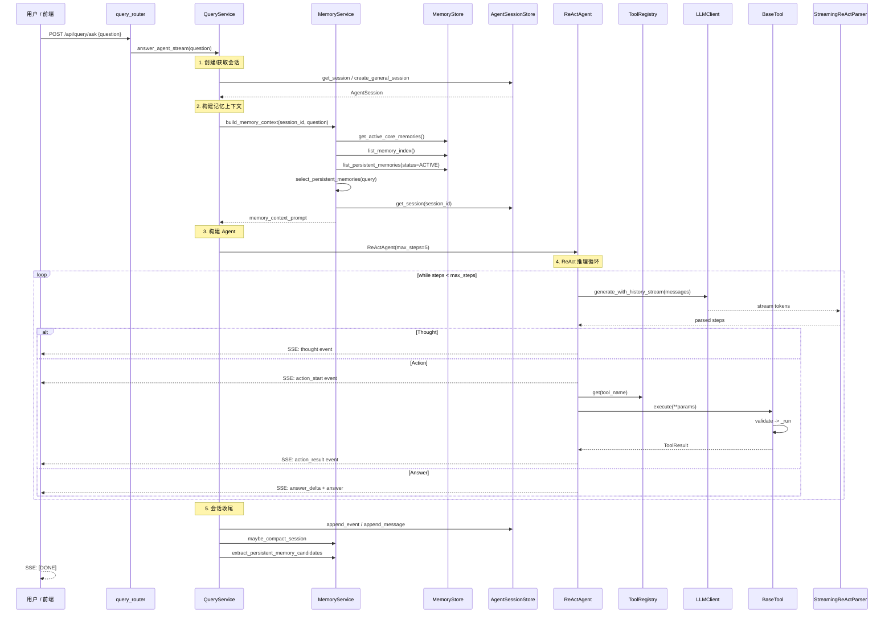

# ReAct Agent 问答全流程

> 覆盖用户提问到 SSE 流式返回的完整推理-行动链路。

---

## 请求入口

两个端点由 `delivery/api/query_router.py` 提供：

| 端点 | 方式 | 用途 |
|------|------|------|
| `POST /api/query/ask` | SSE 流式 | 前端 QueryView 实时展示推理过程 |
| `POST /api/query/ask-sync` | JSON 同步 | CLI / 非流式场景 |

---

## 总体流程



---

## 各阶段详解

### 阶段 1: 会话管理

`QueryService._ensure_general_session(question, session_id, run_id)`

| 场景 | 行为 |
|------|------|
| 提供 session_id 且存在 | 复用已有会话 |
| 提供 run_id 且存在对应 session | 复用已有会话 |
| 都不存在 | create_general_session(topic=question[:120]) |

`AgentSessionStore.create_general_session()`：
- session_type = "general_query"
- status = "active"
- 写入 PostgreSQL agent_sessions 表
- Redis 热缓存 logos:agent_session:{session_id}

### 阶段 2: 记忆上下文构建

`MemoryService.build_memory_context(session_id, question)` 按层次构建：

1. 核心记忆 (versioned revisions, status=active)
2. MEMORY 索引 (所有 status=active 的持久记忆摘要)
3. 相关持久记忆 (关键词匹配, 最多5条, 无匹配取前3条)
4. 会话记忆 (当前 session 的 summary 字段)

构建结果拼接到 ReAct system prompt 之前。

### 阶段 3: Agent 构建

ReActAgent 初始化参数：

| 参数 | 通用模式 | 深度研究模式 |
|------|---------|-------------|
| max_steps | 5 | 15 |
| system_prompt | build_react_system_prompt | build_deep_research_prompt |
| tool_registry | ToolRegistry 单例 | ToolRegistry 单例 |

### 阶段 4: ReAct 推理-行动循环

```
while steps < max_steps:
    1. llm_output = llm_client.generate_with_history_stream(messages)
    2. StreamingReActParser 逐 token 解析:
       - Thought: <推理文本>
       - Action: tool_name({"param": "value"})
       - Answer: <最终回答>
    3. 对每个解析步骤:
       a. Thought -> yield AgentEvent("thought")
       b. Action  -> yield AgentEvent("action_start")
                  -> tool_registry.get(name).execute(**params)
                  -> yield AgentEvent("action_result")
                  -> Observation 追加到 messages
       c. Answer  -> yield AgentEvent("answer_delta") +
                     yield AgentEvent("answer")
                  -> 退出循环
```

**达到 max_steps 时**：强制要求 LLM 基于已有 Observation 给出回答。

### 阶段 5: 工具执行

ToolRegistry 线程安全单例，6 个内置工具：

| 工具名 | 功能 | 依赖 |
|--------|------|------|
| query_knowledge_base | 混合检索 RAG | HybridSearchService, PgVectorStore, PostgresArticleStore |
| get_recent_news | 最近 N 小时新闻 | PostgresArticleStore |
| get_news_stats | 新闻库统计 | PostgresArticleStore |
| generate_brief | 生成新闻简报 | PostgresArticleStore, LLMClient |
| read_article | 读取文章全文 | PostgresArticleStore |
| web_search | 多引擎搜索 | WebSearchService (DuckDuckGo + Tavily) |

每个工具继承 BaseTool，执行流程：validate_params() -> _run(**validated) -> ToolResult。

### 阶段 6: SSE 事件流

```json
data: {"event_type": "llm_delta", "content": "Thought:", "run_id": "...", "sequence": 1}
data: {"event_type": "thought", "content": "用户想了解AI新闻...", "step_index": 1}
data: {"event_type": "action_start", "tool_name": "query_knowledge_base", ...}
data: {"event_type": "action_result", "content": "找到 5 条相关文章..."}
data: {"event_type": "answer_delta", "content": "根据搜索结果，"}
data: {"event_type": "answer", "content": "根据搜索结果，最近的AI新闻..."}
data: [DONE]
```

每个事件含 run_id, sequence, timestamp 审计字段。

### 阶段 7: 会话收尾

1. **追加消息**：user + assistant 最终回答写入 agent_sessions.messages
2. **追加事件**：所有 AgentEvent 序列化写入 agent_sessions.events
3. **会话压缩**：MemoryService.maybe_compact_session(session_id)
   - 10k token 触发首次摘要
   - 后续每 5k token 更新
   - 连续 3 次失败退避至 10k
4. **记忆候选提取**：LLM 分析最近 QA -> 最多 3 条 pending 候选

---

## 敏感信息处理

ReActAgent 在日志中自动脱敏：

| 敏感字段 | 处理 |
|---------|------|
| api_key, apikey, token, secret, password | 替换为 *** |
| webhook_url, url | 替换为 *** |
| 超长文本 (content 大于 12000) | 截断 |
| 事件内容 (content 大于 4000) | 截断 + truncated 标记 |

---

## 配置项

| 配置项 | 默认值 | 说明 |
|--------|--------|------|
| max_steps (通用) | 5 | 最大推理步数 |
| SESSION_COMPACT_INITIAL_TOKENS | 10000 | 首次触发会话压缩 |
| SESSION_COMPACT_INCREMENT_TOKENS | 5000 | 后续压缩增量 |
| SESSION_COMPACT_BACKOFF_TOKENS | 10000 | 连续失败后退避 |

---

## 相关文档

- [search-flow.md](search-flow.md) — query_knowledge_base 检索链路
- [memory-flow.md](memory-flow.md) — 会话记忆压缩与持久记忆提取
- [deep-research-flow.md](deep-research-flow.md) — 深度研究模式
- [ARCHITECTURE.md](../../ARCHITECTURE.md) §6 — Agent 智能体层
