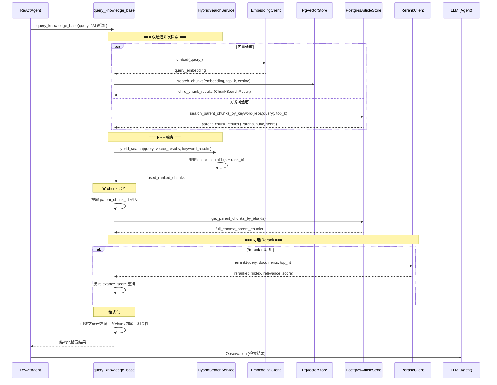
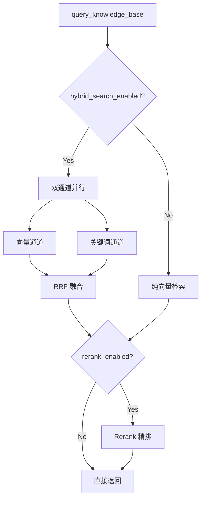

# 混合检索全流程

> 覆盖 query_knowledge_base 工具内部的 RAG 检索完整链路：双通道检索 -> RRF 融合 -> 父 chunk 召回 -> 可选 Rerank。

---

## 总体流程



---

## 各阶段详解

### 双通道检索策略

**向量通道** — 语义匹配:
- EmbeddingClient.embed(query) -> query_embedding
- PgVectorStore.search_chunks(embedding, top_k, cosine)
- 在 child_chunks 表上执行 pgvector 余弦相似度检索
- 返回 ChunkSearchResult (chunk_id, content, score, article_id, parent_chunk_id)

**关键词通道** — 精确匹配:
- jieba 分词 query (中文 + 英文)
- 构建 tsquery: 分词结果用 | (OR) 连接
- PostgresArticleStore.search_parent_chunks_by_keyword(tsquery, top_k)
- 在 parent_chunks 表上执行 tsvector @@ tsquery 全文搜索
- 返回 (ParentChunk, ts_rank_score)

### RRF 融合 (Reciprocal Rank Fusion)

公式: `RRF_score = vector_weight/(k+rank_vector) + keyword_weight/(k+rank_keyword)`

| 参数 | 默认值 | 说明 |
|------|--------|------|
| hybrid_rrf_k | 60 | 平滑常数 |
| hybrid_vector_weight | 1.0 | 向量通道权重 |
| hybrid_keyword_weight | 1.0 | 关键词通道权重 |

每个 chunk 取两条通道中的最高 RRF 分数。

### 父 chunk 召回

子 chunk 检索 - parent_chunk_id -> get_parent_chunks_by_ids(ids)
- 子 chunk 负责精准匹配 (粒度 ~512 tokens)
- 父 chunk 负责完整上下文 (粒度 ~1024 tokens)
- 短文档 (<= 1024 tok) 同时为父子 chunk

### 可选 Rerank

- 启用条件: rerank_enabled=true 且 rerank_api_key + rerank_base_url 均配置
- 实现: OpenAICompatibleRerankClient (Jina/SiliconFlow/Cohere Cross-Encoder API)
- 流程: 对 RRF 融合后的候选文档重新评分 -> 取 top_n 返回
- 候选召回倍数: rerank_top_k_multiplier (默认 3)

---

## 降级策略



---

## 数据结构

### ChunkSearchResult (向量通道输出)
```
chunk_id: str
content: str
score: float
article_id: int
parent_chunk_id: str
```

### ParentChunk (关键词通道 + 召回)
```
parent_chunk_id: str
article_id: int
content: str
token_count: int
child_chunk_ids: list[str]
doc_name: str
source: str
url: str
search_vector: tsvector (PostgreSQL)
```

---

## 存储架构

```
articles (PostgreSQL)
  |
  +-- parent_chunks (PostgreSQL)
  |     |-- content (父 chunk ~1024 tokens)
  |     |-- search_vector (jieba 分词 tsvector)
  |     |-- child_chunk_ids (JSONB)
  |
  +-- child_chunks (PostgreSQL/pgvector)
        |-- content (子 chunk <= 512 tokens)
        |-- embedding (1536-dim pgvector)
        |-- parent_chunk_id (FK)
```

---

## 配置项

| 配置项 | 默认值 | 说明 |
|--------|--------|------|
| hybrid_search_enabled | true | 是否启用混合检索 |
| hybrid_rrf_k | 60 | RRF 平滑常数 |
| hybrid_vector_weight | 1.0 | 向量通道权重 |
| hybrid_keyword_weight | 1.0 | 关键词通道权重 |
| hybrid_keyword_candidates | 20 | 关键词检索候选数 |
| rerank_enabled | false | 是否启用 Rerank |
| rerank_top_k_multiplier | 3 | Rerank 候选召回倍数 |
| embedding_vector_size | 1536 | pgvector 维度 |

---

## 相关文档

- [pipeline-flow.md](pipeline-flow.md) — 数据摄入和向量化
- [query-flow.md](query-flow.md) — ReAct Agent 工具调用
- [ARCHITECTURE.md](../../ARCHITECTURE.md) §2 — 检索策略演进
- [design-docs/tech-decisions.md](../design-docs/tech-decisions.md) — RRF 选型论证
