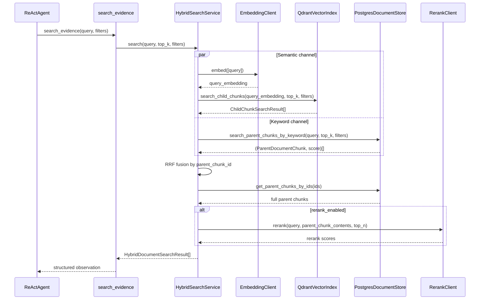
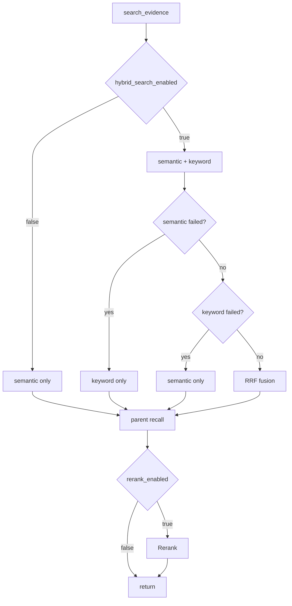

# Evidence 混合检索全流程

> 覆盖 `search_evidence` 工具内部的 RAG 检索链路：Qdrant 子块语义检索 -> PostgreSQL 父块关键词检索 -> RRF 融合 -> 父块召回 -> 可选 Rerank。该工具只检索原文 evidence，不查询 `intel_facts`；结构化事实查询由 `query_intel_facts` 负责。

---

## 总体流程



---

## 语义通道

- `EmbeddingClient.embed([query])` 生成查询向量。
- `QdrantVectorIndex.search_child_chunks()` 在 `insightforge_documents_v1` 中检索子块。
- Qdrant 返回 `ChildChunkSearchResult`，包含子块正文、metadata、score 和 `parent_chunk_id`。
- 调用方按 `parent_chunk_id` 去重，再召回 PostgreSQL 父块。

Qdrant payload 包含：`document_id`、`parent_chunk_id`、`chunk_index`、`content`、`content_hash`、`token_count`、`heading_path`、`doc_name`、`source`、`url`、`source_type`、`document_type`、`competitor_ids`、`product_ids`、`language`、`published_at`、`created_at`、`metadata`。

`search_evidence` 支持下推过滤：`competitor_ids` 映射到 payload `competitor_ids` 任一匹配，`document_type` 映射到 payload 等值，`date_from/date_to` 映射到 `published_at` 或 `created_at` 日期范围。

---

## 关键词通道

- `PostgresDocumentStore.search_parent_chunks_by_keyword()` 查询 `document_parent_chunks.search_vector`。
- 搜索单位是父块，返回 `(ParentDocumentChunk, score)`。
- 父块保存完整上下文、heading path、来源 URL、关联竞品/产品和 `child_point_ids`。
- 关键词通道会 join `source_documents`，将 `competitor_ids`、`document_type`、`date_from/date_to` 下推到 PostgreSQL 过滤。

---

## RRF 融合

公式：

```text
RRF_score = vector_weight / (k + semantic_rank)
          + keyword_weight / (k + keyword_rank)
```

| 参数 | 默认值 | 说明 |
|---|---|---|
| `hybrid_rrf_k` | 60 | 平滑常数 |
| `hybrid_vector_weight` | 1.0 | 语义通道权重 |
| `hybrid_keyword_weight` | 1.0 | 关键词通道权重 |
| `hybrid_keyword_candidates` | 20 | 关键词候选数 |

融合粒度是 `parent_chunk_id`，避免多个子块命中导致同一父块重复进入 LLM 上下文。

---

## 父块召回

```text
ChildChunkSearchResult.parent_chunk_id
  -> DocumentStore.get_parent_chunks_by_ids()
  -> ParentDocumentChunk.content
  -> LLM context
```

子块负责精准命中，父块负责给 LLM 提供完整上下文。短文档仍会生成一个父块和至少一个子块，因此检索路径一致。

---

## 降级策略



---

## 存储架构

```text
source_documents (PostgreSQL)
  |
  +-- document_parent_chunks (PostgreSQL)
  |     |-- content (~1024 tokens)
  |     |-- child_point_ids (includes overlap)
  |     |-- heading_path / metadata
  |     |-- search_vector (GIN FTS)
  |
  +-- document_vector_points (PostgreSQL)
        |-- point_id = {document_id}:c:{chunk_index}
        |-- parent_chunk_id
        |-- vector_status / error

insightforge_documents_v1 (Qdrant)
  |
  +-- point vector: child chunk embedding
  +-- payload.content: child chunk text
  +-- payload.parent_chunk_id: PostgreSQL parent recall key
```

---

## 配置项

| 配置项 | 默认值 | 说明 |
|---|---|---|
| `hybrid_search_enabled` | true | 是否启用混合检索 |
| `hybrid_rrf_k` | 60 | RRF 平滑常数 |
| `hybrid_vector_weight` | 1.0 | 语义通道权重 |
| `hybrid_keyword_weight` | 1.0 | 关键词通道权重 |
| `hybrid_keyword_candidates` | 20 | 关键词检索候选数 |
| `rerank_enabled` | false | 是否启用 Rerank |
| `rerank_top_k_multiplier` | 3 | Rerank 候选召回倍数 |
| `embedding_vector_size` | 1536 | Qdrant collection vector size |

---

## 相关文档

- [pipeline-flow.md](pipeline-flow.md)
- [query-flow.md](query-flow.md)
- [ARCHITECTURE.md](../../ARCHITECTURE.md)
- [tech-decisions.md](../design-docs/tech-decisions.md)
