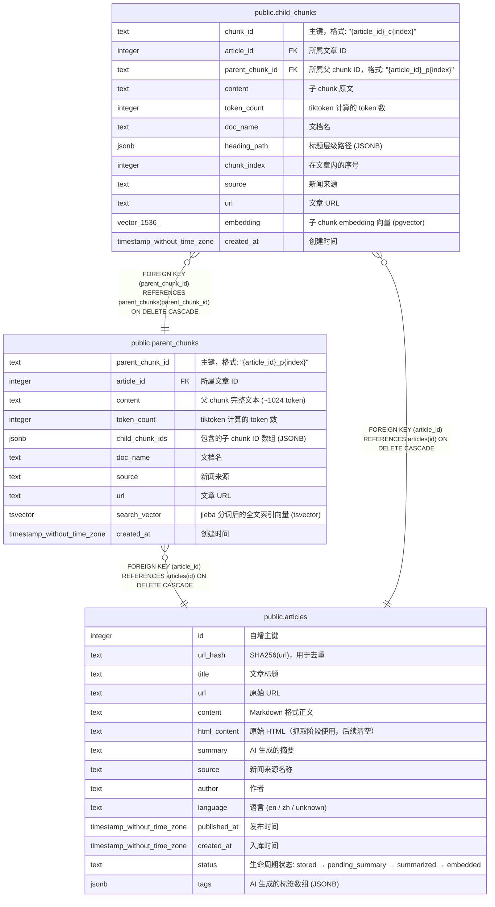

# Logos

## 说明

Logos AI 新闻分析助手数据库 — 文章存储 + 父子分块 RAG + pgvector 向量检索

## 表一览

| 名称                                              | 列一览     | 备注                                                                                                                  | 类型         |
| ----------------------------------------------- | ------- | ------------------------------------------------------------------------------------------------------------------- | ---------- |
| [public.articles](public.articles.md)           | 14      | 文章元数据 + 全文存储。Pipeline 采集的新闻文章，经历 stored → pending_summary → summarized → embedded 生命周期。                             | BASE TABLE |
| [public.parent_chunks](public.parent_chunks.md) | 10      | 父分块。~1024 token 的大粒度文本块，用于 LLM 召回上下文 + jieba 全文索引。                                                                  | BASE TABLE |
| [public.child_chunks](public.child_chunks.md)   | 12      | 子分块 (pgvector)。≤512 token 的细粒度文本块 + embedding 向量，用于语义检索。                                                            | BASE TABLE |

## Stored procedures and functions

| 名称               | ReturnType | Arguments                   | 类型       |
| ---------------- | ---------- | --------------------------- | -------- |
| public.vector    | vector     | vector, integer, boolean    | FUNCTION |
| public.halfvec   | halfvec    | halfvec, integer, boolean   | FUNCTION |
| public.sparsevec | sparsevec  | sparsevec, integer, boolean | FUNCTION |

## ER 图

---

> Generated by [tbls](https://github.com/k1LoW/tbls)
