# Logos

## 说明

Logos AI 新闻分析助手数据库 — 文章存储 + 父子分块 RAG + pgvector 向量检索

## 表一览

| 名称                                                                | 列一览     | 备注                                                                                                                  | 类型         |
| ----------------------------------------------------------------- | ------- | ------------------------------------------------------------------------------------------------------------------- | ---------- |
| [public.articles](public.articles.md)                             | 14      | 文章元数据 + 全文存储。Pipeline 采集的新闻文章，经历 stored → pending_summary → summarized → embedded 生命周期。                             | BASE TABLE |
| [public.parent_chunks](public.parent_chunks.md)                   | 10      | 父分块。~1024 token 的大粒度文本块，用于 LLM 召回上下文 + jieba 全文索引。                                                                  | BASE TABLE |
| [public.child_chunks](public.child_chunks.md)                     | 12      | 子分块 (pgvector)。≤512 token 的细粒度文本块 + embedding 向量，用于语义检索。                                                            | BASE TABLE |
| [public.agent_sessions](public.agent_sessions.md)                 | 21      | Agent 会话记录。保存 Plan Execute 深度研究的消息、计划、todo、执行事件与最终报告索引。                                                             | BASE TABLE |
| [public.core_memory_revisions](public.core_memory_revisions.md)   | 8       | 核心记忆版本表。核心记忆不可物理删除，只能创建新版本并切换 active revision。                                                                      | BASE TABLE |
| [public.persistent_memories](public.persistent_memories.md)       | 10      | 持久记忆表。保存 user/feedback/project 三类跨会话记忆，pending 状态需用户确认。                                                             | BASE TABLE |
| [public.task_runs](public.task_runs.md)                           | 12      |                                                                                                                     | BASE TABLE |
| [public.task_stages](public.task_stages.md)                       | 9       |                                                                                                                     | BASE TABLE |
| [public.task_events](public.task_events.md)                       | 6       |                                                                                                                     | BASE TABLE |
| [public.upload_batches](public.upload_batches.md)                 | 11      |                                                                                                                     | BASE TABLE |
| [public.document_blobs](public.document_blobs.md)                 | 14      |                                                                                                                     | BASE TABLE |
| [public.source_documents](public.source_documents.md)             | 21      | Unified source document metadata and normalized content.                                                            | BASE TABLE |
| [public.document_parent_chunks](public.document_parent_chunks.md) | 19      | Parent chunks stored in PostgreSQL for LLM context and FTS.                                                         | BASE TABLE |
| [public.document_vector_points](public.document_vector_points.md) | 10      | Qdrant child chunk point status; embeddings and child payloads live in Qdrant.                                      | BASE TABLE |
| [public.competitors](public.competitors.md)                       | 11      | 竞品公司档案                                                                                                              | BASE TABLE |
| [public.competitor_products](public.competitor_products.md)       | 9       | 竞品产品线                                                                                                               | BASE TABLE |
| [public.intel_competitors](public.intel_competitors.md)           | 2       | 情报与竞品的多对多关联                                                                                                         | BASE TABLE |
| [public.intel_products](public.intel_products.md)                 | 2       | 情报与竞品产品的多对多关联                                                                                                       | BASE TABLE |
| [public.analysis_reports](public.analysis_reports.md)             | 12      | 竞品分析报告                                                                                                              | BASE TABLE |
| [public.analysis_audit_log](public.analysis_audit_log.md)         | 7       | 分析审计日志（溯源与可观测性）                                                                                                     | BASE TABLE |

## Stored procedures and functions

| 名称               | ReturnType | Arguments                   | 类型       |
| ---------------- | ---------- | --------------------------- | -------- |
| public.vector    | vector     | vector, integer, boolean    | FUNCTION |
| public.halfvec   | halfvec    | halfvec, integer, boolean   | FUNCTION |
| public.sparsevec | sparsevec  | sparsevec, integer, boolean | FUNCTION |

## ER 图

```mermaid
erDiagram

"public.parent_chunks" }o--|| "public.articles" : "FOREIGN KEY (article_id) REFERENCES articles(id) ON DELETE CASCADE"
"public.child_chunks" }o--|| "public.articles" : "FOREIGN KEY (article_id) REFERENCES articles(id) ON DELETE CASCADE"
"public.child_chunks" }o--|| "public.parent_chunks" : "FOREIGN KEY (parent_chunk_id) REFERENCES parent_chunks(parent_chunk_id) ON DELETE CASCADE"
"public.task_stages" }o--|| "public.task_runs" : "FOREIGN KEY (task_run_id) REFERENCES task_runs(id) ON DELETE CASCADE"
"public.task_events" }o--|| "public.task_runs" : "FOREIGN KEY (task_run_id) REFERENCES task_runs(id) ON DELETE CASCADE"
"public.task_events" }o--o| "public.task_stages" : "FOREIGN KEY (stage_id) REFERENCES task_stages(id) ON DELETE SET NULL"
"public.document_blobs" }o--o| "public.upload_batches" : "FOREIGN KEY (upload_batch_id) REFERENCES upload_batches(id) ON DELETE SET NULL"
"public.document_blobs" }o--o| "public.document_blobs" : "FOREIGN KEY (parent_blob_id) REFERENCES document_blobs(id) ON DELETE SET NULL"
"public.source_documents" }o--o| "public.document_blobs" : "FOREIGN KEY (blob_id) REFERENCES document_blobs(id) ON DELETE SET NULL"
"public.document_parent_chunks" }o--|| "public.source_documents" : "FOREIGN KEY (document_id) REFERENCES source_documents(id) ON DELETE CASCADE"
"public.document_vector_points" }o--|| "public.source_documents" : "FOREIGN KEY (document_id) REFERENCES source_documents(id) ON DELETE CASCADE"
"public.document_vector_points" }o--|| "public.document_parent_chunks" : "FOREIGN KEY (parent_chunk_id) REFERENCES document_parent_chunks(parent_chunk_id) ON DELETE CASCADE"
"public.competitor_products" }o--|| "public.competitors" : "FOREIGN KEY (competitor_id) REFERENCES competitors(id) ON DELETE CASCADE"
"public.intel_competitors" }o--|| "public.source_documents" : "FOREIGN KEY (document_id) REFERENCES source_documents(id) ON DELETE CASCADE"
"public.intel_competitors" }o--|| "public.competitors" : "FOREIGN KEY (competitor_id) REFERENCES competitors(id) ON DELETE CASCADE"
"public.intel_products" }o--|| "public.source_documents" : "FOREIGN KEY (document_id) REFERENCES source_documents(id) ON DELETE CASCADE"
"public.intel_products" }o--|| "public.competitor_products" : "FOREIGN KEY (product_id) REFERENCES competitor_products(id) ON DELETE CASCADE"
"public.analysis_audit_log" }o--o| "public.analysis_reports" : "FOREIGN KEY (report_id) REFERENCES analysis_reports(id) ON DELETE SET NULL"

"public.articles" {
  integer id "自增主键"
  text url_hash "SHA256(url)，用于去重"
  text title "文章标题"
  text url "原始 URL"
  text content "Markdown 格式正文"
  text html_content "原始 HTML（抓取阶段使用，后续清空）"
  text summary "AI 生成的摘要"
  text source "新闻来源名称"
  text author "作者"
  text language "语言 (en / zh / unknown)"
  timestamp_without_time_zone published_at "发布时间"
  timestamp_without_time_zone created_at "入库时间"
  text status "生命周期状态: stored → pending_summary → summarized → embedded"
  jsonb tags "AI 生成的标签数组 (JSONB)"
}
"public.parent_chunks" {
  text parent_chunk_id "主键，格式: #quot;{article_id}_p{index}#quot;"
  integer article_id FK "所属文章 ID"
  text content "父 chunk 完整文本 (~1024 token)"
  integer token_count "tiktoken 计算的 token 数"
  jsonb child_chunk_ids "包含的子 chunk ID 数组 (JSONB)"
  text doc_name "文档名"
  text source "新闻来源"
  text url "文章 URL"
  tsvector search_vector "jieba 分词后的全文索引向量 (tsvector)"
  timestamp_without_time_zone created_at "创建时间"
}
"public.child_chunks" {
  text chunk_id "主键，格式: #quot;{article_id}_c{index}#quot;"
  integer article_id FK "所属文章 ID"
  text parent_chunk_id FK "所属父 chunk ID，格式: #quot;{article_id}_p{index}#quot;"
  text content "子 chunk 原文"
  integer token_count "tiktoken 计算的 token 数"
  text doc_name "文档名"
  jsonb heading_path "标题层级路径 (JSONB)"
  integer chunk_index "在文章内的序号"
  text source "新闻来源"
  text url "文章 URL"
  vector_1536_ embedding "子 chunk embedding 向量 (pgvector)"
  timestamp_without_time_zone created_at "创建时间"
}
"public.agent_sessions" {
  uuid id "会话 UUID，同时作为前端会话标识和 Agent run_id"
  text session_type "会话类型，当前固定为 research_plan_execute"
  text topic "用户提交的研究主题"
  text status "会话状态: planned/approved/running/completed/failed/cancelled"
  jsonb messages "会话消息历史，OpenAI message 格式数组"
  jsonb plan "AI 生成并经用户审阅的研究计划 JSON；非结构化计划保存在 raw 字段"
  jsonb todos "用户确认后的执行 todo 列表，JSONB 数组"
  jsonb events "执行过程事件，AgentEvent 序列化后的 JSONB 数组"
  text final_answer "最终研究报告正文副本"
  text report_filename "output/research 下生成的 Markdown 报告文件名"
  text error "失败原因，仅 failed 状态使用"
  timestamp_with_time_zone created_at "会话创建时间"
  timestamp_with_time_zone updated_at "会话最后更新时间"
  timestamp_with_time_zone approved_at "用户确认计划和 todo 的时间"
  timestamp_with_time_zone started_at "执行开始时间"
  timestamp_with_time_zone completed_at "执行结束时间"
  text summary "当前会话摘要，用于普通问答和深度研究的短期记忆注入"
  text summary_template ""
  integer token_count "当前会话估算 token 数"
  integer last_compacted_tokens "上次成功摘要压缩时的估算 token 数"
  integer compact_failures "连续会话摘要更新失败次数"
}
"public.core_memory_revisions" {
  uuid id ""
  text kind ""
  text title ""
  text content ""
  integer version ""
  boolean is_active ""
  timestamp_with_time_zone created_at ""
  timestamp_with_time_zone updated_at ""
}
"public.persistent_memories" {
  uuid id ""
  text memory_type ""
  text title ""
  text summary "MEMORY 索引行使用的短摘要，建议 50 token 以内"
  text content ""
  text status ""
  uuid source_session_id ""
  double_precision confidence ""
  timestamp_with_time_zone created_at ""
  timestamp_with_time_zone updated_at ""
}
"public.task_runs" {
  uuid id ""
  text task_type ""
  text status ""
  text idempotency_key ""
  jsonb input ""
  jsonb result ""
  jsonb error ""
  integer attempt ""
  timestamp_with_time_zone created_at ""
  timestamp_with_time_zone updated_at ""
  timestamp_with_time_zone started_at ""
  timestamp_with_time_zone finished_at ""
}
"public.task_stages" {
  uuid id ""
  uuid task_run_id FK ""
  text name ""
  text status ""
  jsonb result ""
  jsonb error ""
  timestamp_with_time_zone started_at ""
  timestamp_with_time_zone finished_at ""
  timestamp_with_time_zone created_at ""
}
"public.task_events" {
  uuid id ""
  uuid task_run_id FK ""
  uuid stage_id FK ""
  text event_type ""
  jsonb payload ""
  timestamp_with_time_zone created_at ""
}
"public.upload_batches" {
  uuid id ""
  text source ""
  text status ""
  integer file_count ""
  integer expanded_file_count ""
  bigint total_size_bytes ""
  jsonb metadata ""
  jsonb error ""
  timestamp_with_time_zone created_at ""
  timestamp_with_time_zone updated_at ""
  timestamp_with_time_zone finished_at ""
}
"public.document_blobs" {
  uuid id ""
  uuid upload_batch_id FK ""
  uuid parent_blob_id FK ""
  text original_filename ""
  text safe_filename ""
  text content_type ""
  text file_ext ""
  bigint size_bytes ""
  text sha256 ""
  text storage_path ""
  text status ""
  jsonb error ""
  timestamp_with_time_zone created_at ""
  timestamp_with_time_zone updated_at ""
}
"public.source_documents" {
  uuid id ""
  uuid blob_id FK ""
  text url ""
  text canonical_url ""
  text source_type ""
  text document_type ""
  text title ""
  text content ""
  text content_hash ""
  text language ""
  jsonb metadata ""
  jsonb competitor_ids ""
  jsonb product_ids ""
  text parse_status ""
  jsonb parse_error ""
  timestamp_with_time_zone published_at ""
  timestamp_with_time_zone created_at ""
  timestamp_with_time_zone updated_at ""
  text intel_type "情报类型: pricing/feature/strategy/partnership/hiring/funding/market/review/general"
  double_precision source_reliability "来源可信度 0.0~1.0"
  text analysis_notes "AI 分析批注"
}
"public.document_parent_chunks" {
  text parent_chunk_id ""
  uuid document_id FK ""
  text content ""
  integer token_count ""
  jsonb child_point_ids "All child point IDs included in this parent chunk, including overlap."
  jsonb heading_path ""
  text doc_name ""
  text source ""
  text url ""
  text source_type ""
  text document_type ""
  jsonb competitor_ids ""
  jsonb product_ids ""
  text language ""
  timestamp_with_time_zone published_at ""
  jsonb metadata ""
  tsvector search_vector ""
  timestamp_with_time_zone created_at ""
  timestamp_with_time_zone updated_at ""
}
"public.document_vector_points" {
  text point_id "Qdrant point id. Stable UUID derived from document_id and chunk_index."
  uuid document_id FK ""
  text parent_chunk_id FK ""
  integer chunk_index ""
  text content_hash ""
  integer token_count ""
  text vector_status ""
  jsonb error ""
  timestamp_with_time_zone created_at ""
  timestamp_with_time_zone updated_at ""
}
"public.competitors" {
  integer id ""
  text name ""
  jsonb aliases "别名/简称 JSON 数组，用于自动关联"
  text website ""
  text industry ""
  text description ""
  text logo_url ""
  jsonb tags ""
  text status "active=监控中, archived=已归档"
  timestamp_with_time_zone created_at ""
  timestamp_with_time_zone updated_at ""
}
"public.competitor_products" {
  integer id ""
  integer competitor_id FK ""
  text name ""
  text description ""
  text category "产品类别（如 IDE插件、独立IDE）"
  text url ""
  text pricing_info "定价信息摘要"
  timestamp_with_time_zone created_at ""
  timestamp_with_time_zone updated_at ""
}
"public.intel_competitors" {
  uuid document_id FK ""
  integer competitor_id FK ""
}
"public.intel_products" {
  uuid document_id FK ""
  integer product_id FK ""
}
"public.analysis_reports" {
  integer id ""
  text title ""
  text report_type "overview/comparison/briefing/deep_research"
  jsonb competitor_ids ""
  text content ""
  jsonb source_refs "溯源引用列表 JSON 数组"
  jsonb audit_trail "生成链路审计 JSON 数组"
  text status ""
  text session_id "生成此报告的 Agent 会话 ID"
  text report_filename ""
  timestamp_with_time_zone created_at ""
  timestamp_with_time_zone updated_at ""
}
"public.analysis_audit_log" {
  integer id ""
  integer report_id FK ""
  text session_id ""
  text action "intel_collected/tool_called/conclusion_drawn/report_generated"
  jsonb detail ""
  jsonb source_refs ""
  timestamp_with_time_zone created_at ""
}
```

---

> Generated by [tbls](https://github.com/k1LoW/tbls)
