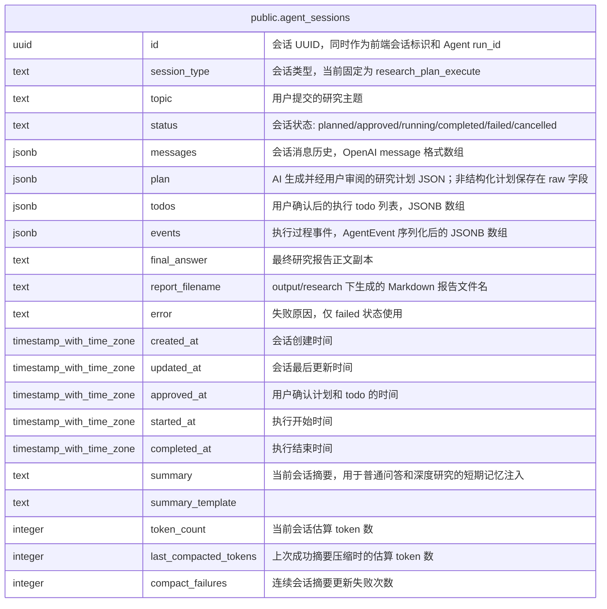

# public.agent_sessions

## 说明

Agent 会话记录。保存 Plan Execute 深度研究的消息、计划、todo、执行事件与最终报告索引。

## 列一览

| 名称                    | 类型                       | 默认值                           | Nullable | 备注                                                              |
| --------------------- | ------------------------ | ----------------------------- | -------- | --------------------------------------------------------------- |
| id                    | uuid                     |                               | false    | 会话 UUID，同时作为前端会话标识和 Agent run_id                                |
| session_type          | text                     | 'research_plan_execute'::text | false    | 会话类型，当前固定为 research_plan_execute                                |
| topic                 | text                     |                               | false    | 用户提交的研究主题                                                       |
| status                | text                     |                               | false    | 会话状态: planned/approved/running/completed/failed/cancelled       |
| messages              | jsonb                    | '[]'::jsonb                   | false    | 会话消息历史，OpenAI message 格式数组                                      |
| plan                  | jsonb                    |                               | true     | AI 生成并经用户审阅的研究计划 JSON；非结构化计划保存在 raw 字段                          |
| todos                 | jsonb                    | '[]'::jsonb                   | false    | 用户确认后的执行 todo 列表，JSONB 数组                                       |
| events                | jsonb                    | '[]'::jsonb                   | false    | 执行过程事件，AgentEvent 序列化后的 JSONB 数组                                |
| final_answer          | text                     |                               | true     | 最终研究报告正文副本                                                      |
| report_filename       | text                     |                               | true     | output/research 下生成的 Markdown 报告文件名                             |
| error                 | text                     |                               | true     | 失败原因，仅 failed 状态使用                                              |
| created_at            | timestamp with time zone | CURRENT_TIMESTAMP             | false    | 会话创建时间                                                          |
| updated_at            | timestamp with time zone | CURRENT_TIMESTAMP             | false    | 会话最后更新时间                                                        |
| approved_at           | timestamp with time zone |                               | true     | 用户确认计划和 todo 的时间                                                |
| started_at            | timestamp with time zone |                               | true     | 执行开始时间                                                          |
| completed_at          | timestamp with time zone |                               | true     | 执行结束时间                                                          |
| summary               | text                     |                               | true     | 当前会话摘要，用于普通问答和深度研究的短期记忆注入                                       |
| summary_template      | text                     |                               | true     |                                                                 |
| token_count           | integer                  | 0                             | false    | 当前会话估算 token 数                                                  |
| last_compacted_tokens | integer                  | 0                             | false    | 上次成功摘要压缩时的估算 token 数                                            |
| compact_failures      | integer                  | 0                             | false    | 连续会话摘要更新失败次数                                                    |

## 约束一览

| 名称                  | 类型          | 定义               |
| ------------------- | ----------- | ---------------- |
| agent_sessions_pkey | PRIMARY KEY | PRIMARY KEY (id) |

## 索引一览

| 名称                              | 定义                                                                                                                |
| ------------------------------- | ----------------------------------------------------------------------------------------------------------------- |
| agent_sessions_pkey             | CREATE UNIQUE INDEX agent_sessions_pkey ON public.agent_sessions USING btree (id)                                 |
| idx_agent_sessions_status       | CREATE INDEX idx_agent_sessions_status ON public.agent_sessions USING btree (status)                              |
| idx_agent_sessions_created_at   | CREATE INDEX idx_agent_sessions_created_at ON public.agent_sessions USING btree (created_at DESC)                 |
| idx_agent_sessions_session_type | CREATE INDEX idx_agent_sessions_session_type ON public.agent_sessions USING btree (session_type)                  |
| idx_agent_sessions_type_updated | CREATE INDEX idx_agent_sessions_type_updated ON public.agent_sessions USING btree (session_type, updated_at DESC) |

## ER 图

---

> Generated by [tbls](https://github.com/k1LoW/tbls)
