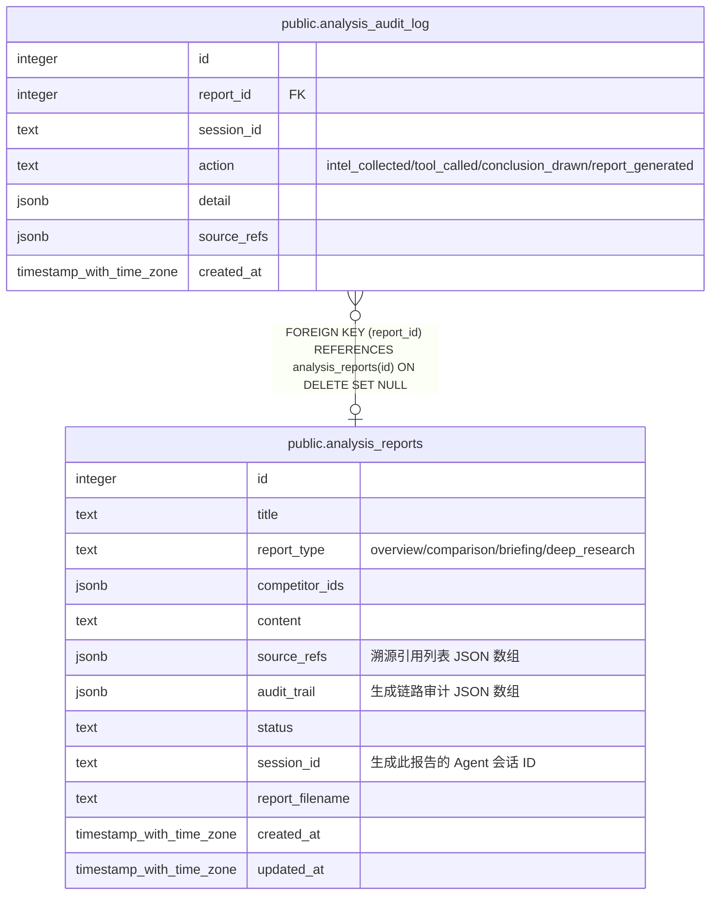

# public.analysis_reports

## 说明

竞品分析报告

## 列一览

| 名称              | 类型                       | 默认值                                          | Nullable | 子表                                                        | 备注                                         |
| --------------- | ------------------------ | -------------------------------------------- | -------- | --------------------------------------------------------- | ------------------------------------------ |
| id              | integer                  | nextval('analysis_reports_id_seq'::regclass) | false    | [public.analysis_audit_log](public.analysis_audit_log.md) |                                            |
| title           | text                     |                                              | false    |                                                           |                                            |
| report_type     | text                     | 'overview'::text                             | false    |                                                           | overview/comparison/briefing/deep_research |
| competitor_ids  | jsonb                    | '[]'::jsonb                                  | true     |                                                           |                                            |
| content         | text                     | ''::text                                     | true     |                                                           |                                            |
| source_refs     | jsonb                    | '[]'::jsonb                                  | true     |                                                           | 溯源引用列表 JSON 数组                             |
| audit_trail     | jsonb                    | '[]'::jsonb                                  | true     |                                                           | 生成链路审计 JSON 数组                             |
| status          | text                     | 'draft'::text                                | true     |                                                           |                                            |
| session_id      | text                     |                                              | true     |                                                           | 生成此报告的 Agent 会话 ID                         |
| report_filename | text                     |                                              | true     |                                                           |                                            |
| created_at      | timestamp with time zone | now()                                        | true     |                                                           |                                            |
| updated_at      | timestamp with time zone | now()                                        | true     |                                                           |                                            |

## 约束一览

| 名称                    | 类型          | 定义               |
| --------------------- | ----------- | ---------------- |
| analysis_reports_pkey | PRIMARY KEY | PRIMARY KEY (id) |

## 索引一览

| 名称                          | 定义                                                                                          |
| --------------------------- | ------------------------------------------------------------------------------------------- |
| analysis_reports_pkey       | CREATE UNIQUE INDEX analysis_reports_pkey ON public.analysis_reports USING btree (id)       |
| idx_analysis_reports_type   | CREATE INDEX idx_analysis_reports_type ON public.analysis_reports USING btree (report_type) |
| idx_analysis_reports_status | CREATE INDEX idx_analysis_reports_status ON public.analysis_reports USING btree (status)    |

## ER 图

---

> Generated by [tbls](https://github.com/k1LoW/tbls)
