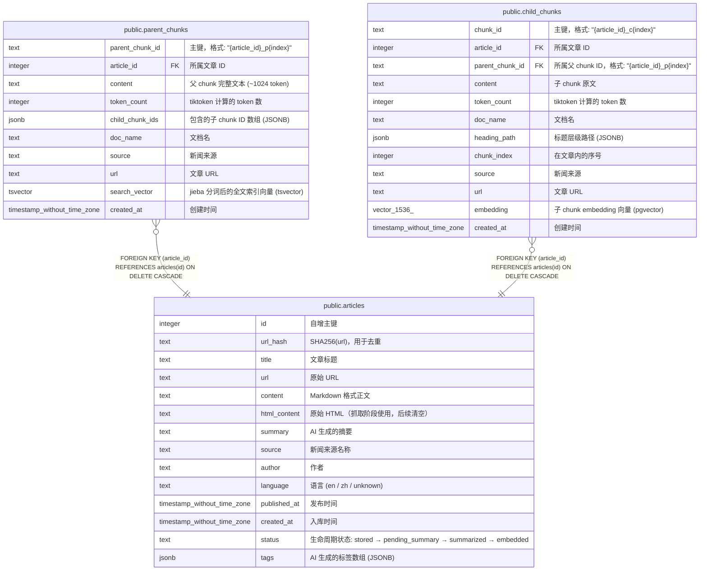

# public.articles

## 说明

文章元数据 + 全文存储。Pipeline 采集的新闻文章，经历 stored → pending_summary → summarized → embedded 生命周期。

## 列一览

| 名称           | 类型                          | 默认值                                  | Nullable | 子表                                                                                            | 备注                                                                |
| ------------ | --------------------------- | ------------------------------------ | -------- | --------------------------------------------------------------------------------------------- | ----------------------------------------------------------------- |
| id           | integer                     | nextval('articles_id_seq'::regclass) | false    | [public.parent_chunks](public.parent_chunks.md) [public.child_chunks](public.child_chunks.md) | 自增主键                                                              |
| url_hash     | text                        |                                      | false    |                                                                                               | SHA256(url)，用于去重                                                  |
| title        | text                        |                                      | false    |                                                                                               | 文章标题                                                              |
| url          | text                        |                                      | false    |                                                                                               | 原始 URL                                                            |
| content      | text                        |                                      | true     |                                                                                               | Markdown 格式正文                                                     |
| html_content | text                        |                                      | true     |                                                                                               | 原始 HTML（抓取阶段使用，后续清空）                                              |
| summary      | text                        |                                      | true     |                                                                                               | AI 生成的摘要                                                          |
| source       | text                        |                                      | true     |                                                                                               | 新闻来源名称                                                            |
| author       | text                        | ''::text                             | true     |                                                                                               | 作者                                                                |
| language     | text                        |                                      | true     |                                                                                               | 语言 (en / zh / unknown)                                            |
| published_at | timestamp without time zone |                                      | true     |                                                                                               | 发布时间                                                              |
| created_at   | timestamp without time zone | CURRENT_TIMESTAMP                    | true     |                                                                                               | 入库时间                                                              |
| status       | text                        | 'stored'::text                       | true     |                                                                                               | 生命周期状态: stored → pending_summary → summarized → embedded          |
| tags         | jsonb                       | '[]'::jsonb                          | true     |                                                                                               | AI 生成的标签数组 (JSONB)                                                |

## 约束一览

| 名称                    | 类型          | 定义                |
| --------------------- | ----------- | ----------------- |
| articles_pkey         | PRIMARY KEY | PRIMARY KEY (id)  |
| articles_url_hash_key | UNIQUE      | UNIQUE (url_hash) |

## 索引一览

| 名称                    | 定义                                                                                  |
| --------------------- | ----------------------------------------------------------------------------------- |
| articles_pkey         | CREATE UNIQUE INDEX articles_pkey ON public.articles USING btree (id)               |
| articles_url_hash_key | CREATE UNIQUE INDEX articles_url_hash_key ON public.articles USING btree (url_hash) |
| idx_status            | CREATE INDEX idx_status ON public.articles USING btree (status)                     |
| idx_created_at        | CREATE INDEX idx_created_at ON public.articles USING btree (created_at)             |
| idx_source            | CREATE INDEX idx_source ON public.articles USING btree (source)                     |

## ER 图

---

> Generated by [tbls](https://github.com/k1LoW/tbls)
