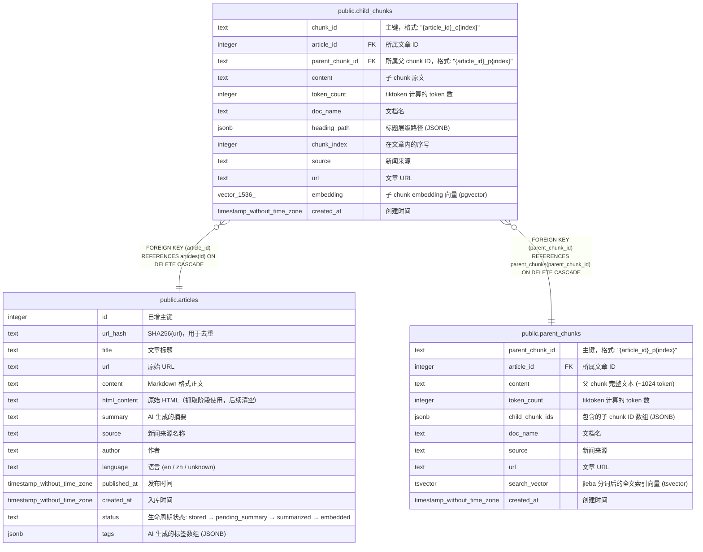

# public.child_chunks

## 说明

子分块 (pgvector)。≤512 token 的细粒度文本块 + embedding 向量，用于语义检索。

## 列一览

| 名称              | 类型                          | 默认值               | Nullable | 父表                                              | 备注                                             |
| --------------- | --------------------------- | ----------------- | -------- | ----------------------------------------------- | ---------------------------------------------- |
| chunk_id        | text                        |                   | false    |                                                 | 主键，格式: "{article_id}_c{index}"                 |
| article_id      | integer                     |                   | false    | [public.articles](public.articles.md)           | 所属文章 ID                                        |
| parent_chunk_id | text                        |                   | false    | [public.parent_chunks](public.parent_chunks.md) | 所属父 chunk ID，格式: "{article_id}_p{index}"       |
| content         | text                        |                   | false    |                                                 | 子 chunk 原文                                     |
| token_count     | integer                     | 0                 | false    |                                                 | tiktoken 计算的 token 数                           |
| doc_name        | text                        | ''::text          | false    |                                                 | 文档名                                            |
| heading_path    | jsonb                       | '[]'::jsonb       | false    |                                                 | 标题层级路径 (JSONB)                                 |
| chunk_index     | integer                     | 0                 | false    |                                                 | 在文章内的序号                                        |
| source          | text                        | ''::text          | true     |                                                 | 新闻来源                                           |
| url             | text                        | ''::text          | true     |                                                 | 文章 URL                                         |
| embedding       | vector(1536)                |                   | false    |                                                 | 子 chunk embedding 向量 (pgvector)                |
| created_at      | timestamp without time zone | CURRENT_TIMESTAMP | true     |                                                 | 创建时间                                           |

## 约束一览

| 名称                      | 类型          | 定义                                                                                        |
| ----------------------- | ----------- | ----------------------------------------------------------------------------------------- |
| fk_child_chunks_article | FOREIGN KEY | FOREIGN KEY (article_id) REFERENCES articles(id) ON DELETE CASCADE                        |
| fk_child_chunks_parent  | FOREIGN KEY | FOREIGN KEY (parent_chunk_id) REFERENCES parent_chunks(parent_chunk_id) ON DELETE CASCADE |
| child_chunks_pkey       | PRIMARY KEY | PRIMARY KEY (chunk_id)                                                                    |

## 索引一览

| 名称                               | 定义                                                                                                 |
| -------------------------------- | -------------------------------------------------------------------------------------------------- |
| child_chunks_pkey                | CREATE UNIQUE INDEX child_chunks_pkey ON public.child_chunks USING btree (chunk_id)                |
| idx_child_chunks_article_id      | CREATE INDEX idx_child_chunks_article_id ON public.child_chunks USING btree (article_id)           |
| idx_child_chunks_parent_chunk_id | CREATE INDEX idx_child_chunks_parent_chunk_id ON public.child_chunks USING btree (parent_chunk_id) |

## ER 图

---

> Generated by [tbls](https://github.com/k1LoW/tbls)
