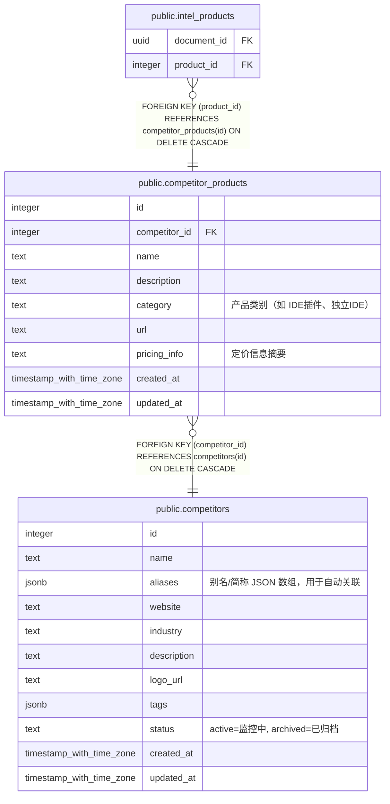

# public.competitor_products

## 说明

竞品产品线

## 列一览

| 名称            | 类型                       | 默认值                                             | Nullable | 子表                                                | 父表                                          | 备注                              |
| ------------- | ------------------------ | ----------------------------------------------- | -------- | ------------------------------------------------- | ------------------------------------------- | ------------------------------- |
| id            | integer                  | nextval('competitor_products_id_seq'::regclass) | false    | [public.intel_products](public.intel_products.md) |                                             |                                 |
| competitor_id | integer                  |                                                 | false    |                                                   | [public.competitors](public.competitors.md) |                                 |
| name          | text                     |                                                 | false    |                                                   |                                             |                                 |
| description   | text                     | ''::text                                        | true     |                                                   |                                             |                                 |
| category      | text                     | ''::text                                        | true     |                                                   |                                             | 产品类别（如 IDE插件、独立IDE）             |
| url           | text                     | ''::text                                        | true     |                                                   |                                             |                                 |
| pricing_info  | text                     | ''::text                                        | true     |                                                   |                                             | 定价信息摘要                          |
| created_at    | timestamp with time zone | now()                                           | true     |                                                   |                                             |                                 |
| updated_at    | timestamp with time zone | now()                                           | true     |                                                   |                                             |                                 |

## 约束一览

| 名称                                     | 类型          | 定义                                                                       |
| -------------------------------------- | ----------- | ------------------------------------------------------------------------ |
| competitor_products_competitor_id_fkey | FOREIGN KEY | FOREIGN KEY (competitor_id) REFERENCES competitors(id) ON DELETE CASCADE |
| competitor_products_pkey               | PRIMARY KEY | PRIMARY KEY (id)                                                         |

## 索引一览

| 名称                       | 定义                                                                                          |
| ------------------------ | ------------------------------------------------------------------------------------------- |
| competitor_products_pkey | CREATE UNIQUE INDEX competitor_products_pkey ON public.competitor_products USING btree (id) |

## ER 图

---

> Generated by [tbls](https://github.com/k1LoW/tbls)
