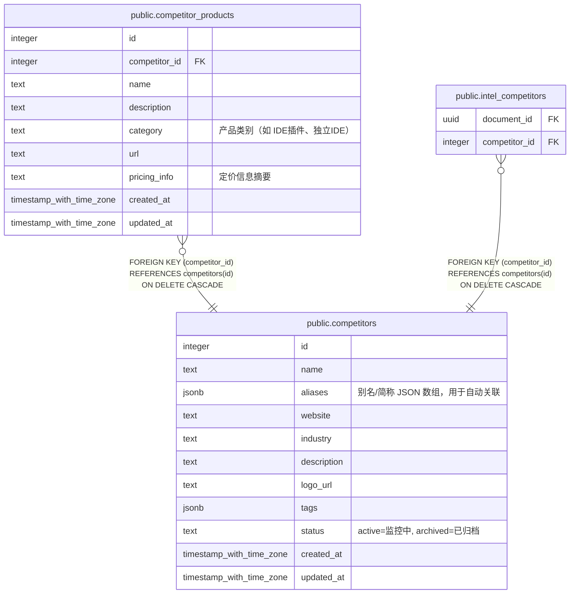

# public.competitors

## 说明

竞品公司档案

## 列一览

| 名称          | 类型                       | 默认值                                     | Nullable | 子表                                                                                                                  | 备注                                |
| ----------- | ------------------------ | --------------------------------------- | -------- | ------------------------------------------------------------------------------------------------------------------- | --------------------------------- |
| id          | integer                  | nextval('competitors_id_seq'::regclass) | false    | [public.competitor_products](public.competitor_products.md) [public.intel_competitors](public.intel_competitors.md) |                                   |
| name        | text                     |                                         | false    |                                                                                                                     |                                   |
| aliases     | jsonb                    | '[]'::jsonb                             | true     |                                                                                                                     | 别名/简称 JSON 数组，用于自动关联              |
| website     | text                     | ''::text                                | true     |                                                                                                                     |                                   |
| industry    | text                     | ''::text                                | true     |                                                                                                                     |                                   |
| description | text                     | ''::text                                | true     |                                                                                                                     |                                   |
| logo_url    | text                     | ''::text                                | true     |                                                                                                                     |                                   |
| tags        | jsonb                    | '[]'::jsonb                             | true     |                                                                                                                     |                                   |
| status      | text                     | 'active'::text                          | true     |                                                                                                                     | active=监控中, archived=已归档          |
| created_at  | timestamp with time zone | now()                                   | true     |                                                                                                                     |                                   |
| updated_at  | timestamp with time zone | now()                                   | true     |                                                                                                                     |                                   |

## 约束一览

| 名称                   | 类型          | 定义               |
| -------------------- | ----------- | ---------------- |
| competitors_pkey     | PRIMARY KEY | PRIMARY KEY (id) |
| competitors_name_key | UNIQUE      | UNIQUE (name)    |

## 索引一览

| 名称                     | 定义                                                                                |
| ---------------------- | --------------------------------------------------------------------------------- |
| competitors_pkey       | CREATE UNIQUE INDEX competitors_pkey ON public.competitors USING btree (id)       |
| competitors_name_key   | CREATE UNIQUE INDEX competitors_name_key ON public.competitors USING btree (name) |
| idx_competitors_status | CREATE INDEX idx_competitors_status ON public.competitors USING btree (status)    |

## ER 图

---

> Generated by [tbls](https://github.com/k1LoW/tbls)
