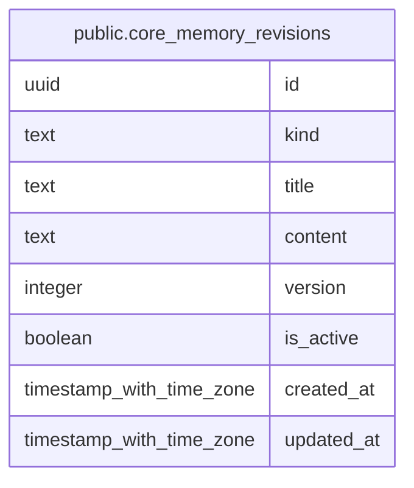

# public.core_memory_revisions

## 说明

核心记忆版本表。核心记忆不可物理删除，只能创建新版本并切换 active revision。

## 列一览

| 名称         | 类型                       | 默认值               | Nullable | 备注   |
| ---------- | ------------------------ | ----------------- | -------- | ---- |
| id         | uuid                     |                   | false    |      |
| kind       | text                     |                   | false    |      |
| title      | text                     |                   | false    |      |
| content    | text                     |                   | false    |      |
| version    | integer                  |                   | false    |      |
| is_active  | boolean                  | true              | false    |      |
| created_at | timestamp with time zone | CURRENT_TIMESTAMP | false    |      |
| updated_at | timestamp with time zone | CURRENT_TIMESTAMP | false    |      |

## 约束一览

| 名称                         | 类型          | 定义               |
| -------------------------- | ----------- | ---------------- |
| core_memory_revisions_pkey | PRIMARY KEY | PRIMARY KEY (id) |

## 索引一览

| 名称                          | 定义                                                                                                     |
| --------------------------- | ------------------------------------------------------------------------------------------------------ |
| core_memory_revisions_pkey  | CREATE UNIQUE INDEX core_memory_revisions_pkey ON public.core_memory_revisions USING btree (id)        |
| idx_core_memory_kind_active | CREATE INDEX idx_core_memory_kind_active ON public.core_memory_revisions USING btree (kind, is_active) |

## ER 图

---

> Generated by [tbls](https://github.com/k1LoW/tbls)
