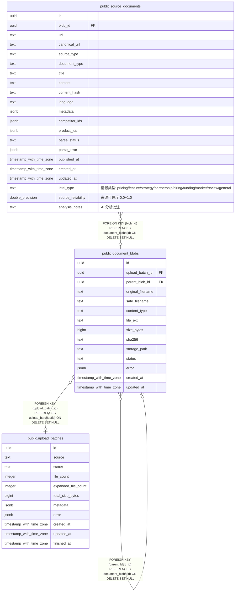

# public.document_blobs

## 列一览

| 名称                | 类型                       | 默认值            | Nullable | 子表                                                                                                      | 父表                                                | 备注   |
| ----------------- | ------------------------ | -------------- | -------- | ------------------------------------------------------------------------------------------------------- | ------------------------------------------------- | ---- |
| id                | uuid                     |                | false    | [public.document_blobs](public.document_blobs.md) [public.source_documents](public.source_documents.md) |                                                   |      |
| upload_batch_id   | uuid                     |                | true     |                                                                                                         | [public.upload_batches](public.upload_batches.md) |      |
| parent_blob_id    | uuid                     |                | true     |                                                                                                         | [public.document_blobs](public.document_blobs.md) |      |
| original_filename | text                     |                | false    |                                                                                                         |                                                   |      |
| safe_filename     | text                     |                | false    |                                                                                                         |                                                   |      |
| content_type      | text                     | ''::text       | false    |                                                                                                         |                                                   |      |
| file_ext          | text                     | ''::text       | false    |                                                                                                         |                                                   |      |
| size_bytes        | bigint                   | 0              | false    |                                                                                                         |                                                   |      |
| sha256            | text                     |                | false    |                                                                                                         |                                                   |      |
| storage_path      | text                     |                | false    |                                                                                                         |                                                   |      |
| status            | text                     | 'stored'::text | false    |                                                                                                         |                                                   |      |
| error             | jsonb                    | '{}'::jsonb    | false    |                                                                                                         |                                                   |      |
| created_at        | timestamp with time zone | now()          | false    |                                                                                                         |                                                   |      |
| updated_at        | timestamp with time zone | now()          | false    |                                                                                                         |                                                   |      |

## 约束一览

| 名称                                  | 类型          | 定义                                                                             |
| ----------------------------------- | ----------- | ------------------------------------------------------------------------------ |
| document_blobs_upload_batch_id_fkey | FOREIGN KEY | FOREIGN KEY (upload_batch_id) REFERENCES upload_batches(id) ON DELETE SET NULL |
| document_blobs_parent_blob_id_fkey  | FOREIGN KEY | FOREIGN KEY (parent_blob_id) REFERENCES document_blobs(id) ON DELETE SET NULL  |
| document_blobs_pkey                 | PRIMARY KEY | PRIMARY KEY (id)                                                               |

## 索引一览

| 名称                        | 定义                                                                                           |
| ------------------------- | -------------------------------------------------------------------------------------------- |
| document_blobs_pkey       | CREATE UNIQUE INDEX document_blobs_pkey ON public.document_blobs USING btree (id)            |
| idx_document_blobs_sha256 | CREATE INDEX idx_document_blobs_sha256 ON public.document_blobs USING btree (sha256)         |
| idx_document_blobs_batch  | CREATE INDEX idx_document_blobs_batch ON public.document_blobs USING btree (upload_batch_id) |

## ER 图

---

> Generated by [tbls](https://github.com/k1LoW/tbls)
