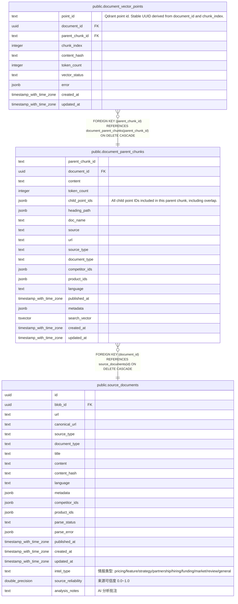

# public.document_parent_chunks

## 说明

Parent chunks stored in PostgreSQL for LLM context and FTS.

## 列一览

| 名称              | 类型                       | 默认值             | Nullable | 子表                                                                | 父表                                                    | 备注                                                                    |
| --------------- | ------------------------ | --------------- | -------- | ----------------------------------------------------------------- | ----------------------------------------------------- | --------------------------------------------------------------------- |
| parent_chunk_id | text                     |                 | false    | [public.document_vector_points](public.document_vector_points.md) |                                                       |                                                                       |
| document_id     | uuid                     |                 | false    |                                                                   | [public.source_documents](public.source_documents.md) |                                                                       |
| content         | text                     |                 | false    |                                                                   |                                                       |                                                                       |
| token_count     | integer                  | 0               | false    |                                                                   |                                                       |                                                                       |
| child_point_ids | jsonb                    | '[]'::jsonb     | false    |                                                                   |                                                       | All child point IDs included in this parent chunk, including overlap. |
| heading_path    | jsonb                    | '[]'::jsonb     | false    |                                                                   |                                                       |                                                                       |
| doc_name        | text                     | ''::text        | false    |                                                                   |                                                       |                                                                       |
| source          | text                     | ''::text        | false    |                                                                   |                                                       |                                                                       |
| url             | text                     | ''::text        | false    |                                                                   |                                                       |                                                                       |
| source_type     | text                     | 'web'::text     | false    |                                                                   |                                                       |                                                                       |
| document_type   | text                     | 'article'::text | false    |                                                                   |                                                       |                                                                       |
| competitor_ids  | jsonb                    | '[]'::jsonb     | false    |                                                                   |                                                       |                                                                       |
| product_ids     | jsonb                    | '[]'::jsonb     | false    |                                                                   |                                                       |                                                                       |
| language        | text                     | ''::text        | false    |                                                                   |                                                       |                                                                       |
| published_at    | timestamp with time zone |                 | true     |                                                                   |                                                       |                                                                       |
| metadata        | jsonb                    | '{}'::jsonb     | false    |                                                                   |                                                       |                                                                       |
| search_vector   | tsvector                 |                 | true     |                                                                   |                                                       |                                                                       |
| created_at      | timestamp with time zone | now()           | false    |                                                                   |                                                       |                                                                       |
| updated_at      | timestamp with time zone | now()           | false    |                                                                   |                                                       |                                                                       |

## 约束一览

| 名称                                      | 类型          | 定义                                                                          |
| --------------------------------------- | ----------- | --------------------------------------------------------------------------- |
| document_parent_chunks_document_id_fkey | FOREIGN KEY | FOREIGN KEY (document_id) REFERENCES source_documents(id) ON DELETE CASCADE |
| document_parent_chunks_pkey             | PRIMARY KEY | PRIMARY KEY (parent_chunk_id)                                               |

## 索引一览

| 名称                                  | 定义                                                                                                             |
| ----------------------------------- | -------------------------------------------------------------------------------------------------------------- |
| document_parent_chunks_pkey         | CREATE UNIQUE INDEX document_parent_chunks_pkey ON public.document_parent_chunks USING btree (parent_chunk_id) |
| idx_document_parent_chunks_document | CREATE INDEX idx_document_parent_chunks_document ON public.document_parent_chunks USING btree (document_id)    |
| idx_document_parent_chunks_fts      | CREATE INDEX idx_document_parent_chunks_fts ON public.document_parent_chunks USING gin (search_vector)         |

## ER 图

---

> Generated by [tbls](https://github.com/k1LoW/tbls)
