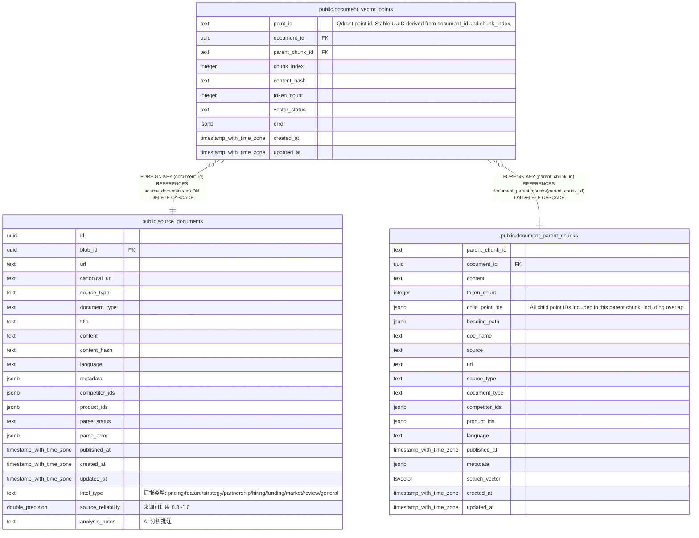

# public.document_vector_points

## 说明

Qdrant child chunk point status; embeddings and child payloads live in Qdrant.

## 列一览

| 名称              | 类型                       | 默认值             | Nullable | 父表                                                                | 备注                                                                     |
| --------------- | ------------------------ | --------------- | -------- | ----------------------------------------------------------------- | ---------------------------------------------------------------------- |
| point_id        | text                     |                 | false    |                                                                   | Qdrant point id. Stable UUID derived from document_id and chunk_index. |
| document_id     | uuid                     |                 | false    | [public.source_documents](public.source_documents.md)             |                                                                        |
| parent_chunk_id | text                     |                 | false    | [public.document_parent_chunks](public.document_parent_chunks.md) |                                                                        |
| chunk_index     | integer                  | 0               | false    |                                                                   |                                                                        |
| content_hash    | text                     | ''::text        | false    |                                                                   |                                                                        |
| token_count     | integer                  | 0               | false    |                                                                   |                                                                        |
| vector_status   | text                     | 'pending'::text | false    |                                                                   |                                                                        |
| error           | jsonb                    | '{}'::jsonb     | false    |                                                                   |                                                                        |
| created_at      | timestamp with time zone | now()           | false    |                                                                   |                                                                        |
| updated_at      | timestamp with time zone | now()           | false    |                                                                   |                                                                        |

## 约束一览

| 名称                                          | 类型          | 定义                                                                                                 |
| ------------------------------------------- | ----------- | -------------------------------------------------------------------------------------------------- |
| document_vector_points_document_id_fkey     | FOREIGN KEY | FOREIGN KEY (document_id) REFERENCES source_documents(id) ON DELETE CASCADE                        |
| document_vector_points_parent_chunk_id_fkey | FOREIGN KEY | FOREIGN KEY (parent_chunk_id) REFERENCES document_parent_chunks(parent_chunk_id) ON DELETE CASCADE |
| document_vector_points_pkey                 | PRIMARY KEY | PRIMARY KEY (point_id)                                                                             |

## 索引一览

| 名称                                  | 定义                                                                                                            |
| ----------------------------------- | ------------------------------------------------------------------------------------------------------------- |
| document_vector_points_pkey         | CREATE UNIQUE INDEX document_vector_points_pkey ON public.document_vector_points USING btree (point_id)       |
| idx_document_vector_points_document | CREATE INDEX idx_document_vector_points_document ON public.document_vector_points USING btree (document_id)   |
| idx_document_vector_points_parent   | CREATE INDEX idx_document_vector_points_parent ON public.document_vector_points USING btree (parent_chunk_id) |
| idx_document_vector_points_status   | CREATE INDEX idx_document_vector_points_status ON public.document_vector_points USING btree (vector_status)   |

## ER 图

---

> Generated by [tbls](https://github.com/k1LoW/tbls)
