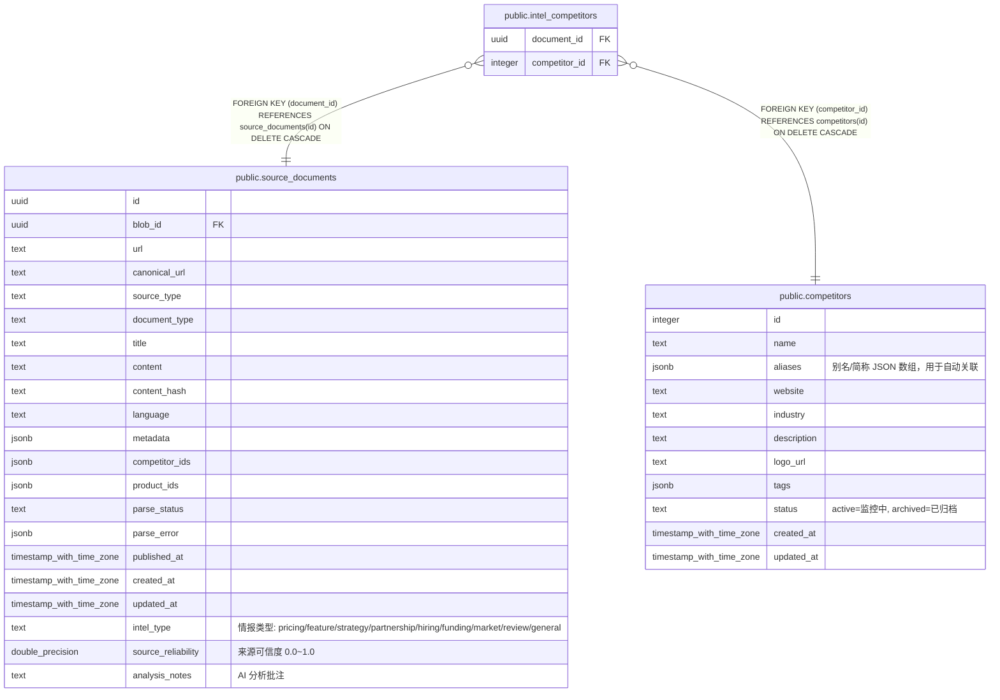

# public.intel_competitors

## 说明

情报与竞品的多对多关联

## 列一览

| 名称            | 类型      | 默认值    | Nullable | 父表                                                    | 备注   |
| ------------- | ------- | ------ | -------- | ----------------------------------------------------- | ---- |
| document_id   | uuid    |        | false    | [public.source_documents](public.source_documents.md) |      |
| competitor_id | integer |        | false    | [public.competitors](public.competitors.md)           |      |

## 约束一览

| 名称                                   | 类型          | 定义                                                                          |
| ------------------------------------ | ----------- | --------------------------------------------------------------------------- |
| intel_competitors_document_id_fkey   | FOREIGN KEY | FOREIGN KEY (document_id) REFERENCES source_documents(id) ON DELETE CASCADE |
| intel_competitors_competitor_id_fkey | FOREIGN KEY | FOREIGN KEY (competitor_id) REFERENCES competitors(id) ON DELETE CASCADE    |
| intel_competitors_pkey               | PRIMARY KEY | PRIMARY KEY (document_id, competitor_id)                                    |

## 索引一览

| 名称                               | 定义                                                                                                              |
| -------------------------------- | --------------------------------------------------------------------------------------------------------------- |
| intel_competitors_pkey           | CREATE UNIQUE INDEX intel_competitors_pkey ON public.intel_competitors USING btree (document_id, competitor_id) |
| idx_intel_competitors_competitor | CREATE INDEX idx_intel_competitors_competitor ON public.intel_competitors USING btree (competitor_id)           |

## ER 图

---

> Generated by [tbls](https://github.com/k1LoW/tbls)
