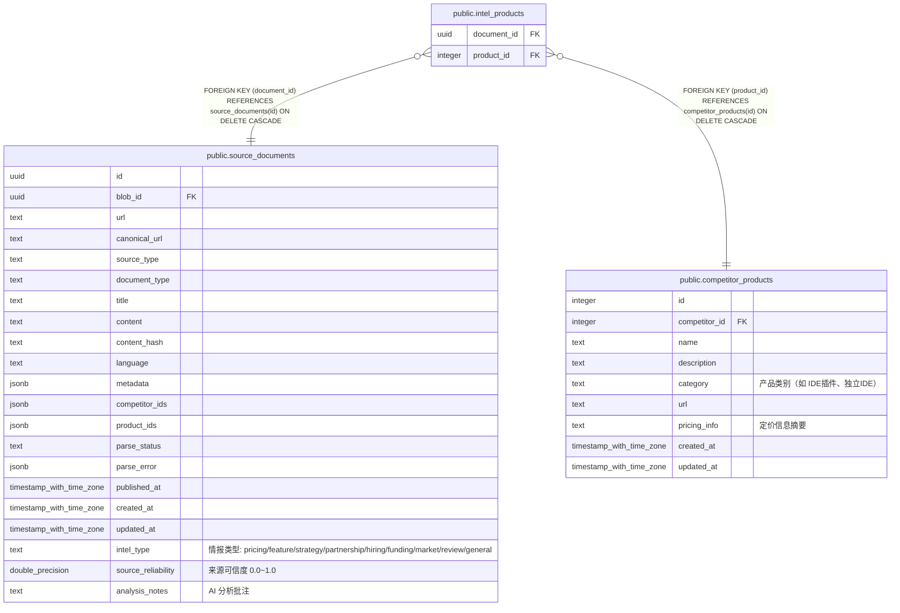

# public.intel_products

## 说明

情报与竞品产品的多对多关联

## 列一览

| 名称          | 类型      | 默认值    | Nullable | 父表                                                          | 备注   |
| ----------- | ------- | ------ | -------- | ----------------------------------------------------------- | ---- |
| document_id | uuid    |        | false    | [public.source_documents](public.source_documents.md)       |      |
| product_id  | integer |        | false    | [public.competitor_products](public.competitor_products.md) |      |

## 约束一览

| 名称                              | 类型          | 定义                                                                            |
| ------------------------------- | ----------- | ----------------------------------------------------------------------------- |
| intel_products_document_id_fkey | FOREIGN KEY | FOREIGN KEY (document_id) REFERENCES source_documents(id) ON DELETE CASCADE   |
| intel_products_product_id_fkey  | FOREIGN KEY | FOREIGN KEY (product_id) REFERENCES competitor_products(id) ON DELETE CASCADE |
| intel_products_pkey             | PRIMARY KEY | PRIMARY KEY (document_id, product_id)                                         |

## 索引一览

| 名称                         | 定义                                                                                                     |
| -------------------------- | ------------------------------------------------------------------------------------------------------ |
| intel_products_pkey        | CREATE UNIQUE INDEX intel_products_pkey ON public.intel_products USING btree (document_id, product_id) |
| idx_intel_products_product | CREATE INDEX idx_intel_products_product ON public.intel_products USING btree (product_id)              |

## ER 图

---

> Generated by [tbls](https://github.com/k1LoW/tbls)
