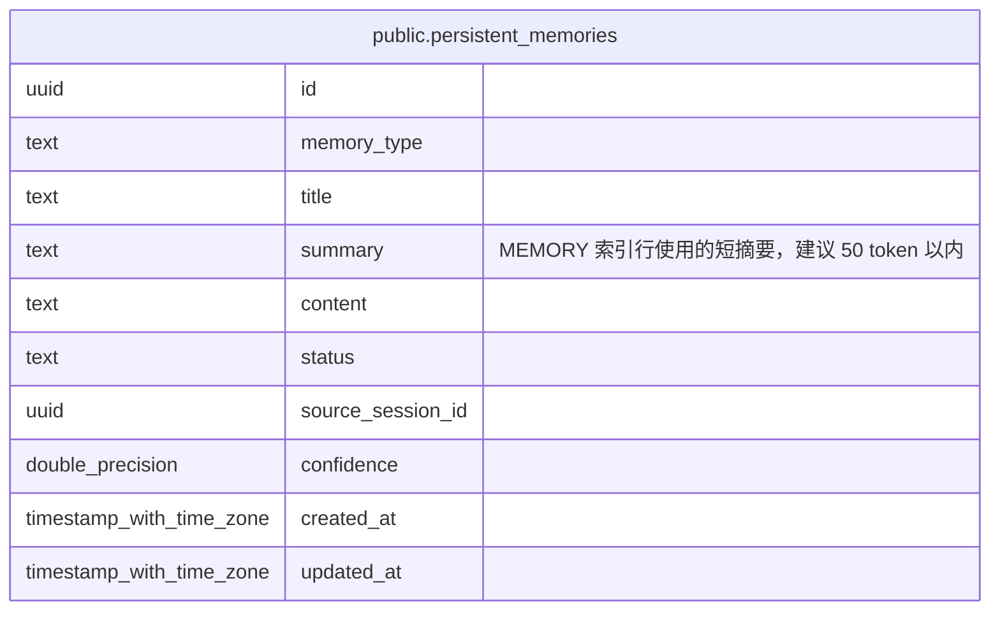

# public.persistent_memories

## 说明

持久记忆表。保存 user/feedback/project 三类跨会话记忆，pending 状态需用户确认。

## 列一览

| 名称                | 类型                       | 默认值               | Nullable | 备注                                            |
| ----------------- | ------------------------ | ----------------- | -------- | --------------------------------------------- |
| id                | uuid                     |                   | false    |                                               |
| memory_type       | text                     |                   | false    |                                               |
| title             | text                     |                   | false    |                                               |
| summary           | text                     |                   | false    | MEMORY 索引行使用的短摘要，建议 50 token 以内               |
| content           | text                     |                   | false    |                                               |
| status            | text                     | 'pending'::text   | false    |                                               |
| source_session_id | uuid                     |                   | true     |                                               |
| confidence        | double precision         |                   | true     |                                               |
| created_at        | timestamp with time zone | CURRENT_TIMESTAMP | false    |                                               |
| updated_at        | timestamp with time zone | CURRENT_TIMESTAMP | false    |                                               |

## 约束一览

| 名称                       | 类型          | 定义               |
| ------------------------ | ----------- | ---------------- |
| persistent_memories_pkey | PRIMARY KEY | PRIMARY KEY (id) |

## 索引一览

| 名称                                  | 定义                                                                                                               |
| ----------------------------------- | ---------------------------------------------------------------------------------------------------------------- |
| persistent_memories_pkey            | CREATE UNIQUE INDEX persistent_memories_pkey ON public.persistent_memories USING btree (id)                      |
| idx_persistent_memories_status      | CREATE INDEX idx_persistent_memories_status ON public.persistent_memories USING btree (status)                   |
| idx_persistent_memories_type_status | CREATE INDEX idx_persistent_memories_type_status ON public.persistent_memories USING btree (memory_type, status) |

## ER 图

---

> Generated by [tbls](https://github.com/k1LoW/tbls)
