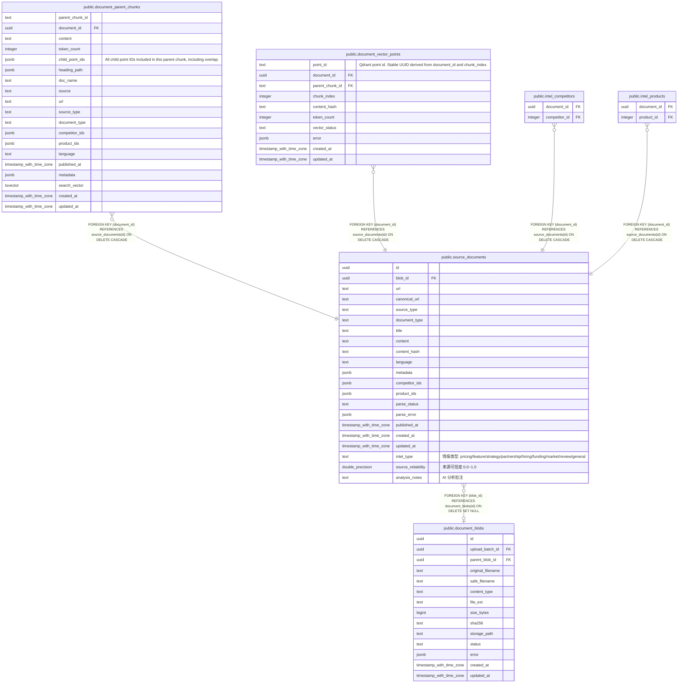

# public.source_documents

## 说明

Unified source document metadata and normalized content.

## 列一览

| 名称                 | 类型                       | 默认值             | Nullable | 子表                                                                                                                                                                                                                                            | 父表                                                | 备注                                                                                  |
| ------------------ | ------------------------ | --------------- | -------- | --------------------------------------------------------------------------------------------------------------------------------------------------------------------------------------------------------------------------------------------- | ------------------------------------------------- | ----------------------------------------------------------------------------------- |
| id                 | uuid                     |                 | false    | [public.document_parent_chunks](public.document_parent_chunks.md) [public.document_vector_points](public.document_vector_points.md) [public.intel_competitors](public.intel_competitors.md) [public.intel_products](public.intel_products.md) |                                                   |                                                                                     |
| blob_id            | uuid                     |                 | true     |                                                                                                                                                                                                                                               | [public.document_blobs](public.document_blobs.md) |                                                                                     |
| url                | text                     | ''::text        | false    |                                                                                                                                                                                                                                               |                                                   |                                                                                     |
| canonical_url      | text                     | ''::text        | false    |                                                                                                                                                                                                                                               |                                                   |                                                                                     |
| source_type        | text                     | 'web'::text     | false    |                                                                                                                                                                                                                                               |                                                   |                                                                                     |
| document_type      | text                     | 'article'::text | false    |                                                                                                                                                                                                                                               |                                                   |                                                                                     |
| title              | text                     |                 | false    |                                                                                                                                                                                                                                               |                                                   |                                                                                     |
| content            | text                     | ''::text        | false    |                                                                                                                                                                                                                                               |                                                   |                                                                                     |
| content_hash       | text                     | ''::text        | false    |                                                                                                                                                                                                                                               |                                                   |                                                                                     |
| language           | text                     | ''::text        | false    |                                                                                                                                                                                                                                               |                                                   |                                                                                     |
| metadata           | jsonb                    | '{}'::jsonb     | false    |                                                                                                                                                                                                                                               |                                                   |                                                                                     |
| competitor_ids     | jsonb                    | '[]'::jsonb     | false    |                                                                                                                                                                                                                                               |                                                   |                                                                                     |
| product_ids        | jsonb                    | '[]'::jsonb     | false    |                                                                                                                                                                                                                                               |                                                   |                                                                                     |
| parse_status       | text                     | 'pending'::text | false    |                                                                                                                                                                                                                                               |                                                   |                                                                                     |
| parse_error        | jsonb                    | '{}'::jsonb     | false    |                                                                                                                                                                                                                                               |                                                   |                                                                                     |
| published_at       | timestamp with time zone |                 | true     |                                                                                                                                                                                                                                               |                                                   |                                                                                     |
| created_at         | timestamp with time zone | now()           | false    |                                                                                                                                                                                                                                               |                                                   |                                                                                     |
| updated_at         | timestamp with time zone | now()           | false    |                                                                                                                                                                                                                                               |                                                   |                                                                                     |
| intel_type         | text                     | 'general'::text | true     |                                                                                                                                                                                                                                               |                                                   | 情报类型: pricing/feature/strategy/partnership/hiring/funding/market/review/general     |
| source_reliability | double precision         | 0.0             | true     |                                                                                                                                                                                                                                               |                                                   | 来源可信度 0.0~1.0                                                                       |
| analysis_notes     | text                     | ''::text        | true     |                                                                                                                                                                                                                                               |                                                   | AI 分析批注                                                                             |

## 约束一览

| 名称                            | 类型          | 定义                                                                     |
| ----------------------------- | ----------- | ---------------------------------------------------------------------- |
| source_documents_blob_id_fkey | FOREIGN KEY | FOREIGN KEY (blob_id) REFERENCES document_blobs(id) ON DELETE SET NULL |
| source_documents_pkey         | PRIMARY KEY | PRIMARY KEY (id)                                                       |

## 索引一览

| 名称                                  | 定义                                                                                                                     |
| ----------------------------------- | ---------------------------------------------------------------------------------------------------------------------- |
| source_documents_pkey               | CREATE UNIQUE INDEX source_documents_pkey ON public.source_documents USING btree (id)                                  |
| idx_source_documents_source_created | CREATE INDEX idx_source_documents_source_created ON public.source_documents USING btree (source_type, created_at DESC) |
| idx_source_documents_type_created   | CREATE INDEX idx_source_documents_type_created ON public.source_documents USING btree (document_type, created_at DESC) |
| idx_source_documents_hash           | CREATE INDEX idx_source_documents_hash ON public.source_documents USING btree (content_hash)                           |
| idx_source_documents_parse_status   | CREATE INDEX idx_source_documents_parse_status ON public.source_documents USING btree (parse_status)                   |
| idx_source_documents_metadata       | CREATE INDEX idx_source_documents_metadata ON public.source_documents USING gin (metadata)                             |
| idx_source_documents_intel_type     | CREATE INDEX idx_source_documents_intel_type ON public.source_documents USING btree (intel_type)                       |

## ER 图

---

> Generated by [tbls](https://github.com/k1LoW/tbls)
