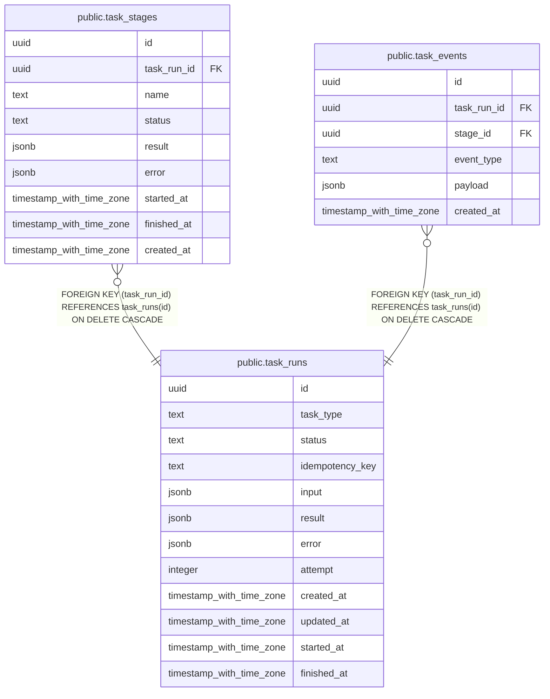

# public.task_runs

## 列一览

| 名称              | 类型                       | 默认值             | Nullable | 子表                                                                                      | 备注   |
| --------------- | ------------------------ | --------------- | -------- | --------------------------------------------------------------------------------------- | ---- |
| id              | uuid                     |                 | false    | [public.task_stages](public.task_stages.md) [public.task_events](public.task_events.md) |      |
| task_type       | text                     |                 | false    |                                                                                         |      |
| status          | text                     | 'pending'::text | false    |                                                                                         |      |
| idempotency_key | text                     |                 | true     |                                                                                         |      |
| input           | jsonb                    | '{}'::jsonb     | false    |                                                                                         |      |
| result          | jsonb                    | '{}'::jsonb     | false    |                                                                                         |      |
| error           | jsonb                    | '{}'::jsonb     | false    |                                                                                         |      |
| attempt         | integer                  | 0               | false    |                                                                                         |      |
| created_at      | timestamp with time zone | now()           | false    |                                                                                         |      |
| updated_at      | timestamp with time zone | now()           | false    |                                                                                         |      |
| started_at      | timestamp with time zone |                 | true     |                                                                                         |      |
| finished_at     | timestamp with time zone |                 | true     |                                                                                         |      |

## 约束一览

| 名称             | 类型          | 定义               |
| -------------- | ----------- | ---------------- |
| task_runs_pkey | PRIMARY KEY | PRIMARY KEY (id) |

## 索引一览

| 名称                           | 定义                                                                                                  |
| ---------------------------- | --------------------------------------------------------------------------------------------------- |
| task_runs_pkey               | CREATE UNIQUE INDEX task_runs_pkey ON public.task_runs USING btree (id)                             |
| idx_task_runs_status_created | CREATE INDEX idx_task_runs_status_created ON public.task_runs USING btree (status, created_at DESC) |

## ER 图

---

> Generated by [tbls](https://github.com/k1LoW/tbls)
