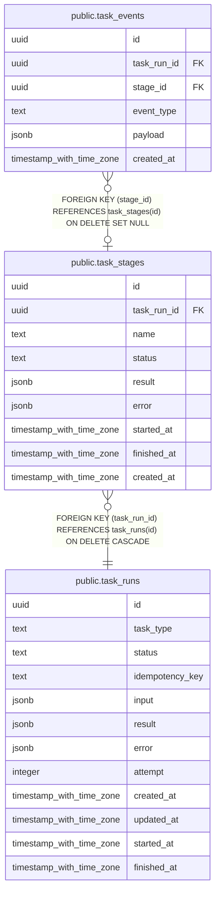

# public.task_stages

## 列一览

| 名称          | 类型                       | 默认值             | Nullable | 子表                                          | 父表                                      | 备注   |
| ----------- | ------------------------ | --------------- | -------- | ------------------------------------------- | --------------------------------------- | ---- |
| id          | uuid                     |                 | false    | [public.task_events](public.task_events.md) |                                         |      |
| task_run_id | uuid                     |                 | false    |                                             | [public.task_runs](public.task_runs.md) |      |
| name        | text                     |                 | false    |                                             |                                         |      |
| status      | text                     | 'pending'::text | false    |                                             |                                         |      |
| result      | jsonb                    | '{}'::jsonb     | false    |                                             |                                         |      |
| error       | jsonb                    | '{}'::jsonb     | false    |                                             |                                         |      |
| started_at  | timestamp with time zone |                 | true     |                                             |                                         |      |
| finished_at | timestamp with time zone |                 | true     |                                             |                                         |      |
| created_at  | timestamp with time zone | now()           | false    |                                             |                                         |      |

## 约束一览

| 名称                           | 类型          | 定义                                                                   |
| ---------------------------- | ----------- | -------------------------------------------------------------------- |
| task_stages_task_run_id_fkey | FOREIGN KEY | FOREIGN KEY (task_run_id) REFERENCES task_runs(id) ON DELETE CASCADE |
| task_stages_pkey             | PRIMARY KEY | PRIMARY KEY (id)                                                     |

## 索引一览

| 名称                  | 定义                                                                               |
| ------------------- | -------------------------------------------------------------------------------- |
| task_stages_pkey    | CREATE UNIQUE INDEX task_stages_pkey ON public.task_stages USING btree (id)      |
| idx_task_stages_run | CREATE INDEX idx_task_stages_run ON public.task_stages USING btree (task_run_id) |

## ER 图

---

> Generated by [tbls](https://github.com/k1LoW/tbls)
