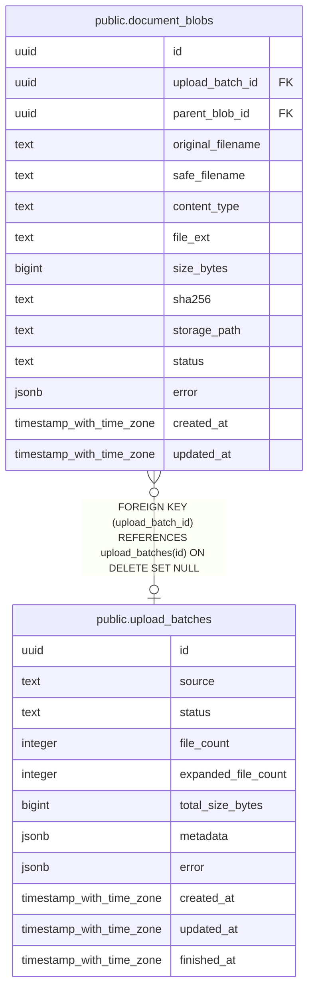

# public.upload_batches

## 列一览

| 名称                  | 类型                       | 默认值              | Nullable | 子表                                                | 备注   |
| ------------------- | ------------------------ | ---------------- | -------- | ------------------------------------------------- | ---- |
| id                  | uuid                     |                  | false    | [public.document_blobs](public.document_blobs.md) |      |
| source              | text                     | 'api'::text      | false    |                                                   |      |
| status              | text                     | 'received'::text | false    |                                                   |      |
| file_count          | integer                  | 0                | false    |                                                   |      |
| expanded_file_count | integer                  | 0                | false    |                                                   |      |
| total_size_bytes    | bigint                   | 0                | false    |                                                   |      |
| metadata            | jsonb                    | '{}'::jsonb      | false    |                                                   |      |
| error               | jsonb                    | '{}'::jsonb      | false    |                                                   |      |
| created_at          | timestamp with time zone | now()            | false    |                                                   |      |
| updated_at          | timestamp with time zone | now()            | false    |                                                   |      |
| finished_at         | timestamp with time zone |                  | true     |                                                   |      |

## 约束一览

| 名称                  | 类型          | 定义               |
| ------------------- | ----------- | ---------------- |
| upload_batches_pkey | PRIMARY KEY | PRIMARY KEY (id) |

## 索引一览

| 名称                  | 定义                                                                                |
| ------------------- | --------------------------------------------------------------------------------- |
| upload_batches_pkey | CREATE UNIQUE INDEX upload_batches_pkey ON public.upload_batches USING btree (id) |

## ER 图

---

> Generated by [tbls](https://github.com/k1LoW/tbls)
